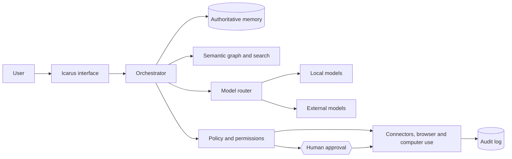

# Icarus

**A personal, long-term and model-independent AI operating system.**

Icarus builds a verifiable digital model of its user, keeps memory independent
of any single AI vendor, integrates the current outside world and controls
digital work from one coherent interface.

The long-term goal is not another chatbot. Icarus is intended to become a
personal **Chief of Staff**, **digital twin** and **control layer for digital
life**: one system that understands the user, their work, relationships,
projects, decisions and habits — while models, services and applications remain
replaceable tools underneath.

> **The model is an engine. Icarus is the vehicle, memory, control system and
> continuity.** A better model can replace the previous one without the user
> losing their history, preferences, rules or working context.

## Read this first

The binding product vision and development principles are documented in:

**[Product vision and development charter](docs/00-produktvision.md)**

Every contributor should read that document before making product,
architecture or interface decisions. Technical documents explain how individual
parts work today; the product vision explains what the whole system is meant to
become.

## What Icarus is meant to become

Icarus is designed as a single, consumer-friendly interface for the user's
digital environment. Over time it should be able to:

- maintain a long-term, inspectable model of the user;
- connect memory, projects, tasks, notes, mail, calendar, contacts and files;
- understand relationships through a navigable knowledge graph and timeline;
- combine personal context with current news, research and external events;
- choose between current and future AI models according to quality, privacy,
  cost and task;
- prepare or perform digital work through APIs, MCP, browser automation and
  computer use;
- run recurring and conditional workflows without gaining hidden authority;
- remain understandable and usable by ordinary consumers rather than only by
  developers.

The user should describe the desired outcome. Icarus should carry the technical
complexity.

## The product principle

> **Always choose the solution that is simplest for the user — not the solution
> that is simplest to build.**

A normal user should not need to understand model providers, embeddings, MCP,
IMAP hosts, context windows, vector databases or agent routing.

Complexity may exist inside the system, but it must not be passed to the person
using it. Where simplicity and control conflict, control wins — and the task is
to make the controlled path simpler, not to remove the control.

## Current status

> **Early, but end-to-end.** The core is a technically advanced alpha, not yet a
> finished consumer product.

The current implementation already includes:

| Pillar | Current state |
|---|---|
| Verifiable self-model | Provenance, versioning, expiry, supersession, disputes and cascading revocation |
| Vendor-independent memory | Local SQLite record with optional semantic indexing; OpenAI-compatible, Anthropic or Ollama models in front |
| Current information | Mail, calendar, projects, tasks, notes, web, files and imports from Obsidian, Notion and text folders |
| Controlled action | Action classes, dry-run approvals, explicit confirmation and append-only audit |

Additional built capabilities include:

- three memory layers: conversation, episodes and confirmed assertions;
- consolidation that proposes but never silently writes facts;
- scheduled ingestion, consolidation and backups;
- reversible monthly retrospectives;
- mail reading and replies inside the application;
- backup and restore;
- prompt-injection containment;
- operating-system keychain support;
- an MCP door through which other assistants use the same memory, policy and
  audit log;
- a Tauri desktop application and a container-based secondary distribution
  path.

The largest missing product areas include consumer-grade UX, the visual memory
graph, deeper Chief-of-Staff behaviour, robust model routing, browser control,
computer use, multi-device operation and a broad connector ecosystem.

## Four non-negotiable foundations

### 1. Memory belongs to the user

The authoritative record lives locally and remains usable without a particular
model provider. Providers are replaceable. The user's identity and history are
not.

### 2. Every durable claim is verifiable

Facts carry provenance, time and state. Raw material is not automatically truth.
A model may propose an assertion, but a human accepts it.

> **Consolidation proposes. It does not write.**

### 3. The model cannot act directly

Models may request tools. Policy decides whether the request is read-only,
local, outward-facing or forbidden. Consequential actions require an appropriate
approval and every outcome is logged.

### 4. Consumer usability is part of the architecture

The system must minimise what users need to know, type, repeat and decide.
Advanced technical controls may exist, but they must not be prerequisites for
normal use.

## Architecture at a glance



The authoritative memory, permissions and audit trail form the stable core.
Models and execution mechanisms are replaceable engines and hands.

Detailed architecture: [`docs/01-architektur.md`](docs/01-architektur.md)

## Memory model

Icarus distinguishes between:

1. **Conversation context** — short-term working context;
2. **Episodes** — raw events, notes, mails and imported material that claim
   nothing by themselves;
3. **Assertions** — durable, reviewed statements with provenance, validity and
   history.

Imported content is deduplicated by digest. Evidence is preserved. Accepted
inferences retain the source episode, verbatim quote and proposing model.
Rejected proposals remain visible so decisions are explainable in both
directions.

Details:

- [`docs/06-gedaechtnis-kontrakt.md`](docs/06-gedaechtnis-kontrakt.md)
- [`docs/08-gedaechtnisschichten.md`](docs/08-gedaechtnisschichten.md)
- [`docs/10-verdichtung.md`](docs/10-verdichtung.md)
- [`docs/12-zusammenfassung.md`](docs/12-zusammenfassung.md)

## Safety model

Untrusted content from web pages, files, mail and calendar is treated as data,
not instruction. File access is confined to explicitly approved roots. Network
requests are guarded against internal targets and redirects. Once untrusted
content enters a round, consequential actions are escalated.

The safety model does not depend on the language model recognising an attack.

Details: [`docs/05-sicherheit.md`](docs/05-sicherheit.md)

## Getting started

```bash
make lokal NOTIZEN=~/Documents/Obsidian
```

That is the whole thing. It creates a Python environment on first run,
generates and reuses a local access token, mounts nothing, and prints a URL
with that token. The notes folder is optional; without it Icarus reads no
files and says so. Stop with Ctrl-C.

### In a container instead

Requires a running Docker daemon. It buys a process boundary between Icarus
and the rest of the machine; everything else is the same.

```bash
make start NOTIZEN=~/Documents/Obsidian
make stop
```

The notes folder is mounted read-only. Both commands create and reuse the same
local token and encryption passphrase.

Full guide: [`docs/15-loslegen.md`](docs/15-loslegen.md)

### From source

Python 3.10+ is required. Rust and Node are additionally required for the native
application.

```bash
make sidecar-dev
make test
make sidecar-run
```

The memory core works without an API key and without a model. For conversation,
configure a provider in the setup wizard or use an environment override:

```bash
ICARUS_PROVIDER=ollama make sidecar-run
ANTHROPIC_API_KEY=... make sidecar-run
```

For semantic search:

```bash
make sidecar-full
```

For the desktop application:

```bash
make app-dev
make app-build
```

## Mail, calendar and files

Mail and calendar are optional. Icarus uses open protocols — IMAP, SMTP and
CalDAV — and attempts to derive server settings from the user's address so that
normal users do not need to know technical hostnames.

File access is disabled until the user explicitly grants a folder. There is no
home-directory default.

```bash
export ICARUS_FILE_ROOTS="$HOME/Documents/icarus"
```

Mail is treated as a particularly dangerous untrusted-input channel. Reading a
mail never turns it into an instruction or a durable fact. Replies use the same
policy and approval path as model-requested sends.

Details:

- [`docs/09-einrichtung.md`](docs/09-einrichtung.md)
- [`docs/13-nutzerfreundlichkeit.md`](docs/13-nutzerfreundlichkeit.md)
- [`docs/14-posteingang.md`](docs/14-posteingang.md)

## Other assistants, same memory

Icarus exposes the same memory and policy to local assistants through MCP:

```json
{
  "mcpServers": {
    "icarus": {
      "command": "/path/to/icarus-mcp"
    }
  }
}
```

The MCP server does not create a second database or a second approval system. It
speaks to the running sidecar, so requests use the same memory, constraints,
policy and audit log.

Details: [`docs/07-mcp-tuer.md`](docs/07-mcp-tuer.md)

## Repository layout

```text
sidecar/             Python memory, policy, agents and connectors
app/                 Tauri desktop application and browser-capable frontend
schema/              Self-model JSON Schema
packaging/           Bundling configuration
scripts/             Development and validation helpers
docs/                Product vision, architecture, security, memory and ADRs
.github/workflows/   Tests and application builds
```

Start with:

1. [`docs/00-produktvision.md`](docs/00-produktvision.md)
2. [`CLAUDE.md`](CLAUDE.md)
3. [`docs/01-architektur.md`](docs/01-architektur.md)
4. the detail document for the subsystem being changed.

## Verification

```bash
make check
```

Tests run without network access and without a live model. New guarantees should
be validated not only with positive tests but, where practical, with sabotage
probes: deliberately break the guarantee and verify that the intended tests
fail.

## Contribution rule

A feature is not complete merely because the backend works. It must also:

- move Icarus toward the product vision;
- preserve provenance, user ownership and explicit control;
- use safe defaults;
- avoid demanding technical knowledge from ordinary users;
- explain outcomes and failures in human language;
- be tested through the real integration path;
- avoid creating a second memory, policy or approval system.

For the full product definition and development stages, read
[`docs/00-produktvision.md`](docs/00-produktvision.md).

## License

Apache-2.0 — see [LICENSE](LICENSE). Bundled third-party components keep their
own licenses.
