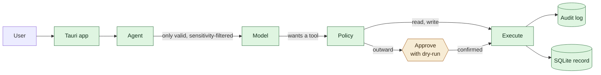

# Icarus

**A personal, long-term AI operating layer.**

Icarus builds a *verifiable* digital model of its user, keeps that memory
independent of any single AI vendor, integrates current information, and
delegates or performs digital work under explicit control.

It is a **downloadable desktop app** — macOS first, Windows after. No Docker, no
server, no setup.

> **Status: early, but end-to-end.** You can talk to it, it remembers with
> provenance, it reaches for current information, and nothing leaves your
> machine without you confirming exactly what goes out. It defends against
> prompt injection, keeps keys in the OS keychain, and backs itself up. A
> dashboard shows today's tasks, appointments and messages.
> Missing: computer-use and memory consolidation.

Detailed documentation is in German under [`docs/`](docs/).

## The four pillars

| # | Pillar | Status |
|---|---|---|
| 1 | Verifiable self-model — provenance, versioning, revocation | **Built.** Record, supersede, expire, revoke with cascade |
| 2 | Vendor-independent memory | **Built.** Local SQLite record; OpenAI-compatible, Anthropic or Ollama in front |
| 3 | Current information | **Built.** Mail (IMAP), calendar (CalDAV), tasks, web, files |
| 4 | Controlled delegation and execution | **Built.** Action classes, dry-run approvals, append-only audit |

## How it is put together



**The model cannot act.** It proposes tools; the policy layer decides. Reads run,
writes report afterwards, and anything leaving your machine requires you to
retype the recipient. Every outcome is logged — including the refusals.

**Untrusted input is contained.** Web pages and files are fetched into confined
paths, framed as data rather than instructions, and — the layer that actually
holds — once foreign content is in context, every consequential action gets
escalated to an approval. That last one does not rely on the model spotting the
attack. See [`docs/05-sicherheit.md`](docs/05-sicherheit.md).

**Two stores, deliberately.** The authoritative record lives in SQLite: exact,
addressable by ID, readable without invoking a model. cognee is only the
semantic index — hits are always resolved against the record, so the graph can
never invent a statement. Drop cognee and the record stays complete; only search
degrades to substring matching. That is pillar 2 made real rather than asserted.

Full picture: [`docs/01-architektur.md`](docs/01-architektur.md).

## Getting started

Requires Python 3.10+ and, for the app itself, Rust and Node.

```bash
make sidecar-dev     # memory core + dev dependencies (no cognee, fast)
make test            # 109 tests: memory, policy, audit, agent, security, connectors
make sidecar-run     # http://127.0.0.1:8765
```

The memory core needs **no API key and no model**. Recording, superseding,
revoking and exporting all work offline; the app says so rather than offering a
broken chat.

For conversation, point it at any provider — including a fully local one:

```bash
cp .env.example .env
# OpenAI:    OPENAI_API_KEY=...
# Anthropic: ANTHROPIC_API_KEY=...
# Ollama:    ICARUS_PROVIDER=ollama   (nothing else needed)
```

For semantic search across your memory:

```bash
make sidecar-full    # adds cognee (~950 MB, see ADR 0005)
```

### Running the app

```bash
make app-dev         # development, uses the sidecar from your PATH
make app-build       # bundles the sidecar and builds the app
```

`make app-build` produces a `.dmg` and `.app` on macOS. It must run **on** macOS
— a Mac bundle cannot be built from Linux or Windows.

For releases, [`.github/workflows/build-macos.yml`](.github/workflows/build-macos.yml)
does this on a macOS runner, signs and notarises the result, and verifies with
`spctl` that Gatekeeper would actually let it through. Without Apple secrets it
still builds, marks the artifact unsigned, and warns — so you can get to a first
artifact before you have a developer account.

## Verifying

```bash
make check           # tests + schema validation + cargo check
```

109 tests, no network and no model required — including a test that plays out a
full prompt-injection attack and asserts nothing escaped.

## Connecting mail and calendar

Open protocols, not vendor APIs — IMAP, SMTP and CalDAV work with iCloud,
Fastmail, Nextcloud, your own server, and (with an app password) Gmail and
Outlook. No OAuth dance, no API that gets deprecated.

```bash
# in .env — then: make secrets-migrate
ICARUS_IMAP_HOST=imap.example.com
ICARUS_SMTP_HOST=smtp.example.com
ICARUS_MAIL_USER=you@example.com
ICARUS_MAIL_PASSWORD=          # use an app password, never your main one
ICARUS_CALDAV_URL=https://caldav.example.com/calendar/
```

Both are optional. Without them the dashboard shows the section with a note and
everything else keeps working.

**Mail is the most dangerous injection vector there is** — anyone can write to
you. Message content is therefore always marked as foreign and taints the round,
so any consequential action afterwards needs an approval. Calendar events with
guests are outward-facing and require you to retype the recipient; without
guests they stay local.

## Keeping it safe

```bash
make secrets-migrate  # move API keys from .env into the OS keychain
make backup           # consistent snapshot of the self-model
```

File access is off unless you grant it explicitly:

```bash
export ICARUS_FILE_ROOTS="$HOME/Documents/icarus"
```

Empty means no file access at all. There is deliberately no default like your
home directory — that would be the convenience setting that removes the
protection.

## Repository layout

```
sidecar/             Python: memory, policy, agent
  icarus_memory/
    model.py         Data model, mirrors schema/self-model.schema.json
    store.py         The rules: supersession, expiry, cascading revocation
    backends.py      SQLite (record) + cognee (semantic index)
    policy.py        Action classes, approval levels, constraints
    audit.py         Append-only log, enforced by SQLite triggers
    providers.py     OpenAI-compatible and Anthropic, one interface
    tasks.py         Tasks with provenance, due dates, done vs. dropped
    connectors/      Mail (IMAP/SMTP) and calendar (CalDAV), open protocols
    tools.py         Web, files, time, memory, mail, calendar, tasks
    agent.py         Ties it together; proposes, never executes directly
    security.py      Path confinement, SSRF guard, untrusted-input handling
    secrets.py       OS keychain: macOS, Windows DPAPI, secret-tool
    backup.py        Snapshots, restore, encrypted export
    server.py        Loopback-only HTTP API for the app
  tests/             109 tests, no network and no model required
app/                 Tauri desktop app (Rust shell, HTML/JS frontend)
packaging/           PyInstaller spec for the bundled sidecar
schema/              Self-model JSON Schema and a worked example
docs/                Architecture, self-model, delegation, security, roadmap, ADRs
.github/workflows/   CI, and a signed + notarised macOS build
```

## Decisions

Two of these reverse earlier ones. The reasoning is kept rather than
overwritten — the same principle the self-model applies to its own data.

- **[ADR 0003](docs/adr/0003-kein-letta.md)** — Letta is not used. The survey
  recommended it; its repository is explicitly deprecated and its self-hosting
  successor is coupled to a vendor cloud.
- **[ADR 0005](docs/adr/0005-cognee-statt-mem0.md)** — cognee instead of Mem0.
  cognee's default stores are file-based, so it fits in an app; Mem0's server
  needs Postgres and pgvector.
- **[ADR 0006](docs/adr/0006-tauri-desktop.md)** — own Tauri app instead of a
  Docker stack. The self-model and the approval layer are not plugins; they
  touch every interaction.
- **[ADR 0004](docs/adr/0004-selbstmodell-schema.md)** — a purpose-built
  self-model schema, because no surveyed project provides cross-domain
  provenance.

Superseded: [ADR 0001](docs/adr/0001-ui-open-webui.md) (Open WebUI),
[ADR 0002](docs/adr/0002-memory-mem0.md) (Mem0).

## License

Apache-2.0 — see [LICENSE](LICENSE). Bundled third-party components keep their
own licenses.
