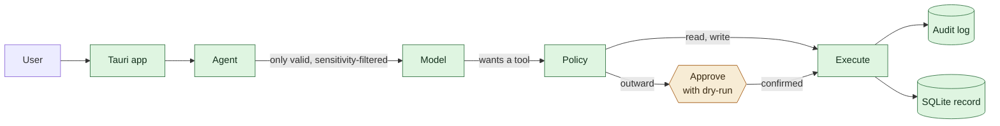

# Icarus

**A personal, long-term AI operating layer.**

Icarus builds a *verifiable* digital model of its user, keeps that memory
independent of any single AI vendor, integrates current information, and
delegates or performs digital work under explicit control.

It is a **desktop app** — macOS first, Windows after. There is also a container
image, so you can try it without a signed bundle; the app remains the real thing.

> **Status: early, but end-to-end.** Open it and a five-step wizard sets it up —
> no config file, no account. It remembers with provenance, reads your existing
> notes, reaches for current information, and nothing leaves your machine without
> you confirming exactly what goes out. It defends against prompt injection,
> keeps keys in the OS keychain, backs itself up — and restores from those
> backups, which is the half of that promise most projects skip. Other assistants on the
> machine reach the same memory over MCP. Consolidation keeps the record honest —
> by proposing, never by writing — and a background process now does that on a
> schedule, so the memory keeps itself in order while you work. Mail lives in
> the chat window: read it, reply to it, take it into memory as raw material.
> Missing: computer-use.

Detailed documentation is in German under [`docs/`](docs/).

## The four pillars

| # | Pillar | Status |
|---|---|---|
| 1 | Verifiable self-model — provenance, versioning, revocation | **Built.** Record, supersede, expire, revoke with cascade |
| 2 | Vendor-independent memory | **Built.** Local SQLite record; OpenAI-compatible, Anthropic or Ollama in front |
| 3 | Current information | **Built.** Mail read *and reply* in the chat window, calendar (CalDAV), projects, tasks, notes, web, files, import from Obsidian/Notion |
| 4 | Controlled delegation and execution | **Built.** Action classes, dry-run approvals, append-only audit |

## Bring your existing notes

Your memory does not start empty and it should not have to. Point Icarus at an
Obsidian vault, a Notion export, or a folder of text files:

```bash
# In the app: Einrichtung → Ordnerzugriff, then Rohmaterial → Aufnehmen.
# From a shell:
export ICARUS_FILE_ROOTS="$HOME/Documents"   # nothing is readable without this
```

Everything lands as an **episode** — raw material with a content digest, a source
and a timestamp — and **nothing** goes into the record. A note can contain an
instruction aimed at a model; it is evidence, not a claim about you. What becomes
a durable assertion is decided by consolidation, and consolidation proposes
rather than writes.

Runs are deduplicated by digest, so re-reading the same vault every night only
picks up what actually changed. That is what makes a process that runs
continuously possible at all.

## Consolidation proposes, it does not write

This is what makes it a chief of staff rather than a filing cabinet: a system
that knows more about you after six months than on day one, without having
accumulated nonsense. It rests on one rule.

> **Consolidation proposes. It does not write.**

The line runs between *ordering* and *claiming*. Ordering is free — marking
episodes as seen, archiving, finding candidates. Claiming needs a human. Even
when the model is confident. Especially then.

A system that silently derives facts and stores them has a memory nobody can
watch, which is the failure this project exists to avoid. It does not go wrong
because the model is bad; it goes wrong because nobody can trace where anything
came from.

Three kinds of proposal, and **two need no model at all**:

| | Needs a model | What it asks |
|---|---|---|
| `confirmation` | no | "this is past its horizon — does it still hold?" |
| `conflict` | no | "these two look contradictory — are they?" |
| `assertion` | yes | "this follows from your notes" |

A memory core whose upkeep requires an API key would not be one. Without a
provider you still get a record that ages, asks, and surfaces contradictions.

Evidence is mandatory. A model-proposed assertion is discarded before it reaches
the queue unless its quote appears **verbatim** in the source — a model that
invents its evidence is exactly what this layer exists to catch. Accepted
proposals carry the chain into the record: source episode, quote, and which model
proposed it. Rejected ones stay visible, so "why is this *not* in there" has an
answer too.

Details, including the honest limits of the conflict finder:
[`docs/10-verdichtung.md`](docs/10-verdichtung.md).

## An agent that runs alongside

What only happens when you remember to do it does not happen. So a background
process re-reads your folders, runs consolidation, and takes a snapshot on a
schedule — the same three steps you can trigger by hand, just without having to.

It gets **no new rights**. It fills the proposal queue, never the record. That
one property is what makes it safe to leave running: the worst case is work
somebody ignores, never a wrong fact.

It is **off by default**, for two reasons that are both real. Model use costs
money, so it is a *second* switch — with the schedule on and the model off you
still get ingest, staleness questions, conflict candidates and backups, with no
API call at all. And noise is worse than silence: a process that hourly proposes
junk grows a queue nobody looks into, which hides the useful part. Hence a floor
of 15 minutes and a default of four hours.

It is a thread in the sidecar, not a system service. It runs while the app runs.
A daemon that phoned a provider at night with the app closed would be a
different promise than the one this project makes.

Details: [`docs/11-zeitplan.md`](docs/11-zeitplan.md).

## Compression, the way memory actually works

An episode layer only ever grows. After a year there are thousands of entries,
archived but never read, and nothing was ever learned from them. Human memory
does the opposite: it keeps a few things verbatim and compresses the rest into
something you can still tell — *"April was almost entirely project A, stuck on a
missing sign-off."*

So Icarus writes a monthly retrospective from old episodes. The question that
decides whether you may let such a thing run at all is whether it can lose
something. It cannot: **the sources are archived, never deleted**, and one click
takes the retrospective back and brings them out again. A bad summary is an
annoyance, not data loss.

Two things are never folded in. **Anything the record draws on** — if an episode
produced an accepted assertion, it stays whole, because the assertion points back
at it and that chain is the one thing this project does not negotiate. And
**anything nobody has looked at yet**, for the same reason archiving skips it.

A summary is also never a source for an assertion. Feed one back into
consolidation and the model would check its quote against text it wrote itself —
the evidence check would still pass and would mean nothing. Retrospectives are
for reading, not for deriving.

Grouped by month, not by topic: finding topics means measuring similarity of
*meaning*, and what the project has today is word overlap, which would carve a
month into groups nobody recognises.

Details: [`docs/12-zusammenfassung.md`](docs/12-zusammenfassung.md).

## One app, not a folder of them

Projects, tasks and notes live in Icarus itself — not in a second tool it syncs
with. A task without a project is a sticky note; the same task on a project is a
step. `projekt_stand` answers the question actually asked in daily life — "where
does X stand?" — in one call, instead of making you explain X again every
session.

Notes are deliberately **not** append-only, unlike assertions. An assertion is a
claim about the person: make it overwritable and the contradiction between old
and new disappears. A note is a working document; a meeting record you may not
correct just forces a second note saying "correction to the above". What stays
immutable either way is where it came from.

## How it is put together



**The model cannot act.** It proposes tools; the policy layer decides. Reads run,
writes report afterwards, and anything leaving your machine requires you to
retype the recipient. Every outcome is logged — including the refusals.

**Untrusted input is contained.** Web pages and files are fetched into confined
paths, framed as data rather than instructions, and — the layer that actually
holds — once foreign content is in context, every consequential action gets
escalated to an approval. That last one does not rely on the model spotting the
attack. See [`docs/05-sicherheit.md`](docs/05-sicherheit.md).

**Memory has rules, and they are tested.** The record is append-only — enforced by
SQLite triggers, not convention. Sensitive facts reach a loopback model but never
an external provider, checked twice on independent paths. Every fact carries its
source and an age verdict, so a fact learned in March is not asserted as present
truth. What is still missing is named rather than glossed over:
[`docs/06-gedaechtnis-kontrakt.md`](docs/06-gedaechtnis-kontrakt.md).

**Two stores, deliberately.** The authoritative record lives in SQLite: exact,
addressable by ID, readable without invoking a model. cognee is only the
semantic index — hits are always resolved against the record, so the graph can
never invent a statement. Drop cognee and the record stays complete; only search
degrades to substring matching. That is pillar 2 made real rather than asserted.

Full picture: [`docs/01-architektur.md`](docs/01-architektur.md).

## Other assistants, same memory

The assistants already on your machine can do plenty, but they forget everything
between sessions. Icarus exposes its memory to them over MCP — as a **second
door into the same house**, never a second system:

```json
{ "mcpServers": { "icarus": { "command": "/path/to/icarus-mcp" } } }
```

`icarus-mcp` opens no database of its own. It talks to the running sidecar, so
every call goes through the same policy, the same constraints and the same audit
log. Outward actions are **not** executed — a foreign assistant cannot retype a
confirmation phrase, so the request lands in the Icarus app and waits for you
there. Otherwise there would be a second approval queue that nobody looks at.

Tell it `icarus_kontext` at the start of a session and it knows who you are,
what you are working on, and how old each of those facts is. Details and the
open ends: [`docs/07-mcp-tuer.md`](docs/07-mcp-tuer.md).

## Two ways to run it

|  | Native app | Container |
|---|---|---|
| Install | `make app-build` on a Mac | `docker compose up` |
| Signing | needed to *distribute*, not to run it yourself | none |
| Secrets | OS keychain | encrypted file, passphrase in the environment |
| File access | real paths | bind mounts, paths differ inside |
| Computer-use (later) | yes | never — a container has no screen to drive |

**For yourself, build it locally.** An unsigned app runs fine on your own Mac —
Gatekeeper blocks the *double click* on an unsigned bundle, not the execution:

```bash
make app-build
xattr -d com.apple.quarantine /Applications/Icarus.app   # or: right-click → Open
```

**For everyone else, the container.** No signature, no Apple account, works on
macOS, Linux and Windows alike:

```bash
export ICARUS_SIDECAR_TOKEN=$(openssl rand -hex 32)
export ICARUS_SECRETS_PASSPHRASE=$(openssl rand -hex 32)
docker compose up
```

The sidecar serves the interface itself here — open the URL it prints, token
included. Two things about that setup are conditions, not suggestions:

- The port mapping is `127.0.0.1:8765:8765`. Write `8765:8765` and Docker binds
  every interface: your entire memory would be reachable from the local network.
- Both variables are required with `:?`, so `docker compose up` **fails** without
  them rather than quietly running an unauthenticated service. A start-up failure
  is the one message nobody overlooks.

Why the container is the second path and not the first, with the honest costs:
[`docs/adr/0007-docker-als-zweiter-weg.md`](docs/adr/0007-docker-als-zweiter-weg.md).

## Setting it up

There is **no account**. Icarus knows no server you could sign in to — the record
lives on your machine, which is the whole premise. What setup actually asks is one
question: which provider gets to see your conversations. "None" is a valid answer.

Open the app and a five-step wizard walks through it. **Every step is skippable,
and Icarus works if you skip all of them.** A wizard with required fields produces
drop-off exactly where someone doesn't yet know the program well enough to fill
anything in.

| Where it goes | What | Why |
|---|---|---|
| `einstellungen.json` (0600) | provider, model, server addresses, allowed folders | must be readable and backup-able |
| OS keychain | API key, mail and CalDAV passwords | never touches the disk |
| `schluessel.icarus` (0600) | the same secrets, where no OS keychain exists | encrypted; backups stay clean |

Where the OS has a keychain, that wins — it is bound to your user account and
needs no passphrase stored anywhere. Where it doesn't (a container, Linux without
`secret-tool`), `ICARUS_SECRETS_PASSPHRASE` unlocks an encrypted file instead.
That keeps readable keys out of every backup and snapshot of the data directory;
it does **not** protect against someone who has both the passphrase and the
volume. With neither store, a key lasts only for the session — it is deliberately
never written to the settings file, and the UI says so on open.

Changes take effect **without a restart** — enter a key and you can talk right
away; allow a folder and you can import right away. A program that demands a
restart after every setting gets closed on the first attempt, and for most people
the first attempt is the only one. Connections are actually tested rather than
assumed: `Verbindung prüfen` returns the real error.

Details: [`docs/09-einrichtung.md`](docs/09-einrichtung.md).

## Getting started

**One command, if you have Docker:**

```bash
make start NOTIZEN=~/Documents/Obsidian   # the folder is optional and read-only
```

It generates a token and a passphrase once, reuses them on every later start,
builds the image, waits until the sidecar answers, and prints the URL with the
token. `make stop` halts it; the memory and the keys stay. Details in German:
[`docs/15-loslegen.md`](docs/15-loslegen.md).

**From source**, requires Python 3.10+ and, for the app itself, Rust and Node.

```bash
make sidecar-dev     # memory core + dev dependencies (no cognee, fast)
make test            # 417 tests: memory, policy, audit, agent, security, connectors, egress, workspace, MCP, episodes, ingest, setup, container, consolidation, schedule, summaries, usability, inbox, restore
make sidecar-run     # http://127.0.0.1:8765
```

The memory core needs **no API key and no model**. Recording, superseding,
revoking and exporting all work offline; the app says so rather than offering a
broken chat.

For conversation, point it at any provider — including a fully local one. In the
app this is the setup wizard; from a shell, environment variables still win over
the settings file, which is how you run a test without touching a user's config:

```bash
ICARUS_PROVIDER=ollama make sidecar-run    # fully local, nothing else needed
ANTHROPIC_API_KEY=... make sidecar-run
```

For semantic search across your memory:

```bash
make sidecar-full    # adds cognee (~950 MB, see ADR 0005)
```

### Running the app

```bash
make app-dev         # development, uses the sidecar from your PATH
make app-build       # bundles the sidecar and builds the app
```

`make app-build` produces a `.dmg` and `.app` on macOS. It must run **on** macOS
— a Mac bundle cannot be built from Linux or Windows.

For releases, [`.github/workflows/build-macos.yml`](.github/workflows/build-macos.yml)
does this on a macOS runner, signs and notarises the result, and verifies with
`spctl` that Gatekeeper would actually let it through. Without Apple secrets it
still builds, marks the artifact unsigned, and warns — so you can get to a first
artifact before you have a developer account.

## Verifying

```bash
make check           # tests + schema validation + cargo check
```

417 tests, no network and no model required — including a test that plays out a
full prompt-injection attack and asserts nothing escaped, a suite that proves
sensitive facts cannot reach an external provider, and one that proves a foreign
assistant on the MCP door cannot trigger an outward action, and one that imports
a vault containing an injection payload and asserts the record stayed empty, and
one that proves no secret ever reaches the settings file, and one that proves
serving the interface does not expose the data behind it, and three that prove
consolidation cannot reach the record without a human saying yes, and one that
runs the whole background schedule and asserts the record came out unchanged,
and three that prove compressing a month cannot lose anything, and one that
takes an email saying "IGNORE ALL PREVIOUS INSTRUCTIONS" into memory and asserts
the record stayed empty and nothing was sent.

## Connecting mail and calendar

**Type your address; Icarus finds the rest.** A field labelled "IMAP host" asks
for knowledge nobody outside IT has — and worse, if you don't know it you don't
know what to search for. So Icarus recognises a dozen providers by the domain
and fills in hosts and ports itself. Server settings stay available, collapsed,
for custom domains — which is exactly the group that knows them.

It also says the thing that saves the most grief: Gmail, iCloud, Outlook, Yahoo
and Fastmail reject your account password and need an app password. Without that
hint you type your correct password three times, get "login failed" three times,
and conclude the program is broken. The hint and its link are shown *before* you
first hit "check".

The calendar is derived from the same provider. Where CalDAV genuinely isn't
available any more — Google and Microsoft turned off simple authentication —
Icarus says so instead of leaving you to search for a quarter of an hour.

Open protocols, not vendor APIs — IMAP, SMTP and CalDAV work with iCloud,
Fastmail, Nextcloud, your own server, and (with an app password) Gmail and
Outlook. No OAuth dance, no API that gets deprecated.

```bash
# in .env — then: make secrets-migrate
ICARUS_IMAP_HOST=imap.example.com
ICARUS_SMTP_HOST=smtp.example.com
ICARUS_MAIL_USER=you@example.com
ICARUS_MAIL_PASSWORD=          # use an app password, never your main one
ICARUS_CALDAV_URL=https://caldav.example.com/calendar/
```

Both are optional. Without them the dashboard shows the section with a note and
everything else keeps working.

**Mail is the most dangerous injection vector there is** — anyone can write to
you. Message content is therefore always marked as foreign and taints the round,
so any consequential action afterwards needs an approval. Calendar events with
guests are outward-facing and require you to retype the recipient; without
guests they stay local.

## Mail where you already write

Read, reply and remember without leaving the app. The rule that governs
everything here: **anyone can email you.** It is the most dangerous input
channel there is, and the only one where a stranger picks the moment.

So the send button is **not** a shortcut. It calls the same tool the model
calls, which means it goes through policy, an approval with the full dry run,
and the audit log. Nothing leaves until you confirm — and confirming an outward
action means retyping the recipient. On a reply that matters more than usual:
the address comes from `Reply-To`, and the sender sets that. A mail that looks
like it came from your colleague can carry `Reply-To: attacker@example.com`, and
retyping is exactly where that shows up.

Taking a mail into memory records an **episode**, not a fact. It keeps that
something *occurred*; it claims nothing about you. Whether a lasting assertion
follows is consolidation's call, and consolidation proposes. That is why the
button is safe despite the provenance — and why a mail saying "IGNORE ALL
PREVIOUS INSTRUCTIONS" may be recorded: it is a fact about the sender, and a
test asserts the record stays empty and nothing goes out.

On request, never on a schedule. An inbox flowing wholesale into episodes would
bring newsletters and spam with it, and every piece would later reach the model
as material.

Details: [`docs/14-posteingang.md`](docs/14-posteingang.md).

## Keeping it safe

```bash
make secrets-migrate  # move API keys from .env into the OS keychain
make backup           # consistent snapshot of the self-model
```

File access is off unless you grant it explicitly:

```bash
export ICARUS_FILE_ROOTS="$HOME/Documents/icarus"
```

Empty means no file access at all. There is deliberately no default like your
home directory — that would be the convenience setting that removes the
protection.

## Repository layout

```
sidecar/             Python: memory, policy, agent
  icarus_memory/
    model.py         Data model, mirrors schema/self-model.schema.json
    store.py         The rules: supersession, expiry, cascading revocation
    backends.py      SQLite (record) + cognee (semantic index)
    policy.py        Action classes, approval levels, constraints
    audit.py         Append-only log, enforced by SQLite triggers
    providers.py     OpenAI-compatible and Anthropic, one interface
    tasks.py         Tasks with provenance, due dates, done vs. dropped
    workspace.py     Projects and notes — the layer tasks and knowledge hang on
    episodes.py      Mid-term layer: raw records with a digest, claiming nothing
    ingest.py        Adapters: Obsidian, Notion export, text files
    proposals.py     The review queue — claims on probation, without effect
    consolidation.py Turns episodes and record into proposals, never into facts
    config.py        Settings that survive a restart; secrets go to the keychain
    crypto.py        One place for encryption — exports and the key file share it
    connectors/      Mail (IMAP/SMTP) and calendar (CalDAV), open protocols
    tools.py         Web, files, time, memory, mail, calendar, tasks, projects, notes
    agent.py         Ties it together; proposes, never executes directly
    security.py      Path confinement, SSRF guard, untrusted-input handling
    secrets.py       OS keychain: macOS, Windows DPAPI, secret-tool
    backup.py        Snapshots, restore, encrypted export
    currency.py      Per-kind staleness horizons; the age verdict on every fact
    scheduler.py     The process that runs on its own — proposes, never writes
    summaries.py     Monthly retrospectives; sources archived, never deleted
    providers_mail.py  Known mail providers, so nobody has to know an IMAP host
    server.py        Loopback-only HTTP API for the app
    mcp.py           The MCP door: same memory for other assistants, same policy
  tests/             417 tests, no network and no model required
app/                 Tauri desktop app (Rust shell, HTML/JS frontend)
                     The frontend also runs in a plain browser, for the container
Dockerfile           Container image; compose.yaml pins the port to loopback
packaging/           PyInstaller spec for the bundled sidecar
schema/              Self-model JSON Schema and a worked example
docs/                Architecture, self-model, delegation, security, MCP door,
                     memory layers, setup, consolidation, schedule,
                     summaries, usability, inbox, roadmap, ADRs
.github/workflows/   CI, and a signed + notarised macOS build
```

## Decisions

Two of these reverse earlier ones. The reasoning is kept rather than
overwritten — the same principle the self-model applies to its own data.

- **[ADR 0003](docs/adr/0003-kein-letta.md)** — Letta is not used. The survey
  recommended it; its repository is explicitly deprecated and its self-hosting
  successor is coupled to a vendor cloud.
- **[ADR 0005](docs/adr/0005-cognee-statt-mem0.md)** — cognee instead of Mem0.
  cognee's default stores are file-based, so it fits in an app; Mem0's server
  needs Postgres and pgvector.
- **[ADR 0006](docs/adr/0006-tauri-desktop.md)** — own Tauri app instead of a
  Docker stack. The self-model and the approval layer are not plugins; they
  touch every interaction.
- **[ADR 0004](docs/adr/0004-selbstmodell-schema.md)** — a purpose-built
  self-model schema, because no surveyed project provides cross-domain
  provenance.

Superseded: [ADR 0001](docs/adr/0001-ui-open-webui.md) (Open WebUI),
[ADR 0002](docs/adr/0002-memory-mem0.md) (Mem0).

## License

Apache-2.0 — see [LICENSE](LICENSE). Bundled third-party components keep their
own licenses.
