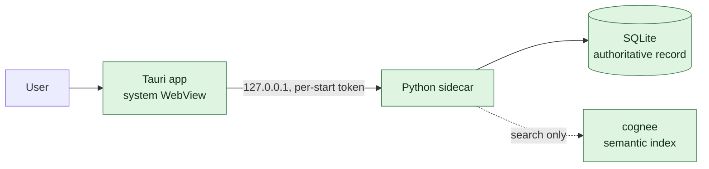

# Icarus

**A personal, long-term AI operating layer.**

Icarus builds a *verifiable* digital model of its user, keeps that memory
independent of any single AI vendor, integrates current information, and
delegates or performs digital work under explicit control.

It is a **downloadable desktop app** — macOS first, Windows after. No Docker, no
server, no setup.

> **Status: early.** The memory core works and is tested: every statement
> carries its origin, changes supersede rather than overwrite, and revoking a
> statement takes everything derived from it with it. There is no chat yet, no
> connectors, and no approval layer. What exists is the part nobody else
> provides; what's missing is the part everybody else already has.

Detailed documentation is in German under [`docs/`](docs/).

## The four pillars

| # | Pillar | Status |
|---|---|---|
| 1 | Verifiable self-model — provenance, versioning, revocation | **Core built.** See [`sidecar/`](sidecar/) |
| 2 | Vendor-independent memory | **Core built.** Authoritative record in local SQLite |
| 3 | Current information — mail, calendar, files, web | **Open** |
| 4 | Controlled delegation and execution | **Specified**, see [`docs/03-delegation.md`](docs/03-delegation.md) |

## How it is put together



**Two stores, deliberately.** The authoritative record lives in SQLite: exact,
addressable by ID, readable without invoking a model. cognee is only the
semantic index — hits are always resolved against the record, so the graph can
never invent a statement. Drop cognee and the record stays complete; only search
degrades to substring matching. That is pillar 2 made real rather than asserted.

Full picture: [`docs/01-architektur.md`](docs/01-architektur.md).

## Getting started

Requires Python 3.10+ and, for the app itself, Rust and Node.

```bash
make sidecar-dev     # memory core + dev dependencies (no cognee, fast)
make test            # 27 tests covering the self-model rules
make sidecar-run     # http://127.0.0.1:8765
```

The memory core needs **no API key and no model**. Recording, superseding,
revoking and exporting all work offline. Only semantic search needs a provider:

```bash
make sidecar-full    # adds cognee (~950 MB, see ADR 0005)
cp .env.example .env # then set LLM_API_KEY
```

### Running the app

```bash
make app-dev         # development, uses the sidecar from your PATH
make app-build       # bundles the sidecar and builds the app
```

`make app-build` produces a `.dmg` and `.app` on macOS. It must run **on** macOS
— a Mac bundle cannot be built from Linux or Windows. Shipping to users also
needs signing and notarisation; see [ADR 0006](docs/adr/0006-tauri-desktop.md).

## Verifying

```bash
make check           # tests + schema validation + cargo check
```

## Repository layout

```
sidecar/             Python: the self-model. Logic, storage, local HTTP API
  icarus_memory/
    model.py         Data model, mirrors schema/self-model.schema.json
    store.py         The rules: supersession, expiry, cascading revocation
    backends.py      SQLite (record) + cognee (semantic index)
    server.py        Loopback-only HTTP API for the app
  tests/             27 tests, no network and no model required
app/                 Tauri desktop app (Rust shell, HTML/JS frontend)
schema/              Self-model JSON Schema and a worked example
docs/                Architecture, self-model, delegation, roadmap, ADRs
```

## Decisions

Two of these reverse earlier ones. The reasoning is kept rather than
overwritten — the same principle the self-model applies to its own data.

- **[ADR 0003](docs/adr/0003-kein-letta.md)** — Letta is not used. The survey
  recommended it; its repository is explicitly deprecated and its self-hosting
  successor is coupled to a vendor cloud.
- **[ADR 0005](docs/adr/0005-cognee-statt-mem0.md)** — cognee instead of Mem0.
  cognee's default stores are file-based, so it fits in an app; Mem0's server
  needs Postgres and pgvector.
- **[ADR 0006](docs/adr/0006-tauri-desktop.md)** — own Tauri app instead of a
  Docker stack. The self-model and the approval layer are not plugins; they
  touch every interaction.
- **[ADR 0004](docs/adr/0004-selbstmodell-schema.md)** — a purpose-built
  self-model schema, because no surveyed project provides cross-domain
  provenance.

Superseded: [ADR 0001](docs/adr/0001-ui-open-webui.md) (Open WebUI),
[ADR 0002](docs/adr/0002-memory-mem0.md) (Mem0).

## License

Apache-2.0 — see [LICENSE](LICENSE). Bundled third-party components keep their
own licenses.
