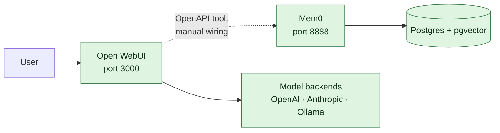

# Icarus

**A personal, long-term AI operating layer.**

Icarus aims to build a *verifiable* digital model of its user, keep that memory
independent of any single AI vendor, integrate current information, and delegate
or perform digital work under explicit control.

> **Status: skeleton.** What runs today is a composed stack — a chat interface, a
> memory layer, and a data store. The two parts that actually differentiate this
> project (a verifiable self-model and a controlled-delegation layer) are
> specified but not built. That gap is deliberate and documented rather than
> papered over.

Detailed documentation is in German under [`docs/`](docs/).

## The four pillars

| # | Pillar | Status |
|---|---|---|
| 1 | Verifiable self-model — provenance, versioning, revocation | **Open.** First concrete step: [`schema/self-model.schema.json`](schema/self-model.schema.json) |
| 2 | Vendor-independent memory | **Partial.** Mem0 on your own Postgres |
| 3 | Current information — web, files, connectors | **Partial.** Available in the UI, not wired up |
| 4 | Controlled delegation and execution | **Open.** Specified in [`docs/03-delegation.md`](docs/03-delegation.md) |

## Architecture



Full picture, including the parts not yet built:
[`docs/01-architektur.md`](docs/01-architektur.md).

## Quickstart

Requires Docker with Compose v2.

```bash
cp .env.example .env
```

Edit `.env` and set at minimum:

- `POSTGRES_PASSWORD` — required, the stack refuses to start without it
  (`openssl rand -base64 24`)
- `JWT_SECRET` — `openssl rand -hex 32`
- `OPENAI_API_KEY` — Mem0 needs a model to extract facts and build embeddings

Then:

```bash
make up
```

| Service | URL |
|---|---|
| Open WebUI | http://localhost:3000 |
| Mem0 API (OpenAPI) | http://localhost:8888/docs |
| Mem0 dashboard (optional) | `make dashboard-up` → http://localhost:3001 |

Postgres is intentionally **not** published to the host.

Run `make help` for all targets. The first `make up` builds the Mem0 image from
source and takes a while — see [ADR 0002](docs/adr/0002-memory-mem0.md) for why
it is built rather than pulled.

### Connecting the interface to the memory layer

**This is not automatic.** Open WebUI ships its own memory feature that knows
nothing about Mem0, so without this step you get two competing memories:

1. In Open WebUI, go to **Settings → Tools → Add Connection**
2. Point it at Mem0's OpenAPI description: `http://mem0:8000/openapi.json`

No `mcpo` proxy is needed — Mem0 already speaks HTTP with OpenAPI.

Mem0 is authenticated by default. Run `make bootstrap-hinweis` for how to create
the first admin and API key.

## Verifying

```bash
make validate-schema   # self-model example against the JSON Schema (needs: pip install jsonschema)
make config            # validate docker-compose.yml without starting anything
make smoke             # check that a running stack responds
```

## Repository layout

```
docker-compose.yml     Open WebUI + Mem0 + Postgres/pgvector, all refs pinned
schema/                Self-model JSON Schema and a worked example
docs/
  00-recherche.md      Open-source landscape survey (as of July 2026)
  01-architektur.md    Reference architecture
  02-selbstmodell.md   Pillar 1 — the verifiable self-model
  03-delegation.md     Pillar 4 — approvals, audit, execution
  04-roadmap.md        Sequencing and effort estimates
  adr/                 Architecture decisions and their rationale
```

## Notable decisions

- **[ADR 0001](docs/adr/0001-ui-open-webui.md)** — Open WebUI as the interface,
  accepting its mixed licensing.
- **[ADR 0002](docs/adr/0002-memory-mem0.md)** — Mem0 as the memory layer, built
  from source because the published image is arm64-only.
- **[ADR 0003](docs/adr/0003-kein-letta.md)** — **Letta is not used.** The survey
  recommended it, but its repository is explicitly deprecated and its
  self-hosting successor is coupled to a vendor cloud. This reverses the
  survey's second recommendation.
- **[ADR 0004](docs/adr/0004-selbstmodell-schema.md)** — a purpose-built
  self-model schema, because no surveyed project provides cross-domain
  provenance.

## License

Apache-2.0 — see [LICENSE](LICENSE). Bundled third-party components keep their
own licenses; note in particular Open WebUI's mixed licensing, discussed in
ADR 0001.
