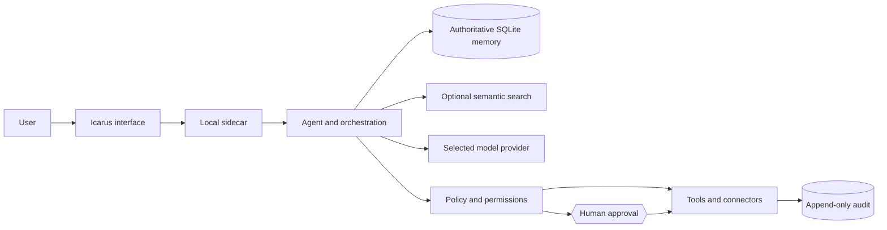

# Icarus

**A personal, long-term and model-independent AI operating system.**

Icarus builds a verifiable digital model of its user, keeps memory independent
of any single AI vendor and controls digital work through one coherent
interface.

The long-term goal is not another chatbot. Icarus is intended to become a
personal **Chief of Staff**, **digital twin** and **control layer for digital
life**.

> **Models are replaceable engines. Icarus owns the continuity:** memory,
> projects, habits, permissions, relationships and history remain when the
> engine changes.

## Read this first

1. [Product vision and development charter](docs/00-produktvision.md)
2. [First product stage: the daily Chief of Staff](docs/00a-erste-produktstufe.md)
3. [Current reference architecture](docs/01-architektur.md)
4. [Documentation map](docs/README.md)

The product vision describes the destination. The reference architecture
describes what is implemented today. Do not treat target components in diagrams
or roadmaps as already built.

## Current status

> **Technically advanced alpha. End-to-end, but not yet a consumer beta.**

Implemented today:

- local, vendor-independent authoritative memory;
- provenance, time, supersession, disputes and cascading revocation;
- conversation, episodes and confirmed assertions as separate memory layers;
- consolidation that proposes but never silently writes durable facts;
- projects, tasks and notes;
- IMAP/SMTP mail and CalDAV calendar integrations;
- file ingestion, basic web retrieval and scheduled processing;
- policy-controlled tools, approvals and append-only audit;
- prompt-injection containment for untrusted content;
- OS keychain support with an encrypted file fallback;
- MCP access to the same memory, policy and audit trail;
- a first consumer shell with four primary areas and progressively disclosed technical views;
- Tauri desktop application and a container-based secondary path;
- full installation backups containing all local databases and settings;
- automated browser, container and bundled-sidecar backup/restore verification.

Still missing or not yet product-grade:

- validated consumer onboarding and information architecture with real target users;
- a prioritising daily Chief-of-Staff experience rather than aggregated cards;
- meeting briefs and systematic open-loop detection;
- a binding entity and knowledge-graph model;
- intelligent model routing and model evaluation;
- current-world search with source comparison and personal relevance;
- browser automation and controlled computer use;
- encrypted multi-device synchronisation and mobile access;
- broad testing against real mail and calendar providers.

## First product stage

Before Icarus expands into universal computer control, it must reliably solve
three everyday jobs:

1. explain what matters today;
2. prepare the user for meetings with complete context;
3. find open loops and prepare the next action.

The first target user is a busy knowledge worker, entrepreneur or project owner
who coordinates many projects, messages, appointments and obligations.

## Product principle

> **Build the solution that is simplest for the user, not the one that is
> simplest to implement.**

A normal user should not need to understand providers, embeddings, MCP, IMAP
hosts, context windows, vector databases or agent routing.

Where simplicity and control conflict, control wins. The controlled path must
then be made simpler rather than removed.

## Current architecture



This diagram describes the current core. A future model router, knowledge graph,
browser layer and multi-device service sit around this core; they do not replace
it.

Detailed architecture: [`docs/01-architektur.md`](docs/01-architektur.md)

## Memory contract

Icarus distinguishes between:

1. **Conversation context** — immediate working context;
2. **Episodes** — raw mail, events, notes, files and other material;
3. **Assertions** — reviewed durable statements with provenance and history.

Raw material is not automatically truth.

> **Consolidation proposes. It does not write.**

A durable claim keeps its source, time, evidence and extraction process.
Rejected proposals remain visible. Conflicting assertions are marked
`disputed`, excluded from normal use and presented separately for clarification.

Details:

- [`docs/02-selbstmodell.md`](docs/02-selbstmodell.md)
- [`docs/06-gedaechtnis-kontrakt.md`](docs/06-gedaechtnis-kontrakt.md)
- [`docs/08-gedaechtnisschichten.md`](docs/08-gedaechtnisschichten.md)
- [`docs/10-verdichtung.md`](docs/10-verdichtung.md)

## Safety contract

Models may request tools. They do not execute them directly.

- read-only actions can run automatically;
- local changes are visible and audited;
- outward actions require an appropriate approval;
- untrusted content raises the approval level for subsequent effective actions;
- every result, refusal and failure is recorded.

Mail, calendar invitations, web pages, files and imported notes are treated as
data rather than instruction.

Details:

- [`docs/03-delegation.md`](docs/03-delegation.md)
- [`docs/05-sicherheit.md`](docs/05-sicherheit.md)

## Backups

When only an isolated self-model exists, Icarus retains the legacy readable
SQLite snapshot format. In a real installation, a backup is a versioned ZIP
bundle containing:

- `self-model.sqlite3`
- `audit.sqlite3`
- `tasks.sqlite3`
- `workspace.sqlite3`
- `episodes.sqlite3`
- `proposals.sqlite3`
- `einstellungen.json`
- `schluessel.icarus`, if the encrypted fallback is used

The bundle contains a manifest with sizes and SHA-256 checksums. Every database
is checked before restore, and the current state is preserved alongside it.

Credentials stored in the operating-system keychain are not exportable and must
be entered again on another device.

## Getting started

### Packaged macOS application

The currently verified native artifact targets **Apple Silicon Macs only**
(`aarch64`: M1 and newer). The Tauri application and its bundled PyInstaller
sidecar are built and tested for the same architecture.

Intel Macs are not currently supported by the packaged application. A genuine
universal release requires a separately built and tested x86_64 application and
x86_64 sidecar; Icarus does not label an ARM-only bundle as universal.

Without Apple signing secrets, CI produces an explicitly marked unsigned build
for testing. A public download must be signed and notarised before release.

### Container

```bash
make start NOTIZEN=~/Documents/Obsidian
```

The notes folder is optional and mounted read-only.

```bash
make stop
```

Full guide: [`docs/15-loslegen.md`](docs/15-loslegen.md)

### From source

Python 3.10+ is required. Rust and Node are additionally required for the native
application.

```bash
make sidecar-dev
make test
make sidecar-run
```

The memory core works without an API key and without a model. For conversation,
configure a provider in the setup wizard or use an environment override:

```bash
ICARUS_PROVIDER=ollama make sidecar-run
ANTHROPIC_API_KEY=... make sidecar-run
```

For semantic search:

```bash
make sidecar-full
```

For the desktop application:

```bash
make app-dev
make app-build
```

## Repository layout

```text
sidecar/             Python memory, policy, agent and connectors
app/                 Tauri desktop application and browser-capable frontend
schema/              Portable self-model JSON Schema
packaging/           Bundling configuration
scripts/             Development and validation helpers
docs/                Vision, product focus, contracts, architecture and ADRs
.github/workflows/   Tests and application builds
```

## Verification

```bash
make check
```

Tests run without network access and without a live model. Guarantees should be
validated with sabotage probes where practical: deliberately break the
guarantee and confirm that the intended test fails.

CI additionally verifies:

- runtime enums match the public JSON Schema;
- a disputed self-model export remains schema-valid;
- full backup and restore through a real Chromium UI flow;
- full backup and restore in the frozen macOS sidecar;
- the packaged macOS application and sidecar share the Apple-Silicon architecture.

## Contribution rule

A feature is not complete merely because the backend works. It must:

- move Icarus toward the product vision and current product stage;
- preserve provenance, user ownership and explicit control;
- use safe defaults;
- avoid demanding technical knowledge from ordinary users;
- explain outcomes and failures in human language;
- be tested through the real integration path;
- avoid creating a second memory, policy, approval or identity system;
- update the binding documentation when the actual system contract changes.

## License

Apache-2.0 — see [LICENSE](LICENSE). Bundled third-party components keep their
own licenses.
