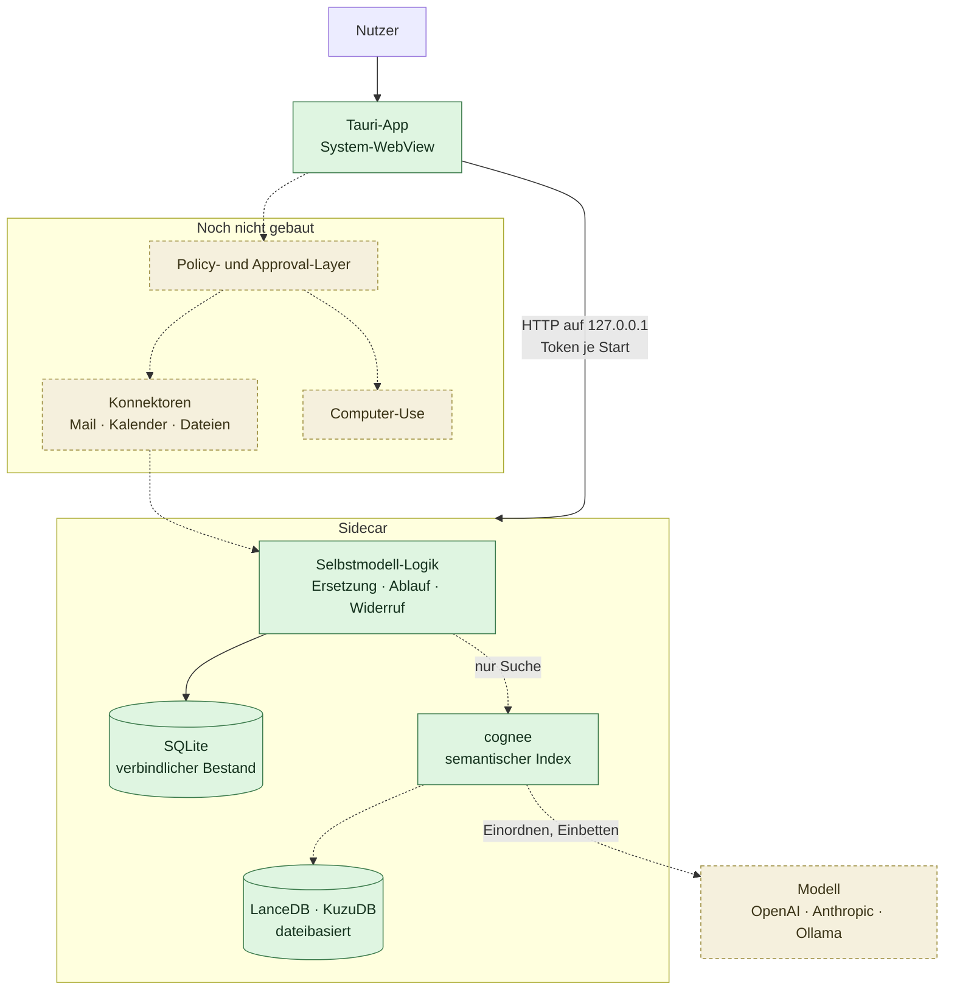

# Referenzarchitektur

## Produktthese

> Ein persönliches, langfristiges KI-Betriebssystem, das ein **überprüfbares digitales Modell** seines Nutzers aufbaut, dessen **Gedächtnis unabhängig von einzelnen KI-Anbietern** verwaltet, **aktuelle Informationen** integriert und **digitale Arbeit kontrolliert delegieren oder ausführen** kann.

Aus dieser These folgen vier Säulen. Jeder Baustein wird daran gemessen, nicht an Feature-Listen.

| # | Säule | Stand |
|---|---|---|
| 1 | Überprüfbares Selbstmodell | **Gebaut, im Kern.** Provenienz, Ersetzung, Ablauf und kaskadierender Widerruf laufen und sind getestet. |
| 2 | Anbieterunabhängiges Gedächtnis | **Gebaut, im Kern.** Der Bestand liegt in lokalem SQLite und überlebt einen Wechsel der Memory-Bibliothek. |
| 3 | Aktuelle Informationen | **Offen.** Konnektoren für Mail, Kalender, Dateien und Web fehlen. |
| 4 | Kontrollierte Delegation | **Spezifiziert, nicht gebaut.** Siehe [03-delegation.md](03-delegation.md). |

## Betriebsform: eine App, kein Stack

Icarus ist eine **downloadbare Desktop-Anwendung**, zuerst für macOS, später Windows. Kein Docker, kein Server, keine Einrichtung.

Das war nicht immer so. Die erste Fassung dieser Architektur setzte auf einen Docker-Compose-Stack aus Open WebUI und Mem0. Diese Entscheidung wurde revidiert, als das Ziel „downloadbare App" feststand: Ein Nutzer, der Docker Desktop installieren muss, bevor er eine Notiz speichern kann, ist nicht die Zielgruppe. Die Begründungen stehen in [ADR 0005](adr/0005-cognee-statt-mem0.md) und [ADR 0006](adr/0006-tauri-desktop.md).

## Aufbau

## Die zwei Speicher, und warum es zwei sind

Das ist die zentrale Entscheidung der Gedächtnisschicht und der häufigste Punkt für Missverständnisse.

**Der verbindliche Bestand liegt in SQLite.** Aussagen, Provenienz, Ersetzungs- und Ableitungsketten müssen exakt sein, per ID adressierbar, deterministisch lesbar und ohne Modellaufruf verfügbar. Ein per LLM befüllter Wissensgraph erfüllt das nicht: Er ist verlustbehaftet und nicht reproduzierbar. Als alleinige Quelle der Wahrheit für ein **überprüfbares** Selbstmodell ist er ungeeignet.

**cognee ist der semantische Index.** Dort liegt seine Stärke: Ähnlichkeitssuche und Graph-Traversierung über die Formulierungen. Treffer aus cognee werden immer gegen den Bestand aufgelöst — der Graph kann keine Aussage erfinden, die im Bestand nicht existiert.

Der praktische Nutzen dieser Trennung: Fällt cognee weg, bleibt der Bestand **vollständig**. Nur die Suche fällt auf Substringsuche zurück. Das ist Säule 2 in praktischer Form statt als Absichtserklärung — und es ist im Code als Schnittstelle `Backend` festgehalten, nicht bloß als Vorsatz.

Ebenso landet **Widerrufenes und Ersetztes nie im semantischen Index**. Sonst käme es über Ähnlichkeit wieder hoch, obwohl es nicht mehr gilt.

## Der Sidecar

Die App startet den Python-Sidecar als Kindprozess:

- Der **Port** wird beim Start vom Betriebssystem vergeben, nicht fest verdrahtet.
- Ein **Token** wird bei jedem Start neu erzeugt und per Umgebungsvariable übergeben. Ohne das könnte jeder lokale Prozess das Selbstmodell auslesen — auf einem Einzelplatzrechner ist genau das der relevante Angriffsweg.
- Gebunden wird ausschließlich an `127.0.0.1`. Es gibt bewusst keine Option, den Sidecar zu öffnen.
- Beim Beenden der App wird der Kindprozess terminiert, sonst hält er die Datenbank offen.

Die Schnittstelle ist bewusst klein: Aussagen aufnehmen, verwendbare lesen, suchen, Kette einer Aussage anzeigen, bestätigen, widerrufen, exportieren.

## Warum die Oberfläche Eigenarbeit ist

Open WebUI und AnythingLLM bringen fertig mit, was hier gebaut werden muss. Trotzdem fiel die Entscheidung für eine eigene Hülle, und der Grund ist eine Eigentumsfrage.

Die beiden Dinge, die Icarus von einem Chat-Frontend unterscheiden, sind keine Plugins. **Herkunft muss bei jeder Aussage sichtbar sein** — deshalb steht unter jeder Zeile, woher sie stammt, und nicht in einem aufklappbaren Detail. **Jede Aktion muss durch die Freigabeklassifikation** — das greift in jede Interaktion ein. In einer fremden App leben diese Dinge als Fremdkörper.

Der Report benennt UX-Vereinfachung als größten Zeitfresser und zugleich als eigentliche Produktdifferenzierung. Diesen Teil auszulagern hieße, den Kern auszulagern.

## Bewusst offene Stellen

**Policy- und Approval-Layer.** Muss vor jeder Form von Ausführung existieren, nicht danach. Spezifikation in [03-delegation.md](03-delegation.md).

**Konnektoren.** Mail, Kalender, Dateien und Web sind Säule 3. Sobald sie schreibend werden, hängen sie am Approval-Layer.

**Computer-Use.** Agent Zero bleibt der stärkste offene Kandidat, kommt aber erst nach Säule 4. Ein Assistent mit Desktop-Zugriff ohne Freigabemodell ist kein Feature, sondern ein Risiko.

**Gesprächsführung.** Es gibt noch keinen Chat. Die App kann heute Aussagen aufnehmen, anzeigen und widerrufen — sie ist der Gedächtniskern mit Oberfläche, nicht der Assistent.

**Verdichtung.** Reflexionen über viele Episoden hinweg — die Ebene, die aus Erinnerungen ein Selbstbild macht — fehlen. Siehe [02-selbstmodell.md](02-selbstmodell.md).
