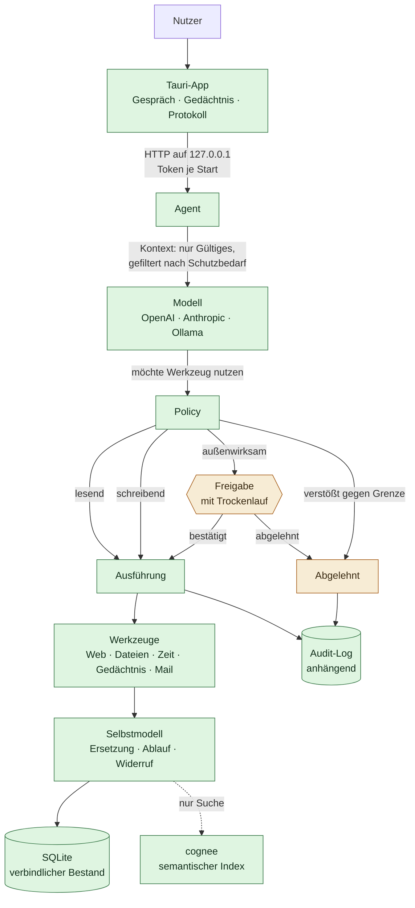

# Referenzarchitektur

## Produktthese

> Ein persönliches, langfristiges KI-Betriebssystem, das ein **überprüfbares digitales Modell** seines Nutzers aufbaut, dessen **Gedächtnis unabhängig von einzelnen KI-Anbietern** verwaltet, **aktuelle Informationen** integriert und **digitale Arbeit kontrolliert delegieren oder ausführen** kann.

Aus dieser These folgen vier Säulen. Jeder Baustein wird daran gemessen, nicht an Feature-Listen.

| # | Säule | Stand |
|---|---|---|
| 1 | Überprüfbares Selbstmodell | **Gebaut, im Kern.** Provenienz, Ersetzung, Ablauf und kaskadierender Widerruf laufen und sind getestet. |
| 2 | Anbieterunabhängiges Gedächtnis | **Gebaut, im Kern.** Der Bestand liegt in lokalem SQLite und überlebt einen Wechsel der Memory-Bibliothek. |
| 3 | Aktuelle Informationen | **Gebaut.** Mail (IMAP/SMTP), Kalender (CalDAV), Aufgaben, Web, Dateien. |
| 4 | Kontrollierte Delegation | **Gebaut.** Aktionsklassen, Freigabestufen, Trockenlauf, anhängendes Audit-Log. |

## Betriebsform: eine App, kein Stack

Icarus ist eine **downloadbare Desktop-Anwendung**, zuerst für macOS, später Windows. Kein Docker, kein Server, keine Einrichtung.

Das war nicht immer so. Die erste Fassung dieser Architektur setzte auf einen Docker-Compose-Stack aus Open WebUI und Mem0. Diese Entscheidung wurde revidiert, als das Ziel „downloadbare App" feststand: Ein Nutzer, der Docker Desktop installieren muss, bevor er eine Notiz speichern kann, ist nicht die Zielgruppe. Die Begründungen stehen in [ADR 0005](adr/0005-cognee-statt-mem0.md) und [ADR 0006](adr/0006-tauri-desktop.md).

## Aufbau

Der wichtigste Pfad in diesem Bild ist der, der **nicht** direkt durchgeht: Das Modell kann Werkzeuge vorschlagen, aber nichts auslösen. Zwischen Vorschlag und Ausführung sitzt die Policy, und alles landet im Protokoll — auch das Abgelehnte.

## Die zwei Speicher, und warum es zwei sind

Das ist die zentrale Entscheidung der Gedächtnisschicht und der häufigste Punkt für Missverständnisse.

**Der verbindliche Bestand liegt in SQLite.** Aussagen, Provenienz, Ersetzungs- und Ableitungsketten müssen exakt sein, per ID adressierbar, deterministisch lesbar und ohne Modellaufruf verfügbar. Ein per LLM befüllter Wissensgraph erfüllt das nicht: Er ist verlustbehaftet und nicht reproduzierbar. Als alleinige Quelle der Wahrheit für ein **überprüfbares** Selbstmodell ist er ungeeignet.

**cognee ist der semantische Index.** Dort liegt seine Stärke: Ähnlichkeitssuche und Graph-Traversierung über die Formulierungen. Treffer aus cognee werden immer gegen den Bestand aufgelöst — der Graph kann keine Aussage erfinden, die im Bestand nicht existiert.

Der praktische Nutzen dieser Trennung: Fällt cognee weg, bleibt der Bestand **vollständig**. Nur die Suche fällt auf Substringsuche zurück. Das ist Säule 2 in praktischer Form statt als Absichtserklärung — und es ist im Code als Schnittstelle `Backend` festgehalten, nicht bloß als Vorsatz.

Ebenso landet **Widerrufenes und Ersetztes nie im semantischen Index**. Sonst käme es über Ähnlichkeit wieder hoch, obwohl es nicht mehr gilt.

## Der Sidecar

Die App startet den Python-Sidecar als Kindprozess:

- Der **Port** wird beim Start vom Betriebssystem vergeben, nicht fest verdrahtet.
- Ein **Token** wird bei jedem Start neu erzeugt und per Umgebungsvariable übergeben. Ohne das könnte jeder lokale Prozess das Selbstmodell auslesen — auf einem Einzelplatzrechner ist genau das der relevante Angriffsweg.
- Gebunden wird ausschließlich an `127.0.0.1`. Es gibt bewusst keine Option, den Sidecar zu öffnen.
- Beim Beenden der App wird der Kindprozess terminiert, sonst hält er die Datenbank offen.

Die Schnittstelle ist bewusst klein: Aussagen aufnehmen, verwendbare lesen, suchen, Kette anzeigen, bestätigen, widerrufen, exportieren — dazu Gespräch, Freigaben, Protokoll, `/context`, Aufgaben und `/dashboard`.

## Warum Aufgaben nicht ins Selbstmodell gehören

Es wäre verlockend, Aufgaben als Aussagen vom Typ `goal` zu führen. Sie liegen trotzdem in einer eigenen Ablage, weil der Lebenszyklus ein anderer ist: Aussagen im Selbstmodell beschreiben, **wie jemand ist**, und werden ersetzt oder widerrufen. Aufgaben beschreiben, **was zu tun ist**, und werden erledigt oder fallengelassen. Beides in ein Modell zu pressen würde beide verwässern.

Übernommen wird das Prinzip: Auch eine Aufgabe trägt ihre Herkunft. Taucht in drei Monaten „Rechnung an Müller schicken" auf, muss beantwortbar sein, ob das aus einer Mail kam, aus einem Gespräch, oder ob das System es sich ausgedacht hat.

Erledigt und fallengelassen sind bewusst zwei Zustände. Ohne diese Trennung sieht ein Jahresrückblick so aus, als wäre alles geschafft worden.

## Was das Modell zu sehen bekommt

`Agent.context()` baut den Wissensblock, und zwar aus `usable()` — nichts Ersetztes, nichts Abgelaufenes, nichts Widerrufenes. Hier zahlt sich das Selbstmodell konkret aus: Ein flacher Faktenspeicher würde „Wohnt in Hamburg" munter mitliefern, obwohl der Umzug längst erfasst ist.

Zusätzlich greift der Schutzbedarf. Aussagen mit `special_category` gehen **nicht** an ein externes Modell. Dem Modell wird stattdessen gesagt, dass etwas zurückgehalten wurde — eine verschwiegene Lücke wäre schlimmer als eine benannte, weil das Modell sonst aus dem Fehlen falsche Schlüsse zieht.

Der Endpunkt `/context` gibt diesen Block wörtlich aus, und die Oberfläche zeigt ihn unter „Gedächtnis". Der Nutzer soll nachlesen können, was übermittelt wird, statt es glauben zu müssen.

## Anbieter sind austauschbar

Zwei Formen decken praktisch das Feld ab: **OpenAI-kompatibel** — was auch Ollama, LM Studio, vLLM und llama.cpp einschließt — und **Anthropic**. Ein vollständig lokaler Betrieb ist damit eine Frage der Basis-URL, keine Sonderbehandlung.

Der Rest des Systems kennt nur `Provider`, `Reply` und `ToolCall` und weiß nicht, wer antwortet. Das ist Säule 2 auf der Modellseite: Das Gedächtnis liegt ohnehin lokal, und der Anbieter davor lässt sich wechseln, ohne dass die Person dabei verloren geht.

## Warum die Oberfläche Eigenarbeit ist

Open WebUI und AnythingLLM bringen fertig mit, was hier gebaut werden muss. Trotzdem fiel die Entscheidung für eine eigene Hülle, und der Grund ist eine Eigentumsfrage.

Die beiden Dinge, die Icarus von einem Chat-Frontend unterscheiden, sind keine Plugins. **Herkunft muss bei jeder Aussage sichtbar sein** — deshalb steht unter jeder Zeile, woher sie stammt, und nicht in einem aufklappbaren Detail. **Jede Aktion muss durch die Freigabeklassifikation** — das greift in jede Interaktion ein. In einer fremden App leben diese Dinge als Fremdkörper.

Der Report benennt UX-Vereinfachung als größten Zeitfresser und zugleich als eigentliche Produktdifferenzierung. Diesen Teil auszulagern hieße, den Kern auszulagern.

## Bewusst offene Stellen

**Konnektoren sind ungetestet gegen echte Server.** IMAP, SMTP und CalDAV sind implementiert und gegen Fakes geprüft; ein Lauf gegen einen echten Server steht aus. Der iCalendar-Parser deckt Zeitpunkt, Titel, Ort und Teilnehmer ab — Wiederholungsregeln nicht.

**Computer-Use.** Agent Zero bleibt der stärkste Kandidat. Jetzt, wo die Policy steht, ist der Weg dafür frei: Die Anbindung erfolgt hinter der Freigabeschicht, nie direkt an der Oberfläche.

**Verdichtung.** Reflexionen über viele Episoden hinweg — die Ebene, die aus Erinnerungen ein Selbstbild macht — fehlen. Siehe [02-selbstmodell.md](02-selbstmodell.md).

**Grenzen greifen wörtlich.** Ein `constraint` trifft über Werkzeugnamen und Inhaltswörter. Das ist nachvollziehbar und bewusst nicht per Modell ausgelegt — bei harten Grenzen will man keine Auslegung —, aber es erkennt keine Umschreibungen.

**Secrets liegen in `.env`.** Ein Schlüsselbund-Zugriff ist nicht gebaut.
