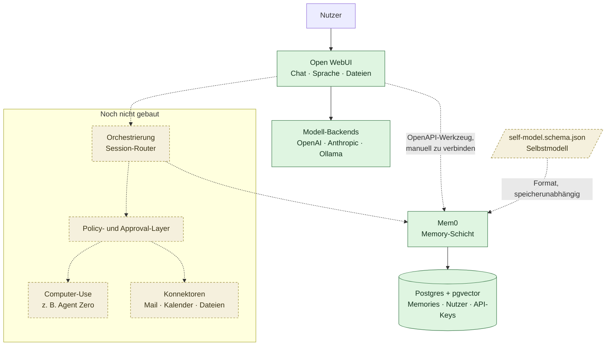

# Referenzarchitektur

## Produktthese

> Ein persönliches, langfristiges KI-Betriebssystem, das ein **überprüfbares digitales Modell** seines Nutzers aufbaut, dessen **Gedächtnis unabhängig von einzelnen KI-Anbietern** verwaltet, **aktuelle Informationen** integriert und **digitale Arbeit kontrolliert delegieren oder ausführen** kann.

Aus dieser These folgen vier Säulen. Jeder Baustein wird daran gemessen, nicht an Feature-Listen.

| # | Säule | Heutiger Stand im Skelett |
|---|---|---|
| 1 | Überprüfbares Selbstmodell | **Offen.** Kein untersuchtes Projekt liefert das. Erster konkreter Schritt: [`schema/self-model.schema.json`](../schema/self-model.schema.json), beschrieben in [02-selbstmodell.md](02-selbstmodell.md). |
| 2 | Anbieterunabhängiges Gedächtnis | **Teilweise.** Mem0 auf eigenem Postgres; die Daten liegen im eigenen Haus. Belegte Exportierbarkeit steht aus. |
| 3 | Aktuelle Informationen | **Teilweise.** Open WebUI bringt Websuche, Dateien und Werkzeuge mit — im Skelett bewusst nicht verdrahtet. |
| 4 | Kontrollierte Delegation | **Offen.** Spezifiziert in [03-delegation.md](03-delegation.md), nicht implementiert. |

Säule 1 und 4 sind der eigentliche Differenzierer. Sie sind bewusst **nicht** durch Fremdkomponenten abgedeckt, und das Skelett soll diese Lücke sichtbar lassen statt sie zu kaschieren.

## Aufbau

Durchgezogene Linien sind im Skelett vorhanden, gestrichelte sind Konfigurationsarbeit oder noch nicht gebaut.

## Die drei laufenden Bausteine

### Open WebUI — Bedienoberfläche

Gepinnt auf `v0.11.0`, erreichbar auf Port 3000. Ausgewählt, weil es im untersuchten Feld die reifste Oberfläche ist und Modelle austauschbar hält: lokal über Ollama oder jede OpenAI-kompatible API. Damit ist Säule 2 auf der Modellseite bereits erfüllt — die Oberfläche bindet sich an keinen Anbieter.

Lizenz-Caveat: Der Kern steht nicht mehr rein unter einer klassischen OSI-Lizenz, sondern enthält Bestandteile unter der Open WebUI License. Siehe [ADR 0001](adr/0001-ui-open-webui.md).

### Mem0 — Memory-Schicht

Apache-2.0, gepinnt auf einen Commit, gebaut aus dem Unterverzeichnis `server` des Mem0-Repos. REST-Schnittstelle mit OpenAPI-Beschreibung auf Port 8888.

Mem0 extrahiert Fakten aus Gesprächen, sucht hybrid (semantisch, lexikalisch, Entitäten) und kennt Zeitstempel und Ablaufdaten. Das ist die beste verfügbare Grundlage, aber noch **kein** überprüfbares Selbstmodell im Sinne von Säule 1 — deshalb das eigene Schema.

Warum aus der Quelle gebaut und nicht das fertige Image: das veröffentlichte `mem0/mem0-api-server` ist arm64-only. Siehe [ADR 0002](adr/0002-memory-mem0.md).

### Postgres mit pgvector

`pgvector/pgvector:pg17`. Hält zwei Datenbanken: die Default-Datenbank als Vektorspeicher für Memories, und `mem0_app` für Nutzer, Auth und API-Keys. Letztere wird beim ersten Start durch [`docker/postgres/init-db.sh`](../docker/postgres/init-db.sh) angelegt.

Der Container veröffentlicht bewusst **keinen** Host-Port. Er ist nur innerhalb des Compose-Netzes erreichbar.

## Der Integrationspfad zwischen Oberfläche und Gedächtnis

Das ist der Punkt, an dem das Skelett ehrlich sein muss: **Open WebUI und Mem0 sind nicht automatisch miteinander verdrahtet.**

Open WebUI bringt ein *eigenes*, davon unabhängiges Memory-Feature mit. Wer nichts weiter tut, bekommt zwei getrennte Gedächtnisse — genau der Zustand, den dieses Projekt vermeiden will.

Die Verbindung ist Konfigurationsarbeit:

1. Mem0 beschreibt sich selbst als OpenAPI unter `http://localhost:8888/docs` (im Compose-Netz `http://mem0:8000`).
2. In Open WebUI unter **Settings → Tools → Add Connection** diese OpenAPI-Beschreibung eintragen.
3. Open WebUI kann Mem0 dann als Werkzeug aufrufen.

Ein Proxy wie `mcpo` wird hier **nicht** gebraucht. Der ist nur nötig, um MCP-Server anzubinden, die über stdio sprechen — Mem0 spricht bereits HTTP mit OpenAPI.

Offene Frage für die nächste Ausbaustufe: Open WebUIs eigenes Memory sollte deaktiviert oder auf Mem0 umgebogen werden, damit es genau eine Quelle der Wahrheit gibt.

## Bewusst offene Stellen

**Agent-Core.** Der Recherche-Report empfahl Letta. Diese Empfehlung ist überholt — das Repo ist deprecated, der Nachfolger an eine Cloud gekoppelt. Details in [ADR 0003](adr/0003-kein-letta.md). Der Platz bleibt vorerst leer; Open WebUI übernimmt die Gesprächsführung.

**Policy- und Approval-Layer.** Muss vor jeder Form von Ausführung existieren, nicht danach. Spezifikation in [03-delegation.md](03-delegation.md).

**Computer-Use.** Agent Zero ist der stärkste offene Kandidat, kommt aber bewusst erst nach dem Approval-Layer ins Compose. Ein Assistent mit Desktop-Zugriff und ohne Freigabemodell ist kein Feature, sondern ein Risiko.

**Konnektoren.** Mail, Kalender und Dateien sind Säule 3 und hängen ebenfalls am Approval-Layer, sobald sie schreibend werden.
