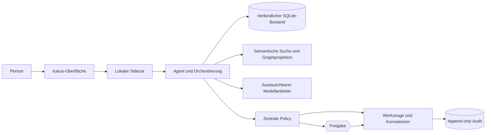
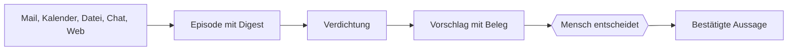

# Referenzarchitektur

> **Status:** aktuelle Ist-Architektur  
> **Gültig seit:** 2026-08-02  
> **Verbindlich für:** `sidecar/`, `app/`, `schema/`  
> **Zuletzt gegen den Code geprüft:** 2026-08-02  
> **Zielbild:** [`00-produktvision.md`](00-produktvision.md)

## Produktthese

Icarus ist ein persönliches, langfristiges und modellunabhängiges
KI-Betriebssystem. Der heutige Code bildet dafür einen lokalen, überprüfbaren
Kern. Browsersteuerung, intelligentes Modellrouting, Multi-Device und der
vollständige Wissensgraph sind Zielarchitektur, nicht bereits fertig.

## Aktueller Stand der vier Säulen

| Säule | Heutiger Stand |
|---|---|
| Überprüfbares Selbstmodell | gebaut: Provenienz, Zeitbezug, Ersetzung, Ablauf, Konflikte und kaskadierender Widerruf |
| Anbieterunabhängiges Gedächtnis | gebaut: SQLite als verbindlicher Bestand, optionaler semantischer Index, OpenAI-kompatibel, Anthropic und Ollama |
| Aktuelle Arbeitsinformationen | gebaut im Alpha-Umfang: Projekte, Aufgaben, Notizen, Dateien, Webabruf, IMAP/SMTP und CalDAV |
| Kontrollierte Delegation | gebaut: Aktionsklassen, Freigaben, Trockenlauf, Audit und Kontaminationseskalation |

## Betriebsformen

Die primäre Produktform ist eine Tauri-Desktop-App mit lokalem Python-Sidecar.
Der Container bleibt als zweiter Betriebs- und Entwicklungsweg erhalten.

Beide Wege verwenden denselben Kern:

- dieselben Datenmodelle,
- dieselbe Policy,
- denselben Audit-Vertrag,
- dieselben Gedächtnisregeln,
- dieselben HTTP-Endpunkte.

Der Container ist kein gleichwertiger Ersatz für spätere native Funktionen wie
Computer-Use oder Betriebssystemintegration.

## Aufbau

Der Sidecar bindet standardmäßig nur an Loopback. Ein zufälliger Port und ein
Token pro App-Start schützen gegen andere lokale Prozesse.

## Datenebenen

Icarus verwendet mehrere getrennte lokale Datenbanken, weil ihre Lebenszyklen
unterschiedlich sind:

| Datei | Inhalt |
|---|---|
| `self-model.sqlite3` | bestätigte Aussagen über die Person |
| `episodes.sqlite3` | aufgenommenes Rohmaterial |
| `proposals.sqlite3` | Vorschläge und menschliche Entscheidungen |
| `workspace.sqlite3` | Projekte und Notizen |
| `tasks.sqlite3` | Aufgaben |
| `audit.sqlite3` | unveränderlicher Handlungsverlauf |

Zusätzlich liegen `einstellungen.json` und gegebenenfalls die verschlüsselte
Fallback-Datei `schluessel.icarus` im Datenverzeichnis.

Diese Trennung darf nicht zu getrennten Produktwahrheiten führen. Gemeinsame
IDs, Herkunft und Orchestrierung verbinden die Ebenen.

## Verbindlicher Bestand und semantische Projektion

SQLite ist die Quelle der Wahrheit. Semantische Suche und künftige
Graphprojektionen dürfen:

- Treffer finden,
- Beziehungen vorschlagen,
- Kontext verdichten,
- Navigation ermöglichen.

Sie dürfen keine Aussage erzeugen, die nicht auf den verbindlichen Bestand
zurückgeführt werden kann. Fällt der semantische Index aus, bleiben Identität,
Projekte und Herkunft vollständig erhalten.

## Modellanbieter

Der heutige Provider-Vertrag normalisiert OpenAI-kompatible APIs und Anthropic.
Ollama und andere lokale OpenAI-kompatible Server sind über dieselbe Schnittstelle
nutzbar.

Der heutige Stand ist **Anbieteraustausch**, noch kein intelligentes Routing.
Künftiges Routing nach Qualität, Schutzbedarf, Kosten, Latenz und Fähigkeit wird
vor dem Provider-Vertrag ergänzt, nicht in das Gedächtnis eingebaut.

## Werkzeugausführung

Ein Modell führt nichts direkt aus:

1. Das Modell schlägt einen Werkzeugaufruf vor.
2. Das Werkzeug deklariert Schema und Aktionsklasse.
3. Die Policy berücksichtigt Grenzen, Fremdinhalte und Voreinstellungen.
4. Lesen läuft, interne Änderungen werden sichtbar, Außenwirkung braucht
   Freigabe.
5. Jeder Ausgang landet im Audit-Log.

MCP nutzt denselben Sidecar. Es gibt keine zweite Datenbank und keine zweite
Freigabelogik für fremde Assistenten.

## Gedächtnisfluss

Die unverhandelbare Regel lautet:

> **Verdichtung schlägt vor. Sie schreibt nicht.**

## Sicherung und Portabilität

Ein reales Icarus-Backup umfasst inzwischen:

- alle sechs lokalen Datenbanken,
- Einstellungen,
- die verschlüsselte Schlüsseldatei, sofern verwendet,
- ein Manifest mit Formatversion, Größen und SHA-256-Prüfsummen.

Vor einer Wiederherstellung werden Archiv, Prüfsummen und SQLite-Integrität
vollständig geprüft. Der vorhandene Stand wird vorher beiseitegelegt.

Geheimnisse aus dem Betriebssystem-Schlüsselbund sind nicht exportierbar und
müssen auf einem neuen Gerät erneut eingetragen werden.

## Bewusst offene Architekturteile

- verbindliches Entitäten- und Graphmodell,
- intelligenter Modellrouter und Evaluation,
- Such- und Nachrichtenquellen mit Quellenvergleich,
- Connector-Manifeste für differenzierte reale Folgen,
- Browser- und Computersteuerung,
- sichere Identität und Synchronisation über mehrere Geräte,
- Consumer-Navigation und onboardingbasierter erster Nutzen,
- Praxistests gegen reale Mail-, Kalender- und Betriebssystemumgebungen.

Diese Punkte stehen in der Roadmap. Sie dürfen den heutigen Kern nicht umgehen
oder eine zweite Speicher-, Policy- oder Identitätsschicht erzeugen.
