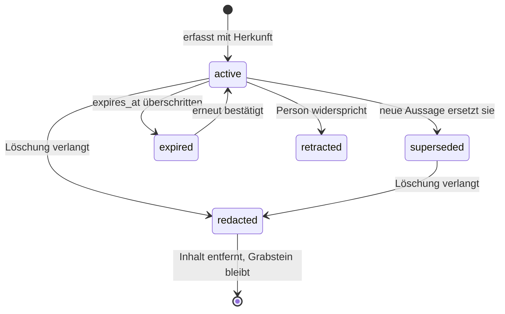

# Säule 1: Das überprüfbare Selbstmodell

> Schema: [`schema/self-model.schema.json`](../schema/self-model.schema.json) · Beispiel: [`schema/beispiel-profil.json`](../schema/beispiel-profil.json) · Entscheidung: [ADR 0004](adr/0004-selbstmodell-schema.md)

## Warum das der schwierige Teil ist

Ein System, das sich Dinge merkt, ist einfach zu bauen. Ein System, dem man nach zehn Jahren noch **glauben** kann, ist es nicht.

Der Unterschied liegt nicht in der Abrufqualität, sondern in vier Fragen, die ein Retrieval-System strukturell nicht beantworten kann:

- **Woher weißt du das?** Aus einer beiläufigen Bemerkung von 2027 oder aus einer bestätigten Angabe von letzter Woche?
- **Gilt das noch?** „Wohnt in Hamburg" war einmal richtig. Ohne Ersetzungskette ist es heute schlicht falsch.
- **Hast du dir das selbst ausgedacht?** Abgeleitete Aussagen sind nützlich, aber sie dürfen nicht denselben Rang haben wie berichtete.
- **Kann ich das wieder loswerden?** Und zwar samt allem, was daraus gefolgert wurde.

Genau hier brechen Assistenten in der Praxis ein. Die einschlägigen Benchmarks — LoCoMo für sehr lange Gespräche, LongMemEval für Wissensupdates, temporales Reasoning und Abstention — messen im Kern diese Fähigkeiten. Ohne explizite Architektur entsteht nur die *Illusion* von Persönlichkeit: ein System, das flüssig klingt und dabei veraltete Fakten mit voller Überzeugung vorträgt.

Keines der untersuchten Projekte löst das vollständig. Sie speichern Fakten und finden sie wieder; sie halten keine Ersetzungsketten, keine Ableitungsherkunft und keinen Widerrufspfad. Deshalb steht hier ein eigenes Format — und zwar bewusst **vor** dem Code, der es füllt.

## Grundregeln

**Jede Aussage trägt ihre Herkunft.** Ohne `provenance` darf nichts ins Modell. Eine Aussage ohne Quelle ist nicht überprüfbar, und ein nicht überprüfbares Modell verfehlt den Zweck des Projekts.

**Nichts wird überschrieben.** Ändert sich etwas, entsteht eine neue Aussage, die die alte über `supersedes` ersetzt; die alte bekommt `status: superseded` und zeigt über `superseded_by` zurück. Die Kette bleibt lesbar. Das ist der Unterschied zwischen „das System weiß, dass ich umgezogen bin" und „das System hat vergessen, dass ich mal woanders wohnte".

**Ableitungen sind gekennzeichnet.** `source_type: inference` plus `derived_from`. Damit ist jederzeit erkennbar, welcher Teil des Modells berichtet und welcher gefolgert ist.

**Löschen heißt kaskadieren.** Wird eine Aussage widerrufen, müssen alle daraus abgeleiteten Aussagen mitgelöscht oder neu begründet werden. Das Feld `redaction.cascade` hält fest, was mitging. Ein Grabstein bleibt stehen, damit eine Lücke als Lücke erkennbar ist statt als Nie-dagewesen.

**Das Format ist speicherunabhängig.** Der verbindliche Bestand liegt heute in lokalem SQLite, der semantische Index in cognee. Das Modell muss beide überleben können — im Code ist das als Schnittstelle `Backend` festgehalten, nicht bloß als Vorsatz. Das ist Säule 2 in konkreter Form.

## Die Typen von Aussagen

Die Unterscheidung nach `kind` ist keine Ordnungsliebe, sondern die Voraussetzung dafür, Widersprüche von Veränderungen zu trennen.

| `kind` | Bedeutung | Zeitliches Verhalten |
|---|---|---|
| `identity` | Stabile Merkmale der Person | Ändert sich selten, dann als Ersetzung |
| `preference` | Arbeits- und Kommunikationsvorlieben | Driftet langsam, gehört regelmäßig bestätigt |
| `state` | Veränderlicher Zustand (Wohnort, Arbeitgeber) | Braucht fast immer `expires_at` oder Ersetzung |
| `episode` | Einzelnes Ereignis | Gilt unbegrenzt, wird aber nie zur Gegenwart |
| `goal` | Vorhaben mit Zeithorizont | Läuft ab oder wird erfüllt |
| `relationship` | Beziehungen zu Personen und Organisationen | Häufig `sensitive` |
| `skill` | Fähigkeiten und Kenntnisse | Wächst, veraltet |
| `constraint` | Harte Randbedingungen und Verbote | Höchste Priorität bei Konflikten |

Ein System, das `identity` und `state` gleich behandelt, produziert genau die Fehler, an denen LongMemEval-artige Aufgaben scheitern.

## Lebenszyklus



`expired` ist kein Endzustand: Eine abgelaufene Aussage kann durch Nachfragen wieder bestätigt werden und ist dann wieder `active` — mit neuem `last_confirmed_at`. Das ist der Mechanismus, über den ein Zwilling aktuell bleibt, ohne zu raten.

Unterschied zwischen `retracted` und `redacted`: Bei `retracted` war die Aussage **falsch** (die Person widerspricht dem Inhalt). Bei `redacted` war sie womöglich richtig, soll aber **weg** (die Person übt ihr Recht auf Löschung aus). Beide brauchen unterschiedliche Behandlung — die erste ist eine Korrektur des Wissens, die zweite ein Eingriff in den Bestand.

## Was das Schema noch nicht leistet

Ehrlich benannt, damit es niemand für fertig hält:

- **Kein Konfliktlöser.** Das Schema kann Widersprüche *darstellen*, aber nicht entscheiden. Welche zweier widersprüchlicher Aussagen gewinnt, ist Logik der Orchestrierungsschicht.
- **Keine Verdichtung.** Reflexionen und Zusammenfassungen über viele Episoden hinweg — die Ebene, die aus Erinnerungen ein Selbstbild macht — fehlen. Für den Anfang lassen sie sich als `inference` mit `derived_from` abbilden, das trägt aber nicht auf Dauer.
- **Keine Durchsetzung.** `sensitivity` ist heute nur eine Markierung. Dass `special_category` niemals an ein externes Modell geht, muss die Orchestrierungsschicht garantieren; siehe [03-delegation.md](03-delegation.md).
- **Kein Konsolidierungslauf.** Aussagen sammeln sich an; ein Prozess, der sie periodisch verdichtet, prüft und veraltete zur Bestätigung vorlegt, fehlt.

## Prüfen

```bash
make test              # 27 Tests der Regeln
make validate-schema   # Beispielprofil gegen das Schema
```

Die Tests laufen **ohne Netz, ohne Modell und ohne cognee**. Das ist Absicht: Die Regeln, die das Modell überprüfbar machen, dürfen nicht von einer Fremdbibliothek abhängen. Abgedeckt sind unter anderem die Ersetzungskette über drei Stationen, die Wiederbelebung einer abgelaufenen Aussage durch Bestätigung, der kaskadierende Widerruf über zwei Ableitungsebenen und die Weigerung, eine widerrufene Aussage zu ersetzen.

Ein Test prüft zusätzlich, dass der **Export gegen genau die Schemadatei validiert**, die dieses Dokument beschreibt — Doku und Code können nicht auseinanderlaufen, ohne dass die Tests rot werden.

`schema/beispiel-profil.json` deckt dieselben schwierigen Fälle als Beispiel ab: Ersetzungskette (Hamburg → Leipzig), abgelaufene Gesundheitsangabe, markierte Ableitung, kaskadierender Widerruf.
