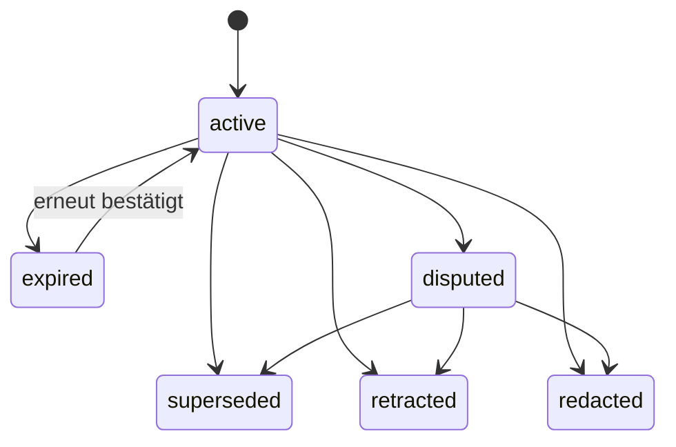

# Das überprüfbare Selbstmodell

> **Status:** aktueller Systemvertrag  
> **Gültig seit:** 2026-08-02  
> **Verbindlich für:** `schema/self-model.schema.json`, `model.py`, `store.py`  
> **Schema-Version:** `0.2.0`  
> **Zuletzt gegen den Code geprüft:** 2026-08-02

## Zweck

Ein Langzeitgedächtnis ist nur wertvoll, wenn es nach Jahren noch beantworten
kann:

- Woher weißt du das?
- Gilt das noch?
- Ist es berichtet oder abgeleitet?
- Was hat diese Aussage ersetzt?
- Welche Folgerungen hängen daran?
- Widerspricht ihr eine andere Angabe?
- Kann die Person sie korrigieren oder entfernen?

Das Selbstmodell speichert deshalb keine flache Liste vermeintlicher Fakten,
sondern versionierte Aussagen mit Herkunft und Lebenszyklus.

## Verbindliche Regeln

### Herkunft ist Pflicht

Jede Aussage trägt `provenance`. Abgeleitete Aussagen behalten zusätzlich den
wörtlichen Beleg und den Prozess beziehungsweise das Modell, das sie
vorgeschlagen hat.

### Inhalt wird nicht überschrieben

Eine Änderung erzeugt eine neue Aussage. `supersedes` und `superseded_by`
erhalten die Geschichte. Statusänderungen sind zulässig; der ursprüngliche
Inhalt bleibt unverändert, außer bei einem ausdrücklich verlangten Widerruf.

### Zeit gehört zur Aussage

`valid_from`, `expires_at` und `last_confirmed_at` unterscheiden Vergangenheit,
Gegenwart und ungeprüfte Alterung. Eine alte Zustandsangabe darf nicht
stillschweigend als heutige Wahrheit erscheinen.

### Ableitungen bleiben erkennbar

`source_type: inference` und `derived_from` markieren, was Icarus gefolgert
hat. Widerruft die Person eine Quelle, werden abhängige Aussagen kaskadierend
entfernt oder müssen neu begründet werden.

### Konflikte werden sichtbar, nicht geraten

`status: disputed` und `disputed_with` markieren ungeklärte Widersprüche
gegenseitig. Strittige Aussagen sind nicht `usable()`. Sie erscheinen getrennt
im Kontext, damit das Modell nachfragt statt eine Seite auszuwählen.

### Löschen hinterlässt einen Grabstein

`redacted` entfernt den persönlichen Inhalt, erhält aber den dokumentierten
Vorgang. `retracted` bedeutet dagegen, dass eine Aussage inhaltlich falsch war.

## Aussagearten

| Art | Bedeutung |
|---|---|
| `identity` | relativ stabile Merkmale |
| `preference` | Vorlieben und Arbeitsweisen |
| `state` | veränderlicher gegenwärtiger Zustand |
| `episode` | vergangenes Einzelereignis |
| `goal` | Vorhaben mit Zeithorizont |
| `relationship` | Beziehung zu Person oder Organisation |
| `skill` | Fähigkeit oder Wissen |
| `constraint` | bindende Grenze für Handlungen |

Aufgaben und Projektdokumente liegen bewusst nicht im Selbstmodell. Sie
beschreiben Arbeit, nicht die Identität der Person.

## Lebenszyklus

## Schema und Laufzeit

Das JSON-Schema ist die öffentliche portable Form. Python-Enums und Schema-Enums
werden automatisch auf Parität getestet. Ein Export mit strittigen Aussagen
muss das Schema validieren.

Version `0.2.0` ergänzt gegenüber `0.1.0` den formal beschriebenen
Konfliktstatus. Bestehende `0.1.0`-Dokumente bleiben lesbar, da die Änderung
Felder ergänzt und keine bestehenden Werte umdeutet.

## Offene Punkte

- automatische semantische Erkennung von Widersprüchen ist weiterhin nur ein
  Vorschlagsverfahren;
- der abgeleitete Zustand wird noch nicht vollständig aus einem Ereignisstrom
  neu projiziert;
- Entitäten und Beziehungen für den künftigen Wissensgraphen sind noch nicht
  verbindlich typisiert;
- eine konsequente Zitatpflicht für jede externe Antwort ist noch nicht
  technisch erzwungen.

Neue Funktionen dürfen diese Lücken schließen, aber nicht die bestehenden
Korrektur- und Herkunftswege umgehen.
