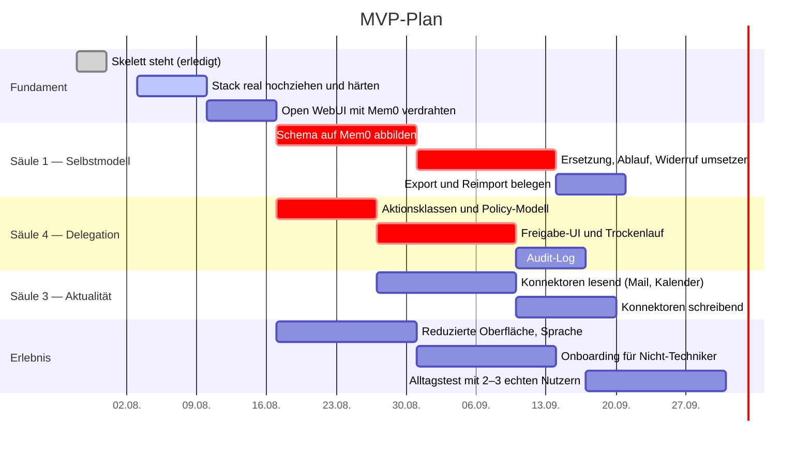

# Roadmap und Aufwand

## Ausgangspunkt

Was heute im Repo steht, ist ein Skelett: eine Oberfläche, eine Memory-Schicht, ein Datenraum, ein Schema. Das ist ungefähr der Stand, den man durch Komposition bestehender Bausteine in wenigen Tagen erreicht — und genau deshalb ist es nicht der schwierige Teil.

Der schwierige Teil sind Säule 1 und Säule 4. Sie stehen in der Planung deshalb auf dem **kritischen Pfad**, nicht am Ende.

## Was in welcher Reihenfolge

Zwei Dinge an diesem Plan sind Absicht:

**Schreibende Konnektoren hängen an der Freigabe-UI.** Lesender Mail- und Kalenderzugriff kann früh kommen; senden und ändern erst, wenn der Trockenlauf steht.

**Der Alltagstest kommt nach dem Audit-Log.** Vorher weiß man bei Problemen nicht, was das System eigentlich getan hat.

## Aufwand

Die Schätzungen gehen von zwei erfahrenen Full-Stack-/AI-Engineers plus etwas Design- und Produktarbeit aus und setzen konsequente Wiederverwendung bestehender Bausteine voraus.

| Ausbaustufe | Umfang | Dauer | Aufwand |
|---|---|---|---|
| **MVP** | Selbst gehostet, einfache Oberfläche, Sprache, Selbstmodell mit Provenienz, Dokumenten- und Webkontext, Mail/Kalender lesend, Freigaben, erstes Computer-Use-Backend | 10–16 Wochen | 6–10 Personenmonate |
| **Mittlere Version** | Mail und Kalender schreibend, Aufgaben- und Projektebene, versioniertes Profil, Import/Export, Mobil- und Desktop-Zugriff, mehr Konnektoren, belastbare Policies | 6–9 Monate | 20–30 Personenmonate |
| **Vollvision** | Versionierte Identität über Jahre, Zeitleiste, Gedächtniskonsolidierung, Konfliktauflösung, Löschpfade, Multi-Agent-Delegation, Oberfläche für Nicht-Techniker | 12–24 Monate | Plattformprodukt |

Der größte Zeitfresser ist in keiner Stufe „ein Modell anbinden". Es sind die Vereinfachung der Oberfläche, das Freigabemodell, das Gedächtnisschema und die Stabilität der Integrationen. Die letzten zwanzig Prozent sind die teuersten — das ist genau der Bereich, in dem heute weder Forschung noch Repos eine fertige Antwort haben.

## Was zuerst geprüft gehört

Vier Fragen, die den Plan umwerfen können und deshalb früh beantwortet werden sollten:

**Trägt Mem0 das Selbstmodell?** Wenn sich Ersetzungsketten und kaskadierende Löschung nicht sauber abbilden lassen, braucht Säule 1 einen eigenen Speicher neben Mem0 — mit entsprechenden Folgen für den Aufwand.

**Lässt sich Open WebUIs eigenes Memory abschalten?** Zwei konkurrierende Gedächtnisse sind schlimmer als eins.

**Wie stabil ist die Lizenzlage von Open WebUI?** Der Kern steht nicht mehr rein unter einer klassischen OSI-Lizenz. Wenn das zum Problem wird, ist AnythingLLM (MIT) die Ausweichoption — der Wechsel ist umso teurer, je später er kommt.

**Bleibt der Agent-Core leer?** Letta ist weggefallen. Ob die Gesprächsführung dauerhaft bei Open WebUI bleibt oder eine eigene Orchestrierung bekommt, ist die größte offene Architekturfrage.

## Der eigentliche Wettbewerbsvorteil

Wer in diesem Feld gewinnt, gewinnt nicht mit dem größten Modell. Die Modelle sind austauschbar, und genau das ist die Prämisse dieses Projekts.

Gewinnen wird, wessen System über Jahre vertrauenswürdig, portabel und einfach genug bleibt, dass man ihm sein Leben anvertraut. Das ist eine Frage von Provenienz, Freigaben und Oberfläche — nicht von Modellgüte. Deshalb liegt der kritische Pfad auf Säule 1 und 4.
