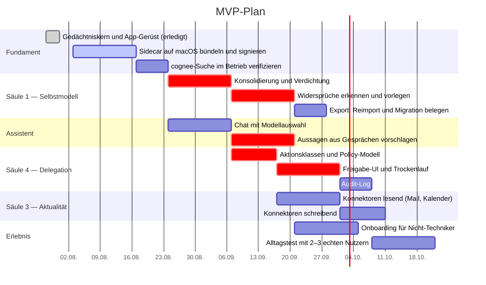

# Roadmap und Aufwand

## Ausgangspunkt

Der Gedächtniskern steht und ist getestet: Provenienz, Ersetzung statt Überschreiben, zeitliche Gültigkeit, kaskadierender Widerruf, Export gegen das Schema. Dazu eine Tauri-Hülle, die den Sidecar startet und den Bestand anzeigt.

Das ist bewusst die ungewöhnliche Reihenfolge. Üblich wäre, mit dem Chat anzufangen und das Gedächtnis später nachzurüsten. Genau das geht bei Provenienz aber nicht: Herkunft nachträglich zu ergänzen ist unmöglich, weil sie dann nirgends mehr existiert. Deshalb zuerst der Teil, den niemand sonst liefert — und danach der Teil, den alle schon haben.

## Was in welcher Reihenfolge

Vier Dinge an diesem Plan sind Absicht:

**Signierung kommt sofort.** Eine nicht notarisierte Mac-App lässt sich nicht verteilen. Das später zu klären heißt, monatelang nichts ausliefern zu können.

**Aussagen aus Gesprächen vorschlagen, nicht speichern.** Der Schritt ist als kritisch markiert, weil hier die Überprüfbarkeit kippen kann. Extrahiert das System stillschweigend Fakten aus dem Chat, entsteht wieder ein Gedächtnis, dem niemand zusehen kann.

**Schreibende Konnektoren hängen an der Freigabe-UI.** Lesender Zugriff darf früh kommen; senden und ändern erst mit Trockenlauf.

**Der Alltagstest kommt nach dem Audit-Log.** Vorher weiß man bei Problemen nicht, was das System getan hat.

## Aufwand

Zwei erfahrene Full-Stack-/AI-Engineers plus etwas Design- und Produktarbeit.

| Ausbaustufe | Umfang | Dauer | Aufwand |
|---|---|---|---|
| **MVP** | Signierte Mac-App, Chat mit Modellauswahl, Selbstmodell mit Provenienz und Verdichtung, Mail/Kalender lesend, Freigaben mit Trockenlauf, Audit-Log | 10–16 Wochen | 6–10 Personenmonate |
| **Mittlere Version** | Windows, Mail und Kalender schreibend, Aufgaben- und Projektebene, mehr Konnektoren, erstes Computer-Use hinter Policy, belastbares Onboarding | 6–9 Monate | 20–30 Personenmonate |
| **Vollvision** | Versionierte Identität über Jahre, Zeitleiste, Gedächtniskonsolidierung, Konfliktauflösung, Löschpfade, Multi-Agent-Delegation, Oberfläche für Nicht-Techniker | 12–24 Monate | Plattformprodukt |

Der größte Zeitfresser ist in keiner Stufe „ein Modell anbinden". Es sind die Vereinfachung der Oberfläche, das Freigabemodell, die Auslieferung samt Signierung und die Stabilität der Integrationen.

## Was zuerst geprüft gehört

Fünf Fragen, die den Plan umwerfen können.

**Wie groß wird das Bundle wirklich?** Gemessen sind 944 MB für ein venv mit cognee. Lässt sich das nicht deutlich drücken, wird die semantische Suche zum optionalen Download — der Bestand funktioniert ohne sie.

**Trägt PyInstaller den Sidecar?** lancedb und pylance bringen native Erweiterungen mit. Das ist der wahrscheinlichste Ort für plattformspezifische Überraschungen.

**Hält cognee, was die Suche verspricht?** Es gibt keinen veröffentlichten LongMemEval-Wert. Die Qualität muss am eigenen Bestand gemessen werden, nicht anhand fremder Vergleichstabellen.

**Wie viel Reibung erzeugt sichtbare Provenienz?** Die Wette des Projekts ist, dass Nachvollziehbarkeit Vertrauen schafft. Möglich ist auch, dass sie als Lärm empfunden wird. Das entscheidet der Alltagstest, nicht die Architektur.

**Reicht eine Eigenentwicklung der Oberfläche?** AnythingLLM bleibt die Ausweichoption. Der Wechsel wird teurer, je mehr Oberfläche entsteht — die Frage gehört früh gestellt, nicht spät.

## Der eigentliche Wettbewerbsvorteil

Wer in diesem Feld gewinnt, gewinnt nicht mit dem größten Modell. Die Modelle sind austauschbar, und genau das ist die Prämisse dieses Projekts.

Gewinnen wird, wessen System über Jahre vertrauenswürdig, portabel und einfach genug bleibt, dass man ihm sein Leben anvertraut. Das ist eine Frage von Provenienz, Freigaben und Oberfläche — nicht von Modellgüte.
