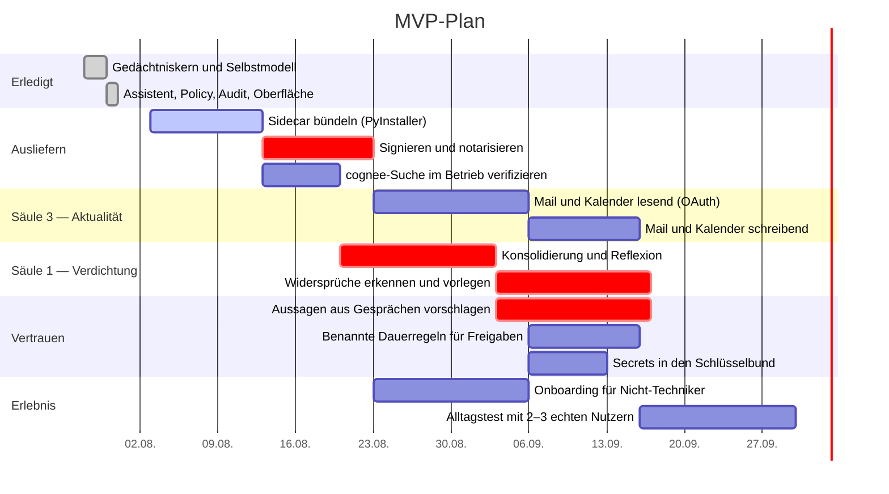

# Roadmap und Aufwand

## Ausgangspunkt

Alle vier Säulen sind angefasst, zwei davon tragen:

- **Selbstmodell** — Provenienz, Ersetzung, Ablauf, kaskadierender Widerruf, Export gegen das Schema.
- **Anbieterunabhängigkeit** — Bestand lokal in SQLite, davor OpenAI-kompatibel, Anthropic oder Ollama.
- **Aktuelle Informationen** — Web-Abruf, Dateien, Zeit. Mail und Kalender fehlen.
- **Kontrollierte Delegation** — Aktionsklassen, Freigabe mit Trockenlauf, anhängendes Audit-Log.

Dazu ein Assistent, der beides verbindet: Er sieht nur gültige, nach Schutzbedarf gefilterte Aussagen und kann nichts ausführen, ohne durch die Policy zu gehen.

Die Reihenfolge war bewusst ungewöhnlich. Üblich wäre, mit dem Chat anzufangen und Gedächtnis und Kontrolle später nachzurüsten. Bei Provenienz geht das nicht — Herkunft nachträglich zu ergänzen ist unmöglich, weil sie dann nirgends mehr existiert. Und ein Freigabemodell nachzurüsten heißt, es gegen bereits gewachsene Bequemlichkeit durchzusetzen.

## Was in welcher Reihenfolge

Drei Dinge an diesem Plan sind Absicht:

**Ausliefern kommt vor Funktionen.** Eine nicht notarisierte Mac-App lässt sich nicht verteilen. Solange das offen ist, hat niemand etwas von neuen Features — und die Bündelung eines Python-Sidecars mit nativen Erweiterungen ist der wahrscheinlichste Ort für böse Überraschungen.

**Aussagen aus Gesprächen vorschlagen, nicht speichern.** Als kritisch markiert, weil hier die Überprüfbarkeit kippen kann. Extrahiert das System stillschweigend Fakten aus dem Chat, entsteht wieder ein Gedächtnis, dem niemand zusehen kann. Heute schreibt der Assistent nur, wenn er das Werkzeug `merken` benutzt — und das meldet sich hinterher.

**Der Alltagstest kommt zum Schluss.** Erst wenn Mail und Kalender wirklich angebunden sind, zeigt sich, ob die Freigaben im Alltag tragen oder nur nerven.

## Aufwand

Zwei erfahrene Full-Stack-/AI-Engineers plus etwas Design- und Produktarbeit.

| Ausbaustufe | Umfang | Dauer | Aufwand |
|---|---|---|---|
| **MVP** | Signierte Mac-App, Mail und Kalender lesend, Verdichtung des Gedächtnisses, Onboarding | 8–12 Wochen | 4–7 Personenmonate |
| **Mittlere Version** | Windows, Mail und Kalender schreibend, Aufgaben- und Projektebene, mehr Konnektoren, erstes Computer-Use hinter Policy, belastbares Onboarding | 6–9 Monate | 20–30 Personenmonate |
| **Vollvision** | Versionierte Identität über Jahre, Zeitleiste, Gedächtniskonsolidierung, Konfliktauflösung, Löschpfade, Multi-Agent-Delegation, Oberfläche für Nicht-Techniker | 12–24 Monate | Plattformprodukt |

Der größte Zeitfresser ist in keiner Stufe „ein Modell anbinden". Es sind die Vereinfachung der Oberfläche, das Freigabemodell, die Auslieferung samt Signierung und die Stabilität der Integrationen.

## Was zuerst geprüft gehört

Fünf Fragen, die den Plan umwerfen können.

**Wie groß wird das Bundle wirklich?** Gemessen sind 944 MB für ein venv mit cognee. Lässt sich das nicht deutlich drücken, wird die semantische Suche zum optionalen Download — der Bestand funktioniert ohne sie.

**Trägt PyInstaller den Sidecar?** lancedb und pylance bringen native Erweiterungen mit. Das ist der wahrscheinlichste Ort für plattformspezifische Überraschungen.

**Hält cognee, was die Suche verspricht?** Es gibt keinen veröffentlichten LongMemEval-Wert. Die Qualität muss am eigenen Bestand gemessen werden, nicht anhand fremder Vergleichstabellen.

**Wie viel Reibung erzeugt sichtbare Provenienz?** Die Wette des Projekts ist, dass Nachvollziehbarkeit Vertrauen schafft. Möglich ist auch, dass sie als Lärm empfunden wird. Das entscheidet der Alltagstest, nicht die Architektur.

**Nerven die Freigaben?** `confirm_strict` verlangt bei außenwirksamen Aktionen, den Empfänger abzutippen. Das ist absichtlich unbequem. Ob es als Schutz oder als Schikane empfunden wird, zeigt erst der Betrieb mit echten Mails — und davon hängt ab, ob die Vorgabe so streng bleibt.

**Reicht eine Eigenentwicklung der Oberfläche?** AnythingLLM bleibt die Ausweichoption. Der Wechsel wird teurer, je mehr Oberfläche entsteht — die Frage gehört früh gestellt, nicht spät.

## Der eigentliche Wettbewerbsvorteil

Wer in diesem Feld gewinnt, gewinnt nicht mit dem größten Modell. Die Modelle sind austauschbar, und genau das ist die Prämisse dieses Projekts.

Gewinnen wird, wessen System über Jahre vertrauenswürdig, portabel und einfach genug bleibt, dass man ihm sein Leben anvertraut. Das ist eine Frage von Provenienz, Freigaben und Oberfläche — nicht von Modellgüte.
