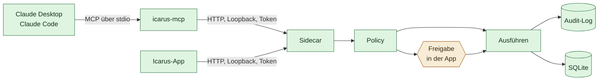

# Die MCP-Tür

Stand 2026-07-31. Verbindlich für `sidecar/icarus_memory/mcp.py`.

Icarus ist eine App mit eigenem Gespräch. Daneben stehen auf demselben Rechner
Assistenten, die schon benutzt werden — Claude Desktop, Claude Code, andere.
Sie können alles Mögliche, aber sie vergessen zwischen zwei Sitzungen alles.

Die MCP-Tür schließt genau diese Lücke: Sie gibt fremden Assistenten Zugang zu
**demselben** Gedächtnis, das die App benutzt. Kein zweiter Bestand, keine
zweite Freigabeliste, kein zweites Protokoll.

## Was sie ausdrücklich nicht ist

Kein zweites System. Der Server öffnet **keine** eigene Datenbank, sondern
spricht über HTTP mit dem laufenden Sidecar.



Drei Gründe, und alle drei sind der Grund:

**Freigaben landen dort, wo ein Mensch sitzt.** Ein fremder Assistent kann
keine Bestätigungsphrase abtippen. Beantragt er etwas Außenwirksames, wird es
nicht ausgeführt — der Antrag erscheint in der Icarus-App und wartet dort.
Bauten wir hier einen zweiten Stapel, gäbe es eine zweite Freigabeliste, die
niemand ansieht. Das ist die Art Lücke, die man erst bemerkt, wenn sie benutzt
wurde.

**Ein Audit-Log.** Was über diese Tür kam, steht im selben Protokoll wie alles
andere, mit demselben Werkzeugnamen und derselben Aktionsklasse. Erkennbar,
nicht versteckt.

**Ein Bestand.** Zwei Prozesse auf derselben SQLite-Datei wären technisch
machbar und fachlich falsch: Die Regeln des Selbstmodells — Ersetzung, Ablauf,
kaskadierender Widerruf — leben im Store, nicht in der Datei. Wer die Datei
umgeht, umgeht die Regeln.

## Was durchgesetzt ist

Der Aufruf geht durch `Agent.invoke()` und damit durch `_handle()` — dieselben
vier Schritte wie im Gespräch:

| Prüfung | Gilt über MCP |
| --- | --- |
| Grenzen aus dem Selbstmodell (`kind: constraint`) | ja, und sie führen zu `denied` |
| Anhebung nach fremdem Inhalt (`tainted`) | ja |
| Freigabe bei außenwirksamen Aktionen | ja, als Antrag in der App |
| Audit-Eintrag, auch bei Verweigerung | ja |

Was **nicht** über diese Tür geht: Der Chat-Endpunkt. Ein fremder Assistent
soll nicht das Modell im Haus anstoßen können — das wäre eine Kette aus zwei
Modellen, bei der niemand mehr sagen kann, wessen Absicht ausgeführt wurde.

Belegt in `tests/test_mcp.py` (21 Tests). Sie laufen gegen den echten
Sidecar-Stapel über einen ASGI-Transport, nicht gegen nachgebaute Antworten:
Eine Brücke, die nur mit Attrappen geprüft ist, beweist über die Brücke nichts.

Die zentrale Zusicherung — außenwirksames Handeln kommt über diese Tür nicht
durch — wurde durch Sabotage geprüft: `invoke()` an der Policy vorbei
verdrahtet, vier Tests fielen mit der erwarteten Meldung, zurückgebaut.

## Protokoll

JSON-RPC 2.0 über stdin/stdout, zeilenweise. Unterstützt: `initialize`,
`ping`, `tools/list`, `tools/call`, dazu leere Antworten auf `prompts/list` und
`resources/list`, weil Clients die beim Verbinden ungefragt abfragen.

Bewusst von Hand statt über ein SDK. Es sind vier Methoden, und eine
Abhängigkeit, die sich im Halbjahrestakt ändert, ist für eine App, die zehn
Jahre laufen soll, der schlechtere Tausch — dieselbe Überlegung wie bei IMAP
und CalDAV statt Anbieter-APIs (siehe [`01-architektur.md`](01-architektur.md)).

## Werkzeuge

Alle tragen das Präfix `icarus_`, damit sie in einem Client neben Dutzenden
anderer erkennbar bleiben.

| Werkzeug | Klasse | Zweck |
| --- | --- | --- |
| `icarus_kontext` | read | Was Icarus über den Nutzer weiß — wörtlich, samt Quellen und Aktualitätsurteil |
| `icarus_heute` | read | Tagesüberblick: Projekte, Aufgaben, Termine, Nachrichten |
| `icarus_freigaben` | read | Was in der App auf eine Entscheidung wartet |
| `icarus_merken` | write_local | Eine Aussage über den Nutzer dauerhaft speichern |
| `icarus_gedaechtnis_suchen` | read | Das Selbstmodell durchsuchen |
| `icarus_projekte`, `icarus_projekt_stand` | read | Projektliste und vollständiger Stand eines Projekts |
| `icarus_projekt_anlegen`, `icarus_projekt_status` | write_local | Projekte anlegen und fortschreiben |
| `icarus_notiz_anlegen`, `icarus_notizen_suchen`, `icarus_notiz_lesen` | write_local / read | Notizen |
| `icarus_aufgaben`, `icarus_aufgabe_anlegen`, `icarus_aufgabe_erledigt` | read / write_local | Aufgaben |
| `icarus_mail_senden`, `icarus_termin_anlegen` | outward | Nur mit Freigabe in der App |

`icarus_notiz_lesen` ist als `returns_untrusted` markiert. Eine Notiz kann aus
einer Mail oder einem Transkript stammen; Herkunft ist nicht
Vertrauenswürdigkeit.

## Einrichtung

Der Sidecar schreibt beim Start `verbindung.json` ins Datenverzeichnis — Port
und Token, die die App bei jedem Start neu vergibt. Ohne diese Datei müsste
beides von Hand eingetragen und nach jedem Neustart erneuert werden. Sie
enthält ein Token und liegt deshalb mit `0600` in einem Verzeichnis mit `0700`.

In der Konfiguration des Assistenten:

```json
{
  "mcpServers": {
    "icarus": {
      "command": "/pfad/zu/icarus-mcp"
    }
  }
}
```

Zum Ausprobieren gegen einen von Hand gestarteten Sidecar schlagen
Umgebungsvariablen die Datei:

```bash
ICARUS_SIDECAR_URL=http://127.0.0.1:8765 ICARUS_SIDECAR_TOKEN=… icarus-mcp
```

## Was offen ist

**Das Token wechselt bei jedem Start der App.** Der MCP-Server liest
`verbindung.json` einmal beim Start. Startet die App danach neu, meldet er
`Token abgelehnt` samt Hinweis, statt still zu scheitern — aber er liest die
Datei nicht neu ein. Solange Clients MCP-Server ohnehin nur beim eigenen Start
hochfahren, ist das erträglich; sauber ist es nicht.

**Keine Herkunftsunterscheidung im Selbstmodell.** Über MCP gemerkte Aussagen
tragen `source_type: chat` wie die aus der App. Wünschenswert wäre erkennbar,
*welcher* Assistent etwas eingetragen hat — das ist genau die Nachvollziehbar­
keit, die das Projekt sonst überall einfordert.

**Keine eigene Freigabestufe für die Tür.** Ein fremder Assistent hat heute
dieselben Rechte wie das Modell in der App. Denkbar wäre, `write_local` über
MCP grundsätzlich auf `confirm` zu heben. Ob das nötig ist oder nur nervt,
entscheidet der Betrieb — dieselbe offene Frage wie bei `confirm_strict` in
[`04-roadmap.md`](04-roadmap.md).

## Verwandte Dokumente

- [`01-architektur.md`](01-architektur.md) — die zwei Speicher und ihr Verhältnis
- [`03-delegation.md`](03-delegation.md) — Aktionsklassen und Freigabestufen
- [`05-sicherheit.md`](05-sicherheit.md) — fremde Inhalte und Prompt Injection
- [`06-gedaechtnis-kontrakt.md`](06-gedaechtnis-kontrakt.md) — die Regeln des Bestands
