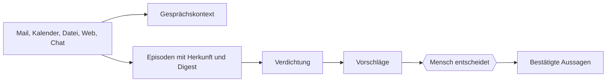

# Gedächtnisschichten

> **Status:** aktueller Systemvertrag  
> **Gültig seit:** 2026-08-02  
> **Verbindlich für:** Gespräch, Episoden, Vorschläge und Selbstmodell  
> **Zuletzt gegen den Code geprüft:** 2026-08-02

## Drei Schichten



### Kurzzeit

Der Gesprächsverlauf hält den unmittelbaren Arbeitskontext. Er ist kein
dauerhaftes Wissen und darf nicht still in das Selbstmodell übergehen.

### Mittelfrist

Episoden halten fest, dass etwas vorlag:

- Nachricht,
- Termin,
- Notiz,
- Datei,
- Gesprächsausschnitt,
- später weitere Ereignisse.

Sie tragen Rohinhalt, Herkunft und Digest. Ein Digest verhindert doppelte
Aufnahme und ermöglicht spätere Neuprüfung. Eine Episode behauptet nichts über
die Person.

### Langzeit

Bestätigte Aussagen beschreiben, was Icarus als Wissen behandeln darf. Für sie
gelten Append-only-Inhalt, Provenienz, Zeitbezug, Ersetzung, Konflikte und
Widerruf.

Projekte, Aufgaben und Notizen liegen daneben als Arbeitskontext. Sie haben
andere Lebenszyklen, werden aber über IDs und Herkunft mit Episoden und Aussagen
verbunden.

## Übergang zwischen den Schichten

> **Verdichtung schlägt vor. Sie schreibt nicht.**

Die Verdichtung darf ohne Zustimmung:

- Episoden ordnen und Kandidaten finden,
- Fälligkeitsfragen erzeugen,
- mögliche Widersprüche vorlegen,
- reversible Zusammenfassungen erzeugen,
- verarbeitete Episoden kennzeichnen.

Sie darf ohne Zustimmung nicht:

- eine Aussage in den Bestand aufnehmen,
- eine bestehende Aussage bestätigen,
- einen Widerspruch als `disputed` festschreiben,
- eine Quelle löschen,
- eine Außenwirkung auslösen.

Auch ein Konfliktfinder ist ein Vorschlagsverfahren. Erst die menschliche
Annahme setzt den Status `disputed`.

## Vorschlagsarten

- `assertion`: aus einer Episode könnte eine dauerhafte Aussage folgen;
- `confirmation`: eine bestehende Aussage sollte erneut bestätigt werden;
- `conflict`: Aussagen könnten einander widersprechen.

Jeder Ableitungsvorschlag braucht einen wörtlichen Beleg, der tatsächlich in der
Quelle vorkommt. Abgelehnte Vorschläge bleiben sichtbar und werden nicht bei
jedem Lauf erneut vorgelegt.

## Zusammenfassungen

Zusammenfassungen sind Episoden, keine Aussagen. Sie dürfen Quellen archivieren,
aber nicht löschen. Quellen, die eine bestätigte Aussage belegen, werden nicht
eingeschmolzen. Eine Zusammenfassung wird nie selbst zum Beleg einer Aussage.

## Aufnahme

Alle Quellen folgen derselben Pipeline:

```text
Quelle → Adapter → Episode → Vorschlag → menschliche Entscheidung → Aussage
```

Adapter sollen möglichst wenig interpretieren. Bedeutung entsteht erst in der
prüfbaren Verdichtung.

## Produktfolgen

- Ein Nutzer muss seine bisherige Ablage nicht zuerst aufgeben.
- Icarus funktioniert ohne Modell; nur modellgestützte Vorschläge fehlen.
- Es gibt keine eingebauten Lebensbereiche, die für jeden Nutzer gelten müssen.
- Neue Konnektoren füllen Episoden oder Arbeitsobjekte, nicht heimlich den
  Bestand.
- Semantischer Index und künftiger Graph bleiben Projektionen über diesen
  Schichten.

## Offene Punkte

- Neuprüfung einer Quelle unmittelbar vor folgenreicher Ausführung;
- skalierbare Verdichtung bei sehr großen Beständen;
- jährliche beziehungsweise thematische Zusammenfassungsebenen;
- verbindliche Entitäten und Beziehungen für die Graphprojektion;
- bessere Verbindung zwischen Rohquelle, Projekt und Entscheidung in der
  Oberfläche.
