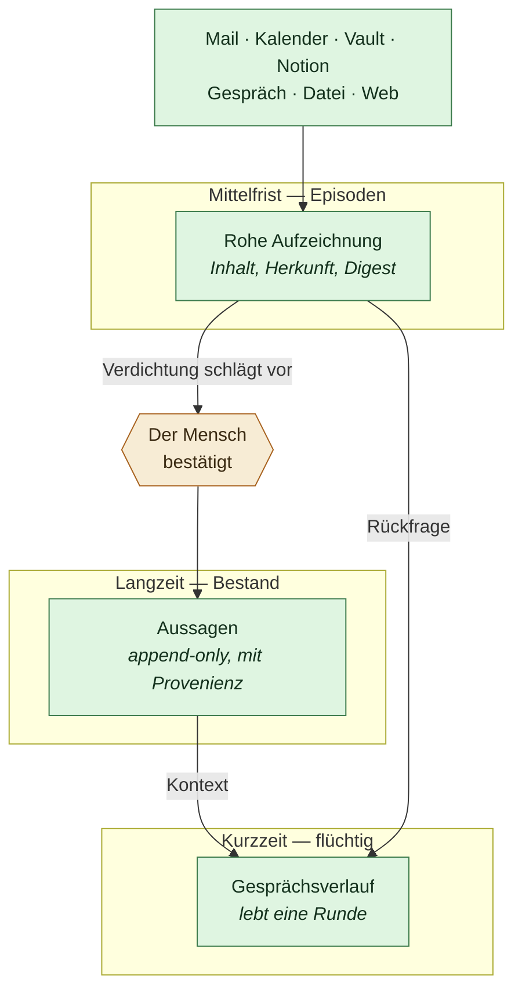

# Gedächtnisschichten

Stand 2026-07-31. Verbindlich für `sidecar/icarus_memory`.

Bis hierher hatte Icarus zwei Zustände: Etwas ist eine **Aussage über die
Person** — dauerhaft, mit Herkunft, append-only — oder es existiert nicht. Das
ist eine gute Regel für den Bestand und eine unmögliche für den Alltag. Zwischen
„eine Mail ist angekommen" und „diese Person arbeitet bei X" liegt Arbeit, und
die hatte bisher keinen Ort.

Dieses Dokument beschreibt die Schichten dazwischen und die Regel, nach der
etwas von einer in die nächste wandert.

## Drei Schichten



### Kurzzeit — der Gesprächsverlauf

`Agent._history`. Lebt eine Runde, wird beim nächsten Beitrag zurückgesetzt oder
per `reset()` verworfen. Nichts davon ist Bestand, und das ist Absicht: Was im
Gespräch gesagt wurde, ist noch keine Behauptung über die Person.

### Mittelfrist — Episoden

**Neu.** Eine Episode ist eine rohe Aufzeichnung dessen, was passiert ist: eine
eingegangene Mail, ein Termin, eine importierte Notiz, ein Gesprächsausschnitt,
den jemand festhalten wollte. Sie behauptet nichts über die Person — sie hält
fest, dass etwas vorlag.

Drei Eigenschaften machen die Schicht tragfähig:

**Digest.** Jede Episode trägt einen SHA-256 ihres Inhalts. Das schließt die
erste offene Lücke aus dem [Gedächtnis-Kontrakt](06-gedaechtnis-kontrakt.md):
Ohne Digest ist keine Neuprüfung vor einer folgenreichen Aktion möglich, weil
niemand feststellen kann, ob die Quelle sich seither geändert hat.

**Entdopplung über den Digest.** Denselben Vault zweimal importieren erzeugt
keine zweite Kopie. Ohne das ist kein Prozess denkbar, der dauerhaft mitläuft —
und genau der ist das Ziel.

**Zustand statt Löschen.** `new → consolidated → archived`, dazu `ignored` für
das, was bewusst nichts hergab. Eine Episode verschwindet nie; sie hört nur auf,
Arbeit zu erzeugen. Wer wissen will, warum eine Aussage im Bestand steht, findet
über `produced` den Weg zurück zum Rohtext.

### Langzeit — der Bestand

Unverändert: `Assertion` mit Provenienz, append-only, per SQLite-Trigger
erzwungen. Alle Regeln aus dem Gedächtnis-Kontrakt gelten weiter.

## Die Regel für den Übergang

> **Verdichtung schlägt vor. Sie schreibt nicht.**

Das ist die wichtigste Entscheidung in diesem Dokument, und sie ist unbequem.

Ein System, das aus Mails und Notizen stillschweigend Fakten über eine Person
ableitet und in den Bestand schreibt, hat wieder ein Gedächtnis, dem niemand
zusehen kann — genau das Versagen, gegen das dieses Projekt gebaut ist. Die
Roadmap hat den Punkt von Anfang an als kritisch markiert, und daran ändert
sich nichts, wenn die Bequemlichkeit lockt.

Also: Die Verdichtung liest Episoden und erzeugt **Vorschläge**. Jeder trägt
seinen Beleg — welche Episode, welche Stelle. Der Mensch bestätigt, ändert oder
verwirft. Bestätigtes wird zur Aussage, mit `derived_from` auf die Episode.

Was die Verdichtung **ohne** Rückfrage darf, weil es nichts behauptet:

- Episoden zusammenfassen und ältere archivieren
- Widersprüche im Bestand als `disputed` markieren — nicht auflösen, nur
  sichtbar machen
- Alterungsurteile fortschreiben (`currency.py`)
- Aussagen zur Bestätigung vorlegen, deren Horizont abgelaufen ist

Die Grenze verläuft zwischen *ordnen* und *behaupten*. Ordnen ist frei,
Behaupten braucht einen Menschen.

## Warum das die eigentliche Arbeit ist

Konnektoren sind endlos. Man kann Jahre damit verbringen und hat am Ende einen
Aggregator, keinen Chief of Staff. Der Unterschied liegt genau hier: ob das
System nach sechs Monaten mehr über einen weiß als am ersten Tag, ohne dabei
Unsinn angesammelt zu haben.

Beides zugleich schafft nur eine Schicht, die roh mitschreibt, und ein
Verfahren, das daraus mit Zustimmung Bestand macht.

## Aufnahme: eine Pipeline für Import und Betrieb

Ein bestehender Obsidian-Vault und die Mails von heute Morgen sind derselbe
Fall: fremder Text mit einer Herkunft, aus dem vielleicht etwas folgt. Deshalb
gibt es **eine** Pipeline, nicht zwei.

```
Quelle → Adapter → Episode (Digest, Herkunft) → Verdichtung → Vorschlag → Bestand
```

Adapter für den Anfang:

| Quelle | Was gelesen wird |
| --- | --- |
| Markdown-Ordner / Obsidian-Vault | `.md` mit YAML-Frontmatter, `[[Wikilinks]]` als Verweise |
| Notion-Export | Markdown-Export samt UUID-Suffixen und Datenbank-CSVs |
| Textdateien | alles Lesbare, ohne Struktur-Annahmen |
| Mail, Kalender | die vorhandenen Konnektoren |

Adapter sind bewusst dumm: Sie machen aus einer Datei eine Episode und raten
nicht, was sie bedeutet. Die Deutung ist Sache der Verdichtung, und die legt
vor.

Damit gilt: Wer Icarus benutzt, muss seine bisherige Ablage nicht aufgeben,
bevor er sieht, ob es trägt. Das ist keine Nettigkeit — ein Produkt, das als
ersten Schritt den Umzug des ganzen Lebens verlangt, wird nicht ausprobiert.

## Was daraus folgt für ein Produkt, das anderen gehört

Icarus darf nichts über *einen bestimmten* Menschen voraussetzen. Konkret:

- **Keine eingebauten Bereiche, Projekte oder Rollen.** `Project.area` ist ein
  freier Text und bleibt es. Wer feste Aufzählungen einbaut, schreibt ein
  Lebensmodell fest, das für den nächsten Nutzer falsch ist.
- **Kein Zwang zu einer Ablage.** Notion, Obsidian, ein Ordner mit Textdateien
  oder nichts davon — alles führt über dieselbe Pipeline.
- **Der erste Start muss ohne alles funktionieren.** Ohne Modell, ohne
  Schlüssel, ohne Konnektor. Was fehlt, wird benannt, nicht kaschiert.
- **Erweitern ohne Fork.** Konnektoren und Adapter sind Schnittstellen, keine
  Sonderfälle im Kern.

## Reihenfolge

Was zuerst gebaut wird, ergibt sich aus den Abhängigkeiten, nicht aus dem Reiz.

1. **Episodenschicht und Aufnahme** — ohne Rohschicht gibt es nichts zu
   verdichten. Enthält den Digest und schließt damit einen offenen Punkt des
   Gedächtnis-Kontrakts nebenbei.
2. **Verdichtung mit Vorschlagsschlange** — das Herzstück. Dazu der
   `disputed`-Status, weil Widersprüche sonst unsichtbar bleiben.
3. **Ein Prozess, der mitläuft** — Verdichtung nach Zeitplan statt auf Zuruf.
   Erst sinnvoll, wenn 1 und 2 im Alltag tragen.
4. **Onboarding** — Erststart, Import-Assistent, Erklärung der Freigaben.
5. **Reichweite** — Mail im Gespräch mit Senden-Knopf, Kontakte und Verläufe
   (CRM), Kalender schreibend.
6. **Computer-Use** — hinter der strengsten Freigabestufe, zuletzt. Ein Agent,
   der Software installiert und ausprobiert, ist genau der Fall, für den die
   Policy-Schicht existiert. Er kommt, wenn die Freigaben im Betrieb
   nachweislich tragen — nicht davor.

## Verwandte Dokumente

- [`01-architektur.md`](01-architektur.md) — die zwei Speicher und ihr Verhältnis
- [`02-selbstmodell.md`](02-selbstmodell.md) — Datenmodell und Korrekturoperationen
- [`06-gedaechtnis-kontrakt.md`](06-gedaechtnis-kontrakt.md) — die Regeln des Bestands
- [`07-mcp-tuer.md`](07-mcp-tuer.md) — dasselbe Gedächtnis für andere Assistenten
