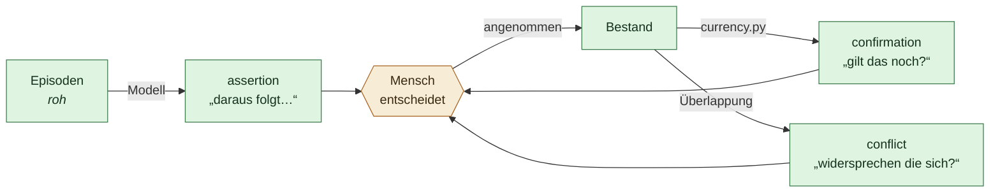

# Verdichtung

Stand 2026-07-31. Verbindlich für `sidecar/icarus_memory/consolidation.py` und
`proposals.py`.

Die Episodenschicht ([`08`](08-gedaechtnisschichten.md)) schreibt roh mit. Der
Bestand ([`06`](06-gedaechtnis-kontrakt.md)) hält, was gilt. Dazwischen steht
das Verfahren, das aus dem einen das andere macht — und das ist der Teil, der
Icarus von einer Ablage unterscheidet.

Ein System, das nach sechs Monaten mehr über jemanden weiß als am ersten Tag,
ohne dabei Unsinn angesammelt zu haben, braucht genau das.

## Die Regel

> **Verdichtung schlägt vor. Sie schreibt nicht.**

Die Grenze verläuft zwischen **ordnen** und **behaupten**.

| Frei, ohne Rückfrage | Braucht einen Menschen |
| --- | --- |
| Episoden als angesehen markieren | Eine Aussage über die Person aufnehmen |
| Altes archivieren | Eine bestehende Aussage bestätigen |
| Kandidaten finden und vorlegen | Zwei Aussagen als strittig markieren |

Auch dann, wenn das Modell sich sehr sicher ist. Besonders dann.

Der Grund ist kein Vorsichtsprinzip, sondern die Erfahrung, gegen die dieses
Projekt gebaut ist: Ein System, das stillschweigend Fakten ableitet und
speichert, hat wieder ein Gedächtnis, dem niemand zusehen kann. Es wird nicht
falsch, weil das Modell schlecht ist — es wird falsch, weil niemand mehr
nachvollziehen kann, woher etwas kam.

## Drei Arten von Vorschlägen

**Zwei der drei brauchen kein Modell.** Das ist wichtig: Ein Gedächtniskern,
dessen Pflege einen API-Schlüssel voraussetzt, wäre keiner. Wer nie einen
Anbieter einträgt, bekommt trotzdem einen Bestand, der altert, nachfragt und
Widersprüche sichtbar macht.

### `confirmation` — reine Regel

`currency.py` kennt für jede Art einen Horizont. Was darüber ist, wird zur Frage
statt zur Behauptung. Angenommen heißt `store.confirm()`, und die Aussage gilt
wieder als gegenwärtig.

### `conflict` — ein Finder, kein Richter

Zwei Aussagen derselben Art, die beide als gegenwärtig gelten und sich stark
überlappen, sind ein **Kandidat**.

Das Maß ist der Anteil an der kleineren Wortmenge (Szymkiewicz-Simpson), nicht
Jaccard. Der Grund ist konkret: Jaccard schwankt mit der Satzlänge. Zwei
Aussagen, die sich in genau einem Wort unterscheiden, kommen auf 0,33 bei zwei
Inhaltswörtern und auf 0,67 bei fünf. Damit fiele ausgerechnet „Wohnt in
Hamburg" gegen „Wohnt in Berlin" durch jedes Raster, das längere Sätze
zuverlässig fängt — also der kurze Identitätssatz, bei dem ein Widerspruch am
meisten wiegt.

Die ehrliche Grenze: Das Verfahren misst Wortüberlappung, nicht Bedeutung. „Ist
Vegetarier" und „Isst gern Schnitzel" fallen ihm nicht auf. Das ist kein Fehler,
den man wegoptimiert — ein Verfahren, das Widersprüche *sicher* fände, müsste
die Welt verstehen.

Deshalb legt es vor, statt zu markieren. Erst die Zustimmung setzt `disputed`.
Ein automatischer Marker, der danebenliegt, macht eine gültige Aussage
unbenutzbar, ohne dass jemand es merkt.

### `assertion` — braucht ein Modell

Das Modell liest eine Episode und schlägt dauerhafte Aussagen vor. Was
zurückkommt, wird geprüft, bevor es überhaupt in die Schlange darf:

| Prüfung | Warum |
| --- | --- |
| Die Art muss eine bekannte sein | Eine erfundene Art landet sonst als `state` und ist falsch einsortiert |
| Ein Zitat ist Pflicht | Ohne Beleg ist der Vorschlag nicht prüfbar |
| **Das Zitat muss wörtlich im Material stehen** | Ein Modell, das den Beleg erfindet, ist genau der Fall, gegen den diese Schicht gebaut ist |
| Zuversicht wird auf 0–1 begrenzt | Ein Wert von 42 sagt nichts |

Der Episodentext geht als **fremder Inhalt** ins Modell, mit derselben
Einrahmung wie Web und Datei. Eine Episode aus einer Mail kann eine Anweisung
enthalten; hier ist sie Material, über das geurteilt wird, kein Auftrag.

## Belege sind Pflicht

Jeder Vorschlag trägt seine `evidence` — welche Episode, welches Zitat, welcher
Digest. Ein Vorschlag ohne Beleg wird abgewiesen, nicht gespeichert.

Der Digest ist der Anfang der Neuprüfung, die der Gedächtnis-Kontrakt als
offenen Punkt führt: Damit ist feststellbar, ob sich die Quelle seit dem
Vorschlag geändert hat.

Wird ein Vorschlag angenommen, trägt die entstehende Aussage all das weiter:
`source_type: inference`, `source_ref` auf die Episode, `verbatim` mit dem Zitat,
`extracted_by` mit dem Modell. Wer später fragt, warum etwas im Bestand steht,
kommt über diese Kette zum Rohtext zurück.

## Abgelehntes bleibt sichtbar

Ein verworfener Vorschlag wird nicht gelöscht, sondern auf `rejected` gesetzt.
Wer später fragt, warum etwas *nicht* im Bestand steht, findet hier die Antwort.
Ein gelöschter Vorschlag wäre ein Vorgang ohne Spur.

Dazu ein Fingerabdruck über den Sachverhalt: Ein zweiter Lauf legt dieselbe
Sache nicht erneut vor, solange sie offen ist. Ohne das wüchse die Schlange mit
jeder Runde — und eine Schlange, in die niemand mehr sieht, ist dasselbe wie
keine Kontrolle.

## Was ohne Modell nicht passiert

Läuft die Verdichtung ohne Anbieter, werden Episoden **nicht** als angesehen
markiert. Sonst gälten sie später als verarbeitet, obwohl nie jemand
hineingeschaut hat, und ihr Inhalt wäre still verloren.

Fällt der Anbieter mitten im Lauf aus, bleibt die betroffene Episode offen und
kommt beim nächsten Mal wieder. Ein Netzwerkfehler darf kein Material
verbrennen.

## Was offen ist

**Kein Prozess, der mitläuft.** Verdichtung passiert auf Zuruf — über den Knopf
in der Oberfläche oder `POST /consolidate`. Der nächste Schritt ist ein
Zeitplan, aber erst, wenn sich im Betrieb zeigt, dass die Vorschläge taugen. Ein
Prozess, der stündlich Unbrauchbares vorlegt, ist schlimmer als keiner.

**Keine Zusammenfassung von Episoden.** Alte Episoden werden archiviert, nicht
verdichtet. Für einen Bestand, der Jahre wächst, wird irgendwann eine
Zusammenfassung nötig — und die ist selbst wieder eine Behauptung und braucht
denselben Weg über einen Vorschlag.

**Keine Neuprüfung vor der folgenreichen Aktion.** Der Digest liegt jetzt an
jedem Beleg. Der Vergleich beim Einlösen einer Freigabe fehlt noch.

**Der Widerspruchsfinder sieht nur Wörter.** Siehe oben. Ein zweiter Durchgang
mit dem Modell wäre möglich — dann aber als Vorschlag über den Vorschlag, und
das ist eine Ebene mehr, als heute nötig ist.

## Verwandte Dokumente

- [`06-gedaechtnis-kontrakt.md`](06-gedaechtnis-kontrakt.md) — die Regeln des Bestands
- [`08-gedaechtnisschichten.md`](08-gedaechtnisschichten.md) — Kurzzeit, Mittelfrist, Bestand
- [`05-sicherheit.md`](05-sicherheit.md) — warum fremder Text eingerahmt wird
