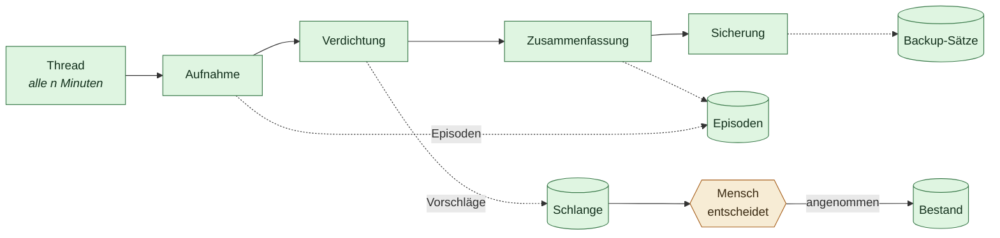

# Der Prozess, der mitläuft

Stand 2026-08-01. Verbindlich für `sidecar/icarus_memory/scheduler.py`.

Bis hierher passierte alles auf Zuruf: aufnehmen, wenn jemand auf „Aufnehmen“
drückt; verdichten, wenn jemand auf „Verdichten“ drückt. Für ein Werkzeug ist
das richtig. Für einen Assistenten, der ein Arbeitsleben begleiten soll, ist es
zu wenig — **was nur passiert, wenn man daran denkt, passiert nicht.**

Die Notizen von gestern liegen im Vault, nicht in den Episoden. Die Aussage vom
letzten Jahr ist überfällig, aber niemand hat nachgefragt. Die Sicherung von vor
drei Wochen ist die letzte. Nichts davon ist ein Fehler im Code; es ist die
Lücke zwischen einem Werkzeug und einem Gedächtnis.

## Die Regel bleibt dieselbe

> **Verdichtung schlägt vor. Sie schreibt nicht.**

Der Zeitplan bekommt keine neuen Rechte. Er tut nur öfter, was ohnehin erlaubt
ist: **ordnen, nicht behaupten.**

| Läuft von selbst | Passiert nie ohne Menschen |
| --- | --- |
| Ordner erneut einlesen (der Digest verhindert Doppel) | Eine Aussage in den Bestand schreiben |
| Regelbasierte Vorschläge erzeugen | Einen Vorschlag annehmen |
| Mit Modell: Vorschläge aus Episoden ableiten | Zwei Aussagen als strittig markieren |
| Mit Modell: alte Monate zusammenfassen | Eine Quelle löschen |
| Eine Sicherung anlegen | Etwas Außenwirksames tun |

Der Zeitplan macht die **Vorschlagsschlange** voller, nicht den Bestand. Das ist
die einzige Eigenschaft, die diesen Prozess unbedenklich macht: Im schlimmsten
Fall entsteht Arbeit, die jemand ignoriert — nie ein falscher Fakt.

Das ist auch der Grund, warum es hier keine Freigabestufe braucht. Ein
Hintergrundprozess, der Außenwirksames tun dürfte, wäre eine ganz andere Zusage
als die, die dieses Projekt gibt. Er kann es nicht: Die Schritte rufen
`consolidator.run()`, nie `accept()`.



## Standardmäßig aus

Zwei Gründe, und beide sind ernst.

**Kosten.** Die modellgestützte Ableitung ruft einen Anbieter. Ein Zeitplan, der
das ungefragt stündlich tut, gibt fremdes Geld aus. Deshalb ist nicht nur der
Zeitplan aus, sondern die Modellnutzung darin **noch einmal getrennt zu
schalten**. Wer den Zeitplan einschaltet und `with_model` aus lässt, bekommt
Aufnahme, Fälligkeitsfragen, Widerspruchskandidaten und Sicherung — alles ohne
einen einzigen API-Aufruf.

**Lärm.** Ein Prozess, der stündlich Unbrauchbares vorlegt, ist schlimmer als
keiner: Die Schlange wächst, niemand sieht mehr hinein, und dann ist auch das
Nützliche darin unsichtbar. Deshalb gibt es eine harte Untergrenze von
`MIN_INTERVAL_MINUTES = 15` und eine Voreinstellung von vier Stunden — ein paar
Mal am Arbeitstag, nicht ständig. Ein kürzerer Wert wird nicht abgelehnt,
sondern angehoben; ein Fehler wäre hier nur eine Hürde ohne Erkenntnis.

## Ein Thread, kein Systemdienst

Icarus ist eine Desktop-App. Der Sidecar lebt, solange die App offen ist.

Ein Systemdienst, der im Hintergrund weiterläuft, wäre eine andere Zusage als
die, die das Projekt gibt („alles bleibt auf diesem Rechner, und du siehst zu“).
Ein `launchd`-Job, der nachts einen Anbieter ruft, während die App zu ist, ist
genau das, wogegen dieses Projekt gebaut ist — auch wenn er dasselbe täte.

Also: ein Thread im Sidecar, als Daemon markiert. Er läuft, wenn die App läuft.
Das ist ehrlich und reicht: Wer die App eine Woche nicht öffnet, hat auch keine
Vorschläge geprüft.

Im Container gilt dasselbe mit anderem Vorzeichen — dort läuft der Sidecar
dauerhaft, und der Zeitplan trägt tatsächlich durch die Nacht. Das ist kein
Sonderfall, sondern dieselbe Regel: Der Prozess lebt genau so lange wie das
Programm, das ihn hält.

**Wartet in kleinen Schritten.** Der Thread wacht alle `TICK_SECONDS = 30` auf
und prüft, ob etwas fällig ist, statt einmal lang zu schlafen. Sonst hinge das
Beenden der App am Takt, und vier Stunden Wartezeit fühlen sich wie ein Absturz
an.

## Ein kaputter Schritt kippt den Lauf nicht

Jeder Schritt ist einzeln in `try` gefasst, und jeder Ordner innerhalb der
Aufnahme noch einmal.

Der Grund ist konkret: Ein Mailserver, der hakt, darf nicht verhindern, dass die
Sicherung läuft. Genau diese Kopplung macht Hintergrundprozesse unbrauchbar —
sie fallen irgendwann ganz aus, und niemand merkt, warum.

Der Bericht sagt dann `ok: false`, aber die Liste zeigt, welcher Schritt es war:

```
gelaufen um: 2026-08-01T09:31:44 | ok: false
  aufnahme:Vault        FileNotFoundError: /Users/…/Weg
  verdichtung           1 Bestätigungen fällig. Nichts davon steht im Bestand.
  sicherung             icarus-backup-20260801T093144Z-a1b2c3d4
```

Auch der Thread selbst darf nicht sterben. Ein Zeitplan, der nach einem
Ausrutscher still aufhört, ist schlimmer als einer, der es erneut versucht:
Beide liefern nichts, aber nur einer sieht so aus, als täte er es.

## Die vier Schritte

### Aufnahme

Liest die eingestellten Ordner erneut ein. Dass ein zweiter Lauf über denselben
Vault nichts doppelt anlegt, ist keine Nettigkeit, sondern die Voraussetzung
dafür, dass dieser Schritt überhaupt wiederholbar ist — sie steckt im Digest der
Episodenschicht ([`08`](08-gedaechtnisschichten.md)).

Die Ordner müssen unter `ICARUS_FILE_ROOTS` freigegeben sein. Der Zeitplan
umgeht die Pfadgrenze nicht; er ist derselbe Aufrufer wie der Knopf in der
Oberfläche.

### Verdichtung

Ruft `consolidator.run(with_model=…)` — dasselbe Verfahren wie auf Zuruf,
beschrieben in [`10`](10-verdichtung.md). Ohne Modell entstehen
Fälligkeitsfragen und Widerspruchskandidaten, mit Modell zusätzlich Vorschläge
aus Episoden.

### Zusammenfassung

Fasst Monate zusammen, die älter als ein Vierteljahr sind — **nach** der
Verdichtung, nie davor. Zusammenfassen archiviert die Quellen; liefe es zuerst,
verschwände Material aus der Verdichtung, das noch nie jemand angesehen hat.

Die Quellen bleiben liegen und lassen sich zurückholen. Details in
[`12`](12-zusammenfassung.md).

### Sicherung

Der billigste Schritt mit dem größten Nutzen. Ein Gedächtnis, das zwanzig Jahre
halten soll, hat genau einen katastrophalen Fehlerfall, und eine Sicherung, die
nur läuft, wenn jemand daran denkt, verhindert ihn nicht.

Fehlen beim ersten Start noch alle Stores, ist das **kein Fehler**, sondern
„nichts zu sichern“. Existiert dagegen nur ein Teilsatz, schlägt die Sicherung
sichtbar fehl; ein unvollständiger Satz darf nie als erfolgreich gelten.
Beim ersten Start gibt es nichts — und wer sich an rote Meldungen gewöhnt,
übersieht die eine, die zählt.

## Von Hand geht immer

`POST /schedule/run` läuft auch bei ausgeschaltetem Plan. Wer den Automatismus
nicht will, soll trotzdem einmal drücken können — und wer ihn einschaltet, soll
sehen können, was dabei herauskommt, bevor er vier Stunden wartet.

## Schnittstelle

| Weg | Was |
| --- | --- |
| `GET /schedule` | Zustand, Takt, letzter Bericht, nächster Lauf |
| `PUT /schedule` | Ein-/Ausschalten, Takt, Modellnutzung, Sicherung, Quellen |
| `POST /schedule/run` | Ein Durchgang, sofort |

Ein unbekannter Adapter in `sources` wird mit `400` abgewiesen, statt still
ignoriert zu werden: Ein Ordner, von dem jemand glaubt, er werde gelesen, ist
schlimmer als einer, den er neu einträgt.

Die Einstellungen liegen in `ScheduleSettings` und überleben den Neustart. Das
Umschalten greift **ohne Neustart** — `PUT /schedule` verdrahtet den Scheduler
neu und startet oder stoppt den Thread.

## Was offen ist

**Keine Rückmeldung nach außen.** Wer die App zu hat, erfährt nichts von einem
fehlgeschlagenen Lauf. Eine Benachrichtigung wäre möglich; sie wäre aber die
erste Stelle, an der Icarus von sich aus etwas sendet, und das gehört bedacht,
nicht nebenbei eingebaut.

**Kein Rückstau-Schutz bei sehr großen Vaults.** Die Aufnahme läuft synchron im
Thread. Bei zehntausenden Dateien dauert ein Lauf lange; er blockiert nichts
anderes, aber der nächste Takt verschiebt sich entsprechend.

## Verwandte Dokumente

- [`10-verdichtung.md`](10-verdichtung.md) — was ein Lauf tut und warum er nur vorschlägt
- [`08-gedaechtnisschichten.md`](08-gedaechtnisschichten.md) — Episoden, Digest, Wiederholbarkeit
- [`06-gedaechtnis-kontrakt.md`](06-gedaechtnis-kontrakt.md) — die Regeln des Bestands
- [`09-einrichtung.md`](09-einrichtung.md) — wo die Einstellungen liegen
- [`12-zusammenfassung.md`](12-zusammenfassung.md) — was der dritte Schritt tut
