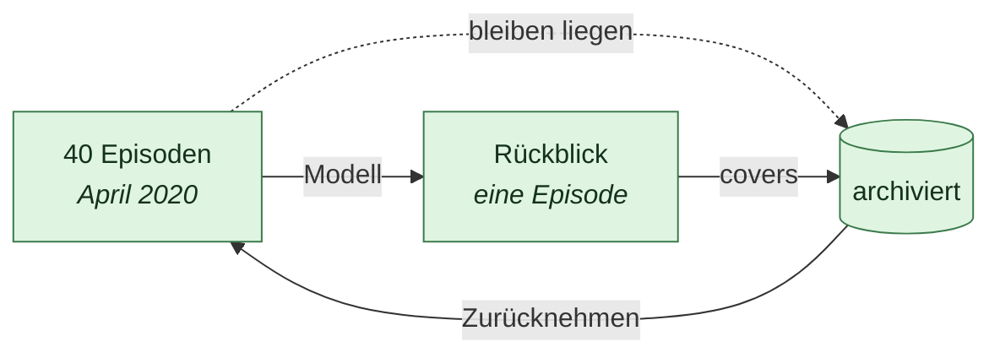

# Zusammenfassung

Stand 2026-08-01. Verbindlich für `sidecar/icarus_memory/summaries.py`.

Die Episodenschicht ([`08`](08-gedaechtnisschichten.md)) wächst monoton. Nach
einem Jahr Alltagsbetrieb liegen dort Tausende Einträge, und `archive_before`
räumt sie nur beiseite — der Inhalt ist weiter da, ungelesen, und niemand hat je
etwas daraus gelernt.

Menschliches Gedächtnis macht das anders. Es behält wenige Ereignisse wörtlich
und presst den Rest zu etwas zusammen, das man noch erzählen kann: „Im April
ging es fast nur um Projekt A, das an einer fehlenden Freigabe hing.“ Das ist
kein Verlust, sondern die Bedingung dafür, dass Erinnerung über Jahre trägt.

## Die eine Frage

Bei jedem Verfahren, das Material zusammenzieht, entscheidet genau eine Frage,
ob man es laufen lassen darf: **Kann es etwas verlieren?**

Hier nicht. Die Quellen werden **archiviert, nicht gelöscht**, und
`delete_summary` holt sie wieder hervor. Eine schlechte Zusammenfassung ist
damit ein Ärgernis, kein Datenverlust.

| Passiert | Passiert nie |
| --- | --- |
| Eine neue Episode der Art `summary` entsteht | Eine Quelle wird gelöscht |
| Die Quellen gehen auf `archived` | Eine Aussage entsteht im Bestand |
| Die Zusammenfassung nennt ihre Quellen | Aus einer Zusammenfassung wird abgeleitet |

## Warum eine Zusammenfassung nie Quelle einer Aussage ist

Die Belegprüfung der Verdichtung ([`10`](10-verdichtung.md)) verlangt, dass das
Zitat **wörtlich im Material** steht. Genau das fängt ein Modell ab, das seinen
Beleg erfindet.

Käme eine Zusammenfassung als Material zurück in die Verdichtung, prüfte das
Modell sein Zitat gegen einen Text, den es selbst geschrieben hat. Die Prüfung
liefe weiter durch und hieße nichts mehr: Der Beleg zeigte auf eine Behauptung
statt auf einen Beleg. Aus einer Deutung würde über zwei Schritte ein Fakt, ohne
dass irgendwo im Weg noch Rohtext stünde.

Deshalb entsteht eine Zusammenfassung direkt als `consolidated`. `pending()`
sieht sie nie, und der Zustandsübergang, der sie doch dorthin brächte, existiert
nicht.

Zum **Lesen** taugt sie trotzdem, und dafür ist sie da: für den Menschen, der
sein eigenes Jahr überblicken will, und als Kontext im Gespräch.

## Was ganz bleibt

Zwei Arten von Episoden werden nie eingeschmolzen.

**Was der Bestand benutzt.** Hat eine Episode eine angenommene Aussage
hervorgebracht (`produced` ist nicht leer), bleibt sie einzeln stehen. Die
Aussage zeigt über `derived_from` auf sie; sie in einer Zusammenfassung aufgehen
zu lassen hieße, die Kette vom Fakt zurück zum Rohtext zu kappen — und die ist
der eine Punkt, an dem dieses Projekt nicht verhandelt.

**Was niemand angesehen hat.** `new` bleibt `new`, egal wie alt. Dieselbe Regel
wie beim Archivieren: Stilles Vergessen trifft sonst genau das Material, das
noch Arbeit erzeugen sollte.

## Die Schwellen

| Wert | Voreinstellung | Warum |
| --- | --- | --- |
| `SUMMARISE_AFTER_DAYS` | 90 | Was letzte Woche war, braucht man noch im Wortlaut |
| `MIN_EPISODES` | 5 | Drei Notizen aus dem April **sind** schon die Übersicht |
| `MAX_EPISODES` | 40 | Ein Monat mit zweihundert Einträgen sprengt jedes Kontextfenster |
| `limit` je Lauf | 3 | Ein erster Durchgang über fünf Jahre Vault schriebe sonst sechzig Anfragen in einem Zug |

Wird bei `MAX_EPISODES` gekürzt, **steht das im Material**, das ins Modell geht.
Still abzuschneiden hieße, einen Rückblick zu erzeugen, der so tut, als beruhe
er auf allem.

## Warum nach Monat und nicht nach Thema

Nach Thema wäre besser und ist nicht ehrlich zu haben. Themen zu finden hieße,
Ähnlichkeit über **Bedeutung** zu messen; das Projekt kann heute
Wortüberlappung, und die zerlegt einen Monat in Gruppen, die niemand
wiedererkennt.

Ein Monat dagegen ist eine Einteilung, über die man nicht streiten muss, und sie
deckt sich damit, wie Menschen über ihre Vergangenheit reden. Wenn später
Einbettungen dazukommen, ist Thema die Verfeinerung — nicht der Ersatz.

## Wiederholbarkeit

Der Zeitraum steht als `period` (`JJJJ-MM`) an der Zusammenfassung. Ein zweiter
Lauf erkennt daran, dass es den April schon gibt.

Über den Digest ginge das nicht: Ein Modell schreibt zweimal denselben Monat mit
anderen Worten, und der Digest wäre beide Male ein anderer. Ohne `period` wüchse
die Liste mit jedem Lauf um dieselben Monate.

## Ohne Modell

Kandidaten werden gefunden, geschrieben wird nichts. Das ist kein Notbetrieb,
sondern nützlich: Die Oberfläche kann sagen, was zusammengefasst *würde*, bevor
jemand einen Anbieter einträgt — und wer nie einen einträgt, verliert nichts
außer der Zusammenfassung selbst.

## Zurücknehmen

`DELETE /summaries/{id}` löscht die Zusammenfassung und setzt die Quellen von
`archived` zurück auf `consolidated`.

Das ist der **einzige** Weg, auf dem eine Episode je verschwindet, und er gilt
ausschließlich für das, was Icarus selbst geschrieben hat. `delete_summary`
weist Rohmaterial ausdrücklich ab, mit einer Fehlermeldung statt still. Ein
Löschweg, der auch Belege erfasst, wäre über kurz oder lang der Weg, auf dem
Belege verschwinden.

## Im Zeitplan

Der Schritt läuft **nach der Verdichtung**, nicht davor ([`11`](11-zeitplan.md)).
Die Reihenfolge ist keine Feinheit: Zusammenfassen archiviert die Quellen. Liefe
es zuerst, verschwände Material aus der Verdichtung, das noch nie jemand
angesehen hat. So sieht die Verdichtung erst alles, und erst danach wird gekürzt.

Er hängt am selben Schalter wie die übrige Modellnutzung. Wer den Zeitplan ohne
Modell laufen lässt, bekommt keine Rückblicke — und keine Rechnung.

## Was offen ist

**Keine Zusammenfassung von Zusammenfassungen.** Nach fünf Jahren liegen sechzig
Rückblicke, und das ist wieder zu viel. Eine zweite Ebene (Jahr aus Monaten)
wäre der nächste Schritt — mit derselben Regel, dass die Ebene darunter liegen
bleibt.

**Kein Verweis von der Zusammenfassung in den Text.** `covers` nennt die
Kennungen, aber die Oberfläche bietet noch keinen Sprung von einem Satz im
Rückblick zu der Episode, aus der er stammt.

**Keine Themen.** Siehe oben. Braucht Einbettungen, die es hier noch nicht gibt.

## Verwandte Dokumente

- [`08-gedaechtnisschichten.md`](08-gedaechtnisschichten.md) — Kurzzeit, Mittelfrist, Bestand
- [`10-verdichtung.md`](10-verdichtung.md) — warum Verdichtung nur vorschlägt
- [`11-zeitplan.md`](11-zeitplan.md) — der Prozess, der beides von selbst tut
