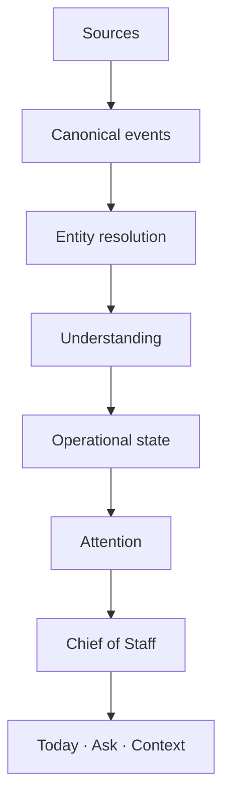

# ICARUS 2.0 — Produkt-, UX- und Architekturplan

Stand: 2026-08-28  
Ausgangspunkt: `main` auf `c4716d6`, einschließlich PR #53
„Vom Gedächtnis zum Stabschef — fünf Etappen“.

Dieses Dokument ist die verbindende Spezifikation für den schrittweisen Ausbau
von ICARUS 2.0. Es ersetzt weder die Produktvision noch die Sicherheits- oder
Gedächtnisverträge. Bei Widersprüchen gelten weiterhin
[`00-produktvision.md`](00-produktvision.md),
[`05-sicherheit.md`](05-sicherheit.md) und
[`06-gedaechtnis-kontrakt.md`](06-gedaechtnis-kontrakt.md).

## 1. Produktversprechen

> **ICARUS hält den organisatorischen Zustand des Lebens seines Nutzers
> kontinuierlich aktuell, erkennt Zusammenhänge, Verpflichtungen,
> Entscheidungen, Risiken und Veränderungen und zeigt nur, was gerade
> Aufmerksamkeit benötigt.**

Der Nutzer organisiert ICARUS nicht. ICARUS organisiert den Kontext des
Nutzers.

Jede Funktion muss deshalb beantworten: **Welche organisatorische Arbeit nimmt
sie dem Nutzer ab?** Eine zusätzliche Ansicht, Liste oder Eingabemaske ist kein
Fortschritt, wenn sie anschließend gepflegt werden muss.

## 2. Nicht verhandelbare Grenzen

- Der autoritative Bestand bleibt lokal und nutzereigen.
- SQLite bleibt die operative Quelle, solange keine dokumentierte Entscheidung
  mit mindestens gleicher Nachvollziehbarkeit und Wiederherstellbarkeit fällt.
- Cognee und andere semantische Indizes bleiben optional und nie autoritativ.
- Episoden und der Canonical Event Layer werden zu **einem** Rohdatenpfad
  weiterentwickelt; es entsteht kein zweites Memory-System.
- Assertions behalten Provenienz, Versionierung, Supersession, Expiry,
  Disputes, Retract, Redaction und kaskadierende Löschpfade.
- Der bestehende Policy-, Approval- und Audit-Pfad bleibt die einzige
  Ausführungsschicht für Aktionen.
- Fremde Inhalte bleiben Daten, nie Anweisungen. Ihre Klassifizierung muss sich
  durch Ableitungen und Aktionen fortpflanzen.
- OpenAI-kompatible Modelle, Anthropic und Ollama bleiben austauschbar.
- MCP wird ausgebaut, nicht durch connector-spezifische Parallelarchitekturen
  umgangen.
- Ohne Modell und ohne semantischen Zusatzindex bleibt der deterministische
  Kern nutzbar.
- Keine irreversible, verdeckte Zusammenführung von Personen oder Wissen.

## 3. Audit des aktuellen Zustands

### 3.1 Was bereits trägt

Der Stand nach PR #53 ist eine belastbare technische Alpha mit fünf
funktionsfähigen Stabschef-Bausteinen:

- deterministisches Briefing;
- Delegation und `wartet_auf` auf Aufgaben;
- aus Episoden abgeleitete Personen;
- Entscheidungen mit Verweisen auf ihre Annahmen;
- ruhende Ziele über nachvollziehbare Tag-Aktivität;
- lokales, append-only geschütztes Assertion-Modell;
- Episoden mit Digest und Deduplizierung;
- Vorschläge statt stiller Konsolidierungs-Writes;
- zentrale Policy, Freigaben und anhängendes Audit;
- Schutz vor Prompt Injection über Pfad-, Netzwerk- und
  Kontaminationsgrenzen;
- lokale Tauri-2-Hülle mit Sidecar auf Loopback und Token je Start;
- Modellunabhängigkeit und MCP in beide Richtungen.

Diese Eigenschaften werden nicht neu gebaut.

### 3.2 Wo das heutige Produkt noch Arbeit verlangt

Die Oberfläche zeigt heute viele interne Ablagen direkt. „Heute“ ist zugleich
Briefing, Kalender, Aufgabenliste, Quellen-Posteingang und Einstieg ins
Gespräch. Die „Ablage“ führt Projekte, Menschen, Assertions, Vorschläge und
Episoden als gleichartige Fächer. Dadurch muss der Nutzer noch verstehen, wo
Informationen liegen und welche interne Schicht er pflegt.

Die Personenebene bündelt nur exakt gleiche Namen. Projekte werden primär
manuell angelegt und über Tags verknüpft. `wartet_auf` ist ein Zustand einer
Aufgabe, aber noch kein eigenständiges Commitment mit Evidenz, Gegenpartei,
Confidence und Lifecycle. Das Briefing priorisiert vorhandene Objekte, besitzt
aber noch kein allgemeines semantisches Attention-Objekt.

Mail und Kalender werden synchron beim Dashboard-Aufruf gelesen. Es fehlen ein
kanonischer Event-Vertrag, Cursor, Idempotenz über Quellen, Hintergrund-Sync,
Deletion-Verhalten und eine nachvollziehbare Understanding-Pipeline.

### 3.3 Technische Engpässe

- `app/src/main.js` ist mit rund 122 KB und 3.500 Zeilen ein Frontend-Monolith.
- `server.py` bündelt mit rund 2.000 Zeilen zu viele API- und
  Kompositionsverantwortungen.
- Operativer Zustand liegt in sieben SQLite-Dateien: Selbstmodell, Episoden,
  Aufgaben, Workspace, Vorschläge, Regeln und Audit.
- Es gibt keine gemeinsame, versionierte Migrationsschicht oder atomare
  Transaktion über diese Stores.
- Backup und Restore sichern derzeit nur `self-model.sqlite3`; Aufgaben,
  Projekte, Episoden, Regeln, Vorschläge und Audit sind nicht Teil eines
  konsistenten Wiederherstellungssatzes.
- Episoden werden heute global über den SHA-256-Digest ihres Textkörpers
  dedupliziert. Zwei verschiedene Nachrichten mit identischem Inhalt können
  dadurch kollabieren; Events benötigen stattdessen eine Idempotenz aus Quelle,
  Account und nativer Quell-ID. Der Digest bleibt Integritätsmerkmal.
- Pending Approvals liegen nur im Prozessspeicher und verschwinden beim
  Neustart. Vor langlebigen Hintergrundaktionen braucht dieser Zustand einen
  sicheren, ablaufenden und weiterhin zentralen Persistenzpfad.
- Frontend-CI prüft nur JavaScript-Syntax. TypeScript, Lint, Komponenten- und
  Browser-E2E fehlen.
- Der Python-Bestand hat eine breite Testsuite, aber keine statische Typprüfung
  oder Laufzeit-Export-gegen-Schema-Prüfung.
- Das JSON-Schema ist bereits hinter der Laufzeit zurück: `decision` und
  `disputed` fehlen in den Enums.
- `package-lock.json` fehlt; Frontend-Installationen sind nicht reproduzierbar.
- Einzelne Bestandsdokumente beschreiben inzwischen überholte Zwischenstände,
  etwa Secrets ausschließlich in `.env`. Implementierung und aktuelle Tests
  sind bei Audits gegen Dokumentbehauptungen abzugleichen; die Dokumente werden
  in kleinen thematischen PRs nachgezogen.

### 3.4 Bekannter kritischer Fehler

`Entscheidung.gefallen_am()` berücksichtigt nur `recorded_at` einer
Replacement-Assertion. Für widerrufene, abgelaufene oder bestrittene Annahmen
ohne Replacement ist der Zeitpunkt unbekannt. `frisch_erschuettert()` behandelt
„unbekannt“ derzeit unbegrenzt als frisch. Damit kann dieselbe Entscheidung
weit länger als 30 Tage jeden Morgen Aufmerksamkeit erzeugen.

Der isolierte Fix erhält einen eigenen PR. Semantisch notwendig ist ein
persistierter Statuswechsel-Zeitpunkt mit konservativen Fallbacks für alte
Daten. Ein bloßer UI-Filter würde die Ursache verdecken.

## 4. Bestandsklassifikation

Die Kategorien bedeuten:

- **KEEP:** Semantik und Rolle unverändert erhalten.
- **EVOLVE:** bestehende Quelle oder Funktion schrittweise erweitern.
- **HIDE:** weiter betreiben, aber aus der Alltagsebene entfernen.
- **REPLACE:** Nutzungspfad ablösen, Migration/Fallback zeitweise erhalten.
- **REMOVE:** nach nachgewiesener Migration löschen.

### 4.1 Screens und Navigation

| Bestand | Einordnung | Ziel |
| --- | --- | --- |
| Heute / Dashboard | EVOLVE | Ruhiger Attention-Einstieg mit NOW, NEEDS YOU und RADAR aus Backenddaten. |
| Gespräch | REPLACE | In ASK aufgehen: Frage, Suche, Navigation, Erklärung und Action Preparation. |
| Ablage als Primärnavigation | REMOVE | Alltagsebene auf Heute und Ask reduzieren; Kontext über Suche und sekundäre Navigation. |
| Projekte | EVOLVE | Kontextseite aus rekonstruiertem Project State, keine primär manuelle Datenbank. |
| Menschen | EVOLVE | Person Context mit konservativer Identity Resolution und Korrekturpfad. |
| Was ich weiß / Assertions | HIDE | Experten- und „Warum?“-Ebene; kein täglicher Pflegeort. |
| Zu klären / Proposals | EVOLVE | Unsichere Ableitungen in NEEDS YOU oder Kontextkorrektur statt eigener Hauptablage. |
| Eingelesenes / Episodes | HIDE | Rohquellen über „Warum?“, Suche und Expertenebene zugänglich. |
| Freigaben | EVOLVE | Kontextuelle Approval-Ansicht; zentraler Policy-Pfad bleibt. |
| Protokoll / Audit | HIDE | Nachvollziehbarkeit und Expertenebene, nicht Alltag. |
| Einrichtung | EVOLVE | Quellen und Wirkung statt Protokollnamen; progressive Offenlegung. |
| Onboarding | EVOLVE | Nutzen zuerst, Connectoren optional, erster echter Lagegewinn in Minuten. |
| Suche | EVOLVE | Teil von ASK; öffnet direkt den passenden Kontext. |
| Mailbox-Block | REPLACE | Quelle verschwindet aus dem Primärinterface; relevante Änderungen erscheinen kontextuell. |
| Kalenderliste | EVOLVE | In NOW und Meeting Lifecycle aufgehen; kein Kalender-App-Ersatz. |

### 4.2 Kernmodule

| Modul / Konzept | Einordnung | Begründung |
| --- | --- | --- |
| Assertions / `SelfModelStore` | KEEP | Autoritative, überprüfbare Wissensschicht. |
| `SqliteBackend` | KEEP | Exakter lokaler Bestand; additive Migrationen vorbereiten. |
| Cognee-Backend | KEEP | Optionaler semantischer Index mit deterministischem Fallback. |
| Episodes / `EpisodeStore` | EVOLVE | Wird zum Canonical Event Layer; keine zweite Rohdatenwahrheit. |
| Tasks / `TaskStore` | KEEP | Operative Aufgaben bleiben kompatibel; Commitments sind nicht bloß Tasks. |
| `wartet_auf` | EVOLVE | Kompatibilitätsquelle für echte Waiting-for-Objekte. |
| Workspace / Projekte / Notizen | EVOLVE | Eingaben weiter unterstützen, aber Project State zunehmend rekonstruieren. |
| Personenableitung | EVOLVE | Identity- und Alias-Layer hinzufügen; exakte Namen bleiben sicherer Fallback. |
| Entscheidungen | EVOLVE | Freshness reparieren und Attention/Project State anbinden. |
| Zielurteil über Tags | KEEP als MVP | Erklärbarer Fallback; Beziehungen später durch explizite und semantische Signale ergänzen. |
| Briefing | EVOLVE | Regeln und Begründbarkeit in allgemeine Attention Engine überführen. |
| Konsolidierung / Proposals | KEEP | Unsichere Extraktion bleibt Vorschlag, kein versteckter Memory Write. |
| Policy / Action Classes / Approvals | KEEP | Einzige Freigabe- und Ausführungsschicht. |
| Audit | KEEP | Teil des Produktversprechens und Grundlage für „Warum?“. |
| Scheduler | EVOLVE | Robuste Jobs, Retries, Cursor und UI-unabhängige Verarbeitung. |
| Native IMAP/SMTP/CalDAV | EVOLVE | Zunächst adapterfähig machen; keine connector-spezifische Logik im Kern. |
| MCP Server und Client | KEEP | Multiplikator unter denselben Sicherheitsregeln. |
| Vanilla-Frontend | REPLACE | React/TypeScript/Vite-Shell schrittweise daneben aufbauen, danach entfernen. |
| Tauri 2 | KEEP | Keine technische Notwendigkeit für Replatforming festgestellt. |
| Sidecar/FastAPI | EVOLVE | Modularisieren, nicht neu schreiben. |

## 5. Zielarchitektur



### 5.1 Canonical Event Layer

Ein Canonical Event ist eine normalisierte Beobachtung und keine bestätigte
Wahrheit. Der bestehende Episode-Vertrag wird additiv erweitert um:

- stabile Event-ID und Quellschlüssel;
- Quelle, Connector und Account;
- `occurred_at`, `observed_at` und optional `updated_at`;
- Teilnehmerreferenzen plus unveränderte Rohwerte;
- Trust-Klassifizierung;
- Scope/Space;
- Raw Reference und Digest;
- mögliche Beziehungen mit Confidence und Provenienz;
- Lösch- und Tombstone-Verhalten.

Bestehende Episode-IDs, Digests und APIs bleiben lesbar. Altdaten werden nicht
nachträglich als `personal` oder `work` erraten, sondern erhalten einen
expliziten unbekannten/Legacy-Scope.

### 5.2 Entity Resolution

Entitäten besitzen stabile IDs; Beobachtungen behalten ihre ursprünglichen
Namen und Identifikatoren. Ein Identity Link enthält:

- zwei Referenzen;
- Link-Typ;
- Confidence;
- Evidence und Provenienz;
- Entscheidung `candidate`, `confirmed`, `rejected` oder `reverted`;
- Zeit und optionalen Nutzerkorrekturverweis.

Automatisch zusammengeführt werden zunächst nur deterministische Identitäten,
etwa derselbe normalisierte, quellenbestätigte Account-Identifier. Fuzzy Names
erzeugen höchstens Kandidaten. Jede Zusammenführung bleibt reversibel.

### 5.3 Understanding und Operational State

Aus Events und bestehenden operativen Quellen entstehen versionierte,
nachvollziehbare Projektionen:

- Commitments, Requests und Waiting-for;
- Entscheidungen und erschütterte Annahmen;
- Projektzustände;
- Meeting-Zustände;
- Beziehungszustände;
- Risiken, Abhängigkeiten und offene Fragen.

Eine Projektion verweist immer auf Evidence. Unsichere Interpretation erhält
Confidence und einen bestätigbaren Kandidatenstatus. Bestätigte Fakten werden
weiterhin nur über den bestehenden Assertion-Vorschlagspfad dauerhaftes Wissen.

### 5.4 Attention Engine

Priorisierung ist Backendlogik. Das API-Objekt soll mindestens tragen:

```json
{
  "id": "att-…",
  "bucket": "needs_you",
  "title": "Freigabe für Projekt Alpha fehlt",
  "reason": "Ohne die Freigabe kann der nächste Meilenstein nicht starten.",
  "entity_refs": ["project:…", "person:…"],
  "evidence_refs": ["event:…", "commitment:…"],
  "confidence": 0.92,
  "suggested_action": {
    "kind": "prepare_follow_up",
    "subject_ref": "commitment:…"
  },
  "created_at": "…",
  "valid_until": "…"
}
```

Buckets:

- **NOW:** unmittelbar relevant, klein und kontextgebunden;
- **NEEDS YOU:** nur menschliche Entscheidung, Freigabe, Korrektur oder fehlende
  Information;
- **RADAR:** ruhig beobachtete Entwicklung, noch nicht akut.

Leere Ergebnisse sind vollständig gültig. Die UI fügt keine Ersatzkarten oder
Fake-Metriken hinzu.

### 5.5 Action Path

ASK und vorgeschlagene Aktionen erzeugen einen vorhandenen Tool Request. Die
bestehende Policy bestimmt Action Class und Autonomiestufe. Vorbereitete
Inhalte sind noch keine Ausführung. Versand, Veröffentlichung, finanzielle,
rechtliche oder irreversible Folgen laufen weiterhin durch explizite
Freigaben. Es entsteht kein zweiter Trust-Schalter.

### 5.6 Spaces und Scopes

Scope wird additiv und fail-closed eingeführt. Unbekannter Scope wird nicht
automatisch einem Bereich zugeordnet. Scope-Labels propagieren durch Event,
Entity Link, Retrieval, Project State, Modellkontext und Action. Abfragen und
Aktionen dürfen den erlaubten Scope nicht durch eine semantische Verknüpfung
überschreiten.

## 6. UX-Spezifikation

### 6.1 Primärnavigation

Die dauerhafte Alltagsebene besteht aus:

1. **Heute**
2. **Ask**

Projekte sind sekundär erreichbar, wenn sie im Alltagstest eine dauerhaft
sichtbare Abkürzung rechtfertigen. Menschen, Quellen, Gedächtnis, Audit,
Connectoren und Regeln sind über ASK, Suche, Kontext oder Einstellungen
erreichbar.

### 6.2 Today

Today beantwortet innerhalb weniger Sekunden:

- Was zählt unmittelbar?
- Was braucht eine menschliche Entscheidung?
- Was sollte ruhig beobachtet werden?

Die Buckets erscheinen nur, wenn sie Inhalt haben. NOW ist keine vollständige
Agenda. NEEDS YOU ist keine Aufgabenliste. RADAR ist kein Newsfeed.

Verbindliche Zustände für Konzept, Komponenten- und Browsertests:

- normal;
- busy mit strikter Begrenzung und Gruppierung;
- quiet ohne künstlichen Inhalt;
- partieller Fehler;
- offline;
- schmaler Laptop;
- mobile Breite.

### 6.3 Ask

ASK verbindet Frage, Suche, Navigation, Erklärung und Action Preparation. Der
Nutzer muss keine Speicherorte kennen. Antworten tragen zunächst eine klare
Aussage und bieten danach „Warum?“ an. Quellen, Evidence, Confidence und
interne IDs werden erst in dieser Offenlegung gezeigt.

Korrekturen sind natürliche Befehle wie:

- „Gehört nicht zu Projekt Alpha.“
- „Das ist eine andere Claudia.“
- „Keine Aufgabe.“
- „Deadline ist Montag.“
- „Diese Information ist privat.“

Jede Korrektur wird als nachvollziehbarer, reversibler Systeminput behandelt;
sie überschreibt keine Rohquelle.

### 6.4 Kontextseiten

Projekt- und Personenseiten sind rekonstruierte Lagebilder, keine Formulare.
Ihre dominante Aussage lautet jeweils „Was hat sich verändert?“ beziehungsweise
„Was ist mit dieser Person offen?“. Manuelle Eingaben bleiben als Korrektur und
Fallback möglich, nicht als Voraussetzung.

### 6.5 Meeting Lifecycle

- **Vorher:** Teilnehmer, Beziehung, letzte Kommunikation, Projektstand,
  Entscheidungen, Commitments, Waiting-for, neue Entwicklungen und
  Gesprächspunkte.
- **Währenddessen:** Datenmodell für Recording-Zustimmung, Audio,
  Transkription, Sprecher und Timecodes; Recording erst nach eigener
  Plattformentscheidung.
- **Danach:** Summary, Decisions, Commitments, Requests, Waiting-for,
  Deadlines, Abhängigkeiten und offene Fragen als belegte Kandidaten.

## 7. Golden Flows und Abnahmekriterien

| Flow | Backend-Beweis | UX-Beweis |
| --- | --- | --- |
| GF-01 Morning | begrenzte Attention Objects in drei Buckets | Lage in Sekunden erfassbar |
| GF-02 Incoming Request | Event → Person → Request mit Evidence/Confidence | kein manueller Taskzwang |
| GF-03 Waiting-for | gesendete Bitte erzeugt Waiting-for | offen ohne Schuld-/Überfälligsignal |
| GF-04 Completion | Eingang korreliert erfülltes Waiting-for | automatische Aktualisierung erklärbar/korrigierbar |
| GF-05 Meeting Preparation | Meeting Context Aggregator | ein fokussiertes Briefing |
| GF-06 Meeting Follow-up | Transkript → belegte Kandidaten | Unsicheres schnell bestätigen/korrigieren |
| GF-07 Decision Changed | Statuswechsel einer Annahme → Attention | „überprüfenswert“, nicht „falsch“ |
| GF-08 Project Risk | Inaktivität/Verzug → RADAR | ruhig, begründet, kein Alarmismus |
| GF-09 Ask | Commitment Query mit Quellen | Antwort unabhängig vom Speicherort |
| GF-10 Why | Evidence- und Provenance-Pfad | progressive Offenlegung |
| GF-11 Safe Action | vorhandene Policy/Approval/Audit-Kette | Vorbereitung getrennt vom Versand |
| GF-12 Quiet Day | leere Attention-Antwort | ruhiger, vollständiger Zustand |

Für jeden Flow werden Interaktionen gezählt. Optimiert wird nicht auf null,
sondern auf den Wegfall unnötiger organisatorischer Pflege.

## 8. API-Lücken

Heute fehlen insbesondere:

- versionierter Canonical Event Contract und Ingest-Endpunkt;
- Connector-Account, Cursor, Idempotency Key und Tombstones;
- Identity-, Entity-Link- und Merge-Revert-APIs;
- Commitment-, Request- und Waiting-for-Lifecycle;
- Project-State-Aggregat und `changed_since`;
- Attention-Domain und getrennte Query von NOW/NEEDS YOU/RADAR;
- Meeting Context und Transcript Import;
- Evidence/Why-Auflösung über Domainobjekte hinweg;
- Scope-Filter an Retrieval, Reasoning und Actions;
- Hintergrundjob-Status, Retry und Dead Letter ohne UI-Abhängigkeit;
- kontextuelle Notification Events;
- eine universelle ASK-Schnittstelle oberhalb des bestehenden Chats;
- sichere, vollständige Backup-/Restore-Sätze für alle operativen Stores.

Bestehende Endpunkte bleiben während der Migration verfügbar. Neue APIs werden
versioniert oder mit ausdrücklich getesteter Backward Compatibility ergänzt.

## 9. Migration und Wiederherstellung

### 9.1 Regeln

- Keine bestehende ID wird umgedeutet.
- Additive Felder sind zunächst optional und besitzen ehrliche Legacy-Werte.
- Kein Backfill rät Scope, Identität, Projekt oder Vertrauen.
- Jede Tabellenänderung erhält eine nummerierte Migration, Vorbedingung,
  Transaktion, Test und Downgrade-/Recovery-Hinweis.
- Neue operative Daten werden nicht als verlässlich ausgeliefert, bevor sie in
  einem vollständigen Backup-Set enthalten sind.
- Dual Writes sind nur mit atomarer Transaktion oder nachvollziehbarem Outbox-
  und Replay-Verfahren zulässig.
- Die alte Oberfläche bleibt nur so lange Fallback, wie der neue Flow nicht
  funktionsgleich verifiziert ist.

### 9.2 Migrationsreihenfolge

1. Migrations- und Backup-Grundlage für mehrere Stores.
2. Episodes additiv zum Canonical Event Contract erweitern.
3. Commitments als operative Domain mit Transition-Historie ergänzen.
4. Identity Links und Entitäten auf Events und Bestand aufbauen.
5. Project State als reine Projektion einführen.
6. Attention Objects aus bestehenden und neuen Domains erzeugen.
7. React-Shell parallel zur alten UI integrieren.
8. Golden Flows einzeln umlegen und verifizieren.
9. Alte Routen und Vanilla-Ansichten erst nach belegter Nutzung entfernen.

## 10. Konkrete PR-Roadmap

Jeder PR löst genau ein Nutzer- oder Architekturproblem und enthält Problem,
User Impact, altes/neues Verhalten, Architektur, Risiken, Tests, Migration und
Rollback. UI-PRs enthalten Browser-Verifikation und Screenshots.

1. **P0 — ICARUS-2.0-Audit und Ausführungsplan**  
   Dieses Dokument; keine Laufzeitänderung.
2. **P1 — Decision Freshness korrekt begrenzen**  
   Statuswechselzeit, Legacy-Fallbacks, 30-Tage-Grenztests; keine Features.
3. **P1b — Laufzeitexport und JSON-Schema synchronisieren**  
   `decision`, `disputed`, Statuswechselzeit und echter Exporttest.
4. **P2a — Versionierte SQLite-Migrationen**  
   Migration Runner, `user_version`, atomare Upgrades, Downgrade Guard und
   Recovery-Tests.
5. **P2b — Vollständige lokale Backup-Sätze**  
   alle operativen Stores konsistent sichern und wiederherstellen.
6. **P2c — Canonical Event Contract auf Episodes**  
   additive Felder, Legacy-Backfill, Idempotenz- und Provenienztests.
7. **P2d — Connector Adapter Contract**  
   Cursor, Retry, Dedup, Trust, Scope, Raw Reference und Deletion; noch keine
   breite Connector-Migration.
8. **P3a — Commitment Domain**  
   Commitment, Request, Waiting-for und Transition-Historie ohne Extraktion.
9. **P3b — Task-/Waiting-for-Kompatibilität**  
   bestehende Tasks weiter bedienen, keine unkontrollierten Dual Writes.
10. **P4 — Entity und Identity Links**  
    deterministische Links, Kandidaten, Confidence und Revert.
11. **P5 — Project State Aggregator**  
    Aufgaben, Episoden/Events, Assertions, Entscheidungen und Commitments;
    `changed_since`.
12. **P6 — Attention Domain und API**  
    NOW, NEEDS YOU, RADAR; deterministisch startfähig und erklärbar.
13. **P7a — Visuelles Gesamtkonzept**  
    alle geforderten Desktop-, Narrow-, Mobile-, Empty-, Error- und
    Offline-Zustände vor Code.
14. **P7b — React/TypeScript/Vite-Shell in Tauri 2**  
    Heute und Ask, Lazy Loading, API-/State-Grenzen, alte UI als Fallback.
15. **P8 — Today Experience**  
    echte Attention-Daten, Golden States, Accessibility, Browser- und Visual-QA.
16. **P9 — ASK**  
    Fragen, Suche, Navigation, Why und Action Preparation über bestehendem
    Agent-/Policy-Kern.
17. **P10 — Project und Person Context**  
    rekonstruierte Lagebilder und Korrekturen.
18. **P11 — Meeting Foundation und Transcript Import**.
19. **P12 — Connectoren einzeln nach Priorität**.
20. **P13 — Hintergrundjobs und fertiges Lagebild beim Start**.
21. **P14 — Kontextuelle Notifications**.
22. **P15 — Graduelle, kontextspezifische Autonomie über bestehende Policies**.

Abhängige PRs bleiben als Draft offen oder warten auf den Merge ihres
Vorgängers. Es werden keine Ketten großer, ungeprüfter PRs automatisch gemergt.

## 11. Teststrategie

### Backend

- Unit Tests für Domainregeln und Zeitgrenzen;
- Integrationstests über echte API- und SQLite-Pfade;
- Migration-, Replay-, Idempotenz- und Recovery-Tests;
- Sabotageproben für Provenienz, Scope, Deduplizierung, Policy und Löschung;
- Runtime-Export gegen das aktuelle JSON-Schema;
- Golden-Flow-Fixtures ohne zwingenden Modellaufruf.

### Frontend

- TypeScript `strict`, Lint und reproduzierbarer Lockfile-Build;
- Komponenten- und Accessibility-Tests;
- Browserinteraktionen über echte API-Fixtures;
- E2E für GF-01, GF-05, GF-09, GF-11 und GF-12 als erstes Pflichtset;
- Desktop, 1280 px, schmal und mobile Größe;
- Screenshotvergleich Konzept gegen Implementierung;
- reduzierte Bewegung, Keyboard, Fokus, Touch Targets und Screenreader-Basis.

Ein erfolgreicher Build allein ist kein UI-Beweis.

## 12. Risiken und Gegenmaßnahmen

| Risiko | Wirkung | Gegenmaßnahme |
| --- | --- | --- |
| Parallele Rohdatenmodelle | widersprüchliche Wahrheit | Episodes evolvieren, Event-Contract nicht daneben bauen |
| Falscher Personen-Merge | fremder Kontext und gefährliche Aktionen | konservative Links, Kandidaten, Evidence, Revert |
| Unsichere Extraktion als Fakt | scheinbar sichere Verpflichtungen | Candidate-Status, Confidence, Evidence, Korrektur |
| Scope-Leak über Beziehungen | private Daten in Work-Kontext | fail-closed Propagation und Sabotagetests |
| Nicht-atomare Dual Writes | divergierende Tasks/Commitments | Transaktion oder Outbox vor Kompatibilitätswrite |
| Unvollständige Backups | verlorener operativer Zustand | vollständige Backup-Sätze vor Domain-Abhängigkeit |
| Sync im UI-Pfad | langsamer/inkonsistenter Start | Hintergrundjobs, Cursor, fertige Projektionen |
| Notification-Lärm | Nutzer schaltet Proaktivität ab | nur bedeutungsvolle State Changes, Ruhe als Erfolg |
| React-Rewrite als Big Bang | lange Regression und verlorene Sicherheit | parallele Shell, Flow-für-Flow-Migration |
| Businesslogik im Frontend | nicht erklärbare Priorisierung | semantische Attention Objects aus Backend |
| Schema-/Runtime-Drift | ungültige Exporte | Runtime-Exporttest in CI |
| Connector-Sonderfälle im Kern | unwartbare Pipeline | Adaptervertrag und kanonische Normalisierung |

## 13. Nicht-Ziele

ICARUS 2.0 baut vorerst kein vollständiges E-Mail-Programm, keinen
Slack-/Jira-/Kalender-Ersatz, keinen Dokumenteneditor, Workflow Builder,
n8n-Klon, Agent Marketplace, Avatar, 3D-Interface, Gamification, Social
Network oder riesige Knowledge-Graph-Hauptansicht. WhatsApp ist keine
Architekturvoraussetzung.

Ebenso kein Ziel: theoretische Skalierung auf Millionen Nutzer vor korrekter
Semantik, sicheren Daten, guter UX und wartbarem Code.

## 14. Architekturentscheidungen

### A-20.1 — Canonical Events evolvieren Episodes

**Decision:** Der Event Layer erweitert den bestehenden Episode Store und
dessen Ingest-Pfad.  
**Context:** Episodes besitzen bereits Rohinhalt, Provenienz, Zeit, Teilnehmer,
Digest und Deduplizierung.  
**Alternatives:** neue Event-Datenbank; Connector-spezifische Tabellen.  
**Reason:** Eine zweite Rohdatenwahrheit verletzt den Memory-Vertrag und
erzwingt Synchronisation ohne Nutzwert.  
**Consequences:** additive Migration und Legacy-Felder; Episode-APIs bleiben
zunächst kompatibel.

### A-20.2 — Tauri und Sidecar bleiben

**Decision:** Tauri 2 und der Python-Sidecar werden schrittweise modularisiert,
nicht replatformed.  
**Context:** Loopback, Token, Policy, lokale Stores, Modelladapter und MCP sind
bereits integriert und getestet.  
**Alternatives:** vollständiger Rust- oder Node-Rewrite.  
**Reason:** Kein objektiver Produktgewinn rechtfertigt das Risiko für
Sicherheit, Daten und Lieferzeit.  
**Consequences:** React/TypeScript/Vite ersetzt nur die Vanilla-Oberfläche;
Backendmodule werden entlang der Domains getrennt.

### A-20.3 — Attention ist eine Backend-Domain

**Decision:** NOW, NEEDS YOU und RADAR werden als semantische, belegte Objekte
vom Backend geliefert.  
**Context:** UI-seitige Sortierung könnte weder ASK noch Notifications oder
Background Processing konsistent nutzen.  
**Alternatives:** Karten im Frontend aus Dashboarddaten ableiten.  
**Reason:** Eine einzige erklärbare Priorisierung verhindert divergierende
Urteile.  
**Consequences:** UI bleibt Projektion und kann ruhige Leere korrekt zeigen.

### A-20.4 — React-Migration ohne Big Bang

**Decision:** Die neue Shell wird parallel eingebunden und Golden Flow für
Golden Flow umgelegt.  
**Context:** Die bestehende Vanilla-App ist monolithisch, enthält aber viele
bewährte Sicherheits- und Fehlerpfade.  
**Alternatives:** kompletter Austausch in einem PR; unbegrenzte Fortsetzung des
Monolithen.  
**Reason:** Der parallele Weg begrenzt Regressionen und beendet dennoch das
Wachstum des Monolithen.  
**Consequences:** zeitweise zwei Rendering-Pfade, ausdrücklich kein doppelter
Backend- oder Domainzustand.

### A-20.5 — Operational State braucht vollständige Wiederherstellung

**Decision:** Versionierte Migrationen und vollständige Backup-Sätze gehen dem
produktiven Ausbau kritischer Events und Commitments voraus.  
**Context:** Heute sichert Restore nur das Selbstmodell; der Stabschef hängt
zunehmend von operativen Daten ab.  
**Alternatives:** neue Stores zunächst ungesichert ausliefern.  
**Reason:** Ein Chief of Staff ohne wiederherstellbaren aktuellen Zustand
verletzt das Eigentums- und Dauerhaftigkeitsversprechen.  
**Consequences:** zwei kleine Foundation-PRs vor der breiten Domainnutzung.

## 15. Definition of Done für eine Phase

Eine Phase ist abgeschlossen, wenn:

- das abgegrenzte Nutzer- oder Architekturproblem tatsächlich entfernt ist;
- Migration und Rückwärtsverhalten geprüft sind;
- passende Unit-, Integration-, Regression- und Sabotagetests grün sind;
- UI-Änderungen im echten Browser auf allen geforderten Breiten geprüft wurden;
- bekannte relevante Fehler behoben oder der PR ausdrücklich als Draft
  blockiert ist;
- Risiken, technische Schuld, Rollback und der nächste kleinste Schritt im PR
  dokumentiert sind;
- dieses Dokument bei wesentlichen Architekturänderungen aktualisiert wurde.

Der ultimative Test bleibt:

> **Würde ein echter Chief of Staff seinen Chef bitten, diese Arbeit selbst zu
> erledigen?**

Wenn ja, ist die Lösung noch nicht fertig gedacht.
