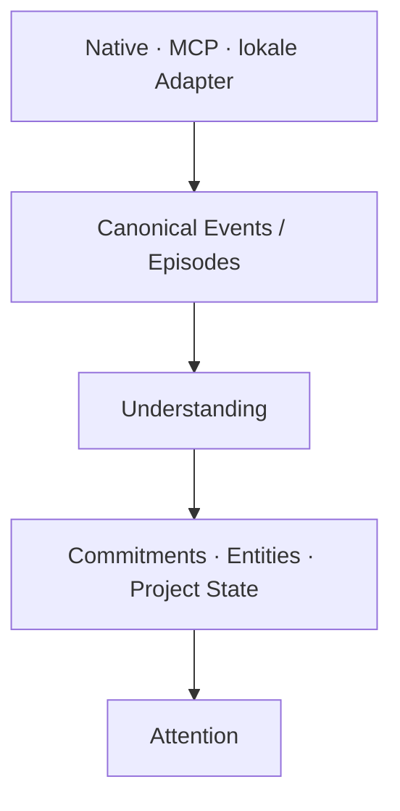

# Canonical Events

Stand: 2026-08-31. Dieser Vertrag ist die P2c-Grundlage zwischen Quellen und
späteren Understanding-Domains. Er ersetzt weder Assertions noch die
Provenance-, Policy- oder Löschverträge.



## Was ein Canonical Event ist

Ein Canonical Event ist eine normalisierte, nachvollziehbare Beobachtung eines
realen oder vom Nutzer eingebrachten Vorgangs: etwa eine empfangene Mail, ein
Kalendereintrag, ein importiertes Dokument oder eine Notiz. Die bestehende
`Episode` ist sein langlebiger Speicher; es gibt keinen zweiten konkurrierenden
Rohdatenstore.

Nicht Canonical Events sind Interpretationen wie „Claudia hat etwas
versprochen“, Projekt-Risiken, Prioritäten oder Attention. Diese folgen erst in
späteren Phasen und verweisen auf Events als Evidence.

## Raw und Derived

`EpisodeArtifact.SOURCE` kennzeichnet beobachtete Quellen. `EpisodeArtifact.DERIVED`
kennzeichnet ICARUS-Arbeit. Insbesondere ist `EpisodeKind.SUMMARY` immer
`derived`; sie ist keine Raw Truth und kann nicht über `upsert_source_event()`
eingespielt werden.

`raw_events()` und `derived_artifacts()` machen die Trennung technisch
abfragbar. `pending()` verarbeitet nur Source Events. Summaries können Rohquellen
für Navigation referenzieren, ersetzen sie aber nicht und dürfen nie der einzige
Beleg einer bestätigten Assertion sein.

## Identität und Digest

Eine Quellidentität ist das Value Object:

```text
source_type + source_account + native_source_id
```

Sie ist in SQLite eindeutig. Das Konto verhindert Kollisionen gleicher nativer
IDs in getrennten Accounts. Es enthält keine Tokens oder Passwörter. Externe
Adapter müssen eine stabile native ID liefern; ohne eine solche verwenden sie
eine konservative, adapterlokale Referenz (bei Dateien etwa der kanonische
relative Source-Ref). Unsicherheit erzeugt lieber getrennte Events als einen
False Merge.

Der SHA-256-Digest beschreibt den kanonisch gespeicherten **Inhaltszustand**
(Titel, Body, fachliche Zeit, Teilnehmer, Metadaten). Er ist nie globale
Event-Identität. Zwei Mails mit gleichem Text bleiben deshalb getrennt.

## Zeit, Teilnehmer und Felder

Jedes Event besitzt eine stabile ICARUS-ID sowie mindestens Quellidentität,
`event_type`, `occurred_at`, `captured_at`, Digest, Provenance und Revision.
`occurred_at` ist die fachliche Quellzeit; `captured_at` ist der Aufnahmezeitpunkt
in ICARUS. Optional bleibt `source_updated_at` die Zeit des Quellsystems.
Intern werden Zeitwerte timezone-aware gespeichert und serialisiert.

Teilnehmer bleiben quellennahe Daten (`role`, optional Anzeige-Name, Adresse,
externe ID). Die alte `participants: list[str]` bleibt für kompatible APIs
erhalten. Keine dieser Angaben ist bereits eine Person-ID oder ein Entity-Merge.
Explizite Projektlinks werden transportiert; automatische Projektzuordnung ist
kein Bestandteil von P2c. `scope_id`, `trust`, `raw_metadata` und `source_state`
bereiten Scope-, Trust- und spätere Tombstone-Verträge vor, ohne sie vorweg zu
implementieren.

## Update- und Revision-Semantik

`EpisodeStore.upsert_source_event()` gibt `created`, `unchanged` oder `updated`
zurück:

- gleiche Quellidentität und gleicher Digest: kein Write, keine neue Revision;
- gleiche Quellidentität und geänderter Inhalt: derselbe Event bleibt aktuell,
  seine Revision wird erhöht und die vollständige frühere Fassung bleibt in
  `episode_revisions` lesbar;
- unterschiedliche Quellidentität: getrennte Events, auch bei gleichem Text.

Dadurch bleibt später erklärbar, was ICARUS zu einem Zeitpunkt wusste. Eine
Quellenlöschung wird in P2c noch nicht synchronisiert; der vorbereitete
`source_state` ist kein Auftrag, Historie still zu löschen.

## Connector-Grenze

Providerlogik endet im Adapter. Der bestehende Mail-Remember-Pfad liefert
`email.received` mit IMAP-Konto, Message-ID/UID, Absender/Empfängern und
getrennten Quell-/Capture-Zeiten. Lokale Datei- und Dokumentimporte liefern
`document.imported` bzw. `file.imported` mit pseudonymisiertem Root-Kontext und
Source-Ref. Der bestehende CalDAV-Pfad persistiert noch nicht automatisch; seine
reale `Event`-Form besitzt jetzt einen deterministischen `calendar.event`-
Normalizer für den späteren Sync. Das ist kein neuer Connector und kein
Background-Sync.

Native Connectoren, MCP-Connectoren und lokale Adapter müssen künftig genau
diesen Vertrag an der Grenze erfüllen. Commitment-, Entity-, Project-State- und
Attention-Code versteht Events, nicht Gmail-, Outlook- oder Slack-Sonderfälle.

## Migration, Backup und Sicherheit

`episodes.sqlite3` migriert über P2a atomar von Schema v1 nach v2. Dabei bleiben
ID, Body, Provenance, `occurred_at`, Teilnehmer und Projektlink erhalten.
Legacy-Episoden erhalten ausschließlich die explizite konservative Identität
`legacy / legacy / <episode-id>`; Scope, Konto und neue Semantik werden nicht
erraten. Legacy-Summaries werden als `derived` markiert. Neue Datenbanken laufen
über denselben v1→v2-Pfad.

P2b sichert den Store mit Schema-Version 2. Ein Backup mit unterstütztem v1
wird nur in einer temporären Restore-Kopie migriert; das Backup-Original bleibt
unverändert. Future- und negative Schema-Versionen bleiben fail-closed.

Event Bodies, Mailtexte, Adressen und Metadaten gehören nicht in normale Logs
oder Fehlermeldungen. Source accounts speichern keine Credentials. Rohdaten
bleiben fremde Daten und niemals Anweisungen.

## Tests und Grenzen

Die Tests decken Source-Identity-Idempotenz, gleiche Texte mit verschiedenen
IDs/Konten, Revision History, Raw-vs-Derived, v1→v2-Erhalt, Mail-, Kalender- und
Datei-Normalisierung sowie Backup-Restore von Episode-v1 ab. Temporäre
Sabotageproben prüfen, dass Digest nicht wieder globale Identität wird, das
Konto nicht aus der Identität fällt und Summaries nicht als Source Events gelten.

P2c ist keine Understanding Engine: keine Commitment-Extraktion, Entity
Resolution, automatische Projektzuordnung, Attention, LLM-Normalisierung,
neuen Connectoren oder UI werden hier eingeführt. Große spätere Eventmengen
können zusätzliche Index- und Retention-Strategien benötigen.
